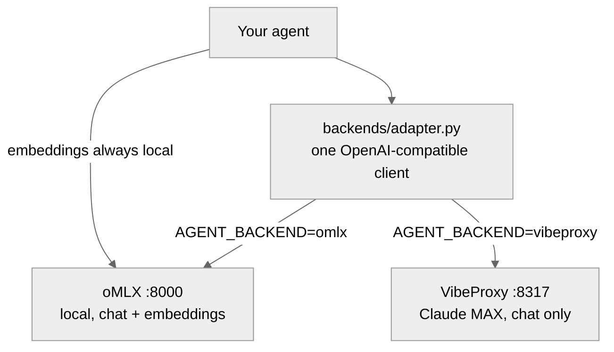

# Building Self-Improving Agents — Curriculum + Runnable Lab

A hands-on, 13-module curriculum for building **self-improving AI agents** that run on
backends you already have — a **local model via [oMLX](https://omlx.ai)** (Apple Silicon)
or your **Claude MAX subscription via [VibeProxy](https://github.com/automazeio/vibeproxy)** —
with **no direct paid API calls**. It ships with a runnable Python scaffold and a slash
command that keeps the curriculum current by mining the last 30 days of research.

> Built from real May-2026 signal (Hacker News, GitHub, Reddit, arXiv). See [`research/`](research/)
> for the source material every claim is grounded in.

---

## Why this exists

Most "self-improving agent" material assumes a metered API key. This curriculum targets the
two backends a hobbyist/practitioner actually has on a Mac, where calls are **rate-limited, not
per-token-billed** — which changes the design: the many-call loops (reflect, critique,
keep/discard) that are expensive on an API are essentially free here.



The one rule the whole curriculum is built on: **generation backend is swappable; embeddings
are always local** (VibeProxy has no embeddings endpoint).

---

## Repository layout

| Path | What |
|---|---|
| [`curriculum/`](curriculum/) | The 13 Obsidian notes (`00`–`12`) + a Canvas map. Rich Mermaid diagrams. Best viewed in [Obsidian](https://obsidian.md). |
| [`scaffold/`](scaffold/) | The runnable Python lab: agent loop, memory, reflection, skills, verification gate, DGM-style evolve loop, eval harness. |
| [`tools/`](tools/) | The maintenance automation: `refresh-research.sh`, `improve-workflow.js`, and the authoring spec. |
| [`.claude/commands/`](.claude/commands/) | The `/improve-curriculum` slash command. |
| [`research/`](research/) | Source research the curriculum is grounded in (provenance). |

### Curriculum modules

| # | Module | Focus |
|---|--------|-------|
| 00 | Curriculum Map | Hub, roadmap, the three camps |
| 01 | What Self-Improving Means | Taxonomy + the skeptic's "when NOT to build one" |
| 02 | Backends — oMLX & VibeProxy | Setup, unified adapter, embeddings-stay-local |
| 03 | The Minimal Agent Loop | ReAct baseline (you can't measure improvement without one) |
| 04 | Memory Systems | Episodic / semantic / procedural experience layer |
| 05 | Reflection & Self-Correction | The REFLECT step + the recursive-drift warning |
| 06 | Skill Acquisition & Curation | agent-seed pattern, SkillOS / Muse-Autoskill |
| 07 | Verification Gates & Layered Control | The L0–L3 hierarchy; "prompt alone failed" |
| 08 | Self-Modification — DGM Pattern | Keep/discard archive over the prompt, safely |
| 09 | Sandboxing & Safe Execution | Containarium / Nerve, checkpoints, safe-commit |
| 10 | Evaluation Harness | Eval-first, regression guards, variant-vs-baseline |
| 11 | Capstone — Production Agent | Wire it together + production checklist |
| 12 | Resources & Field Map | Annotated bibliography + glossary |
| 13 | Graduating to a Framework | Optional: when/how to adopt mem0, Pydantic AI, or the Claude Agent SDK on our backends |

> **Local model prep (16–32 GB Macs):** Module 02 includes a model-selection table — e.g. `Qwen2.5-Coder-7B-Instruct-4bit` + `nomic-embed-text-v1.5` on 16 GB, stepping up to a 14B model on 32 GB. The Claude/VibeProxy track still installs the local embedding model.
>
> **Optional framework track:** `scaffold/frameworks/` ships backend-aware drop-ins — [mem0](https://github.com/mem0ai/mem0) for memory and [Pydantic AI](https://github.com/pydantic/pydantic-ai) for the loop — both pointed at oMLX/VibeProxy via a custom `base_url`. Install with `pip install -e ".[frameworks]"`.

---

## Quick start

### 1. Install

```bash
git clone https://github.com/shaneliuyx/self-improving-agents-curriculum.git
cd self-improving-agents-curriculum
bash install.sh                              # tooling + scaffold
# also drop the notes into your Obsidian vault:
VAULT_DIR="/path/to/your/vault" bash install.sh
```

### 2. Start a backend

- **Local:** install [oMLX](https://omlx.ai), download a chat model (e.g. `Qwen2.5-Coder-7B`)
  and an embedding model (`nomic-embed-text`), click **Start Server** (`:8000`).
- **Claude MAX:** install [VibeProxy](https://github.com/automazeio/vibeproxy), sign in with
  your subscription (`:8317`). *(Note: using a subscription via proxy may violate provider ToS.)*

Even on the Claude track, keep oMLX running for **local embeddings**.

### 3. Run the lab

```bash
cd ~/self-improving-agent-lab
cp .env.example .env          # set AGENT_BACKEND=omlx or vibeproxy
./scripts/go                  # one ACT->RECORD->REFLECT->LEARN->VERIFY iteration
```

---

## Keeping the curriculum fresh — `/improve-curriculum`

The curriculum maintains itself by applying its own thesis to itself. In Claude Code:

```
/improve-curriculum
```

This runs **GATHER → REFLECT → LEARN → VERIFY → SHIP**: it calls the
[`last30days`](https://github.com/mvanhorn/last30days-skill) skill (or `tools/refresh-research.sh`)
for fresh sources, gap-analyzes them against the current notes, applies **sourced, additive**
updates in parallel ([`tools/improve-workflow.js`](tools/improve-workflow.js)), audits
consistency (wikilinks, Mermaid, citations, `py_compile`), and pushes. Every edit must cite a
real source — the curriculum's own anti-"recursive-drift" rule.

> Requires the `last30days` plugin and Python 3.12+ for the research step.

---

## Grounding

This material is built from real signal surfaced in May 2026 — including the
[Darwin Gödel Machine](https://arxiv.org/abs/2505.22954),
[SkillOS](https://arxiv.org/abs/2605.06614),
[Komi-learn](https://github.com/kurikomi-labs/komi-learn),
the [agent-seed harness](https://github.com/B67687/agentic-workflows/pull/82),
the NousResearch [rule-priority-hierarchy finding](https://github.com/NousResearch/hermes-agent/issues/29652),
and the r/AI_Agents [skeptic thread](https://www.reddit.com/r/AI_Agents/comments/1taei9m/stop_building_ai_agents/).
Full provenance in [`research/`](research/).

## License

[MIT](LICENSE) © 2026 shaneliuyx
