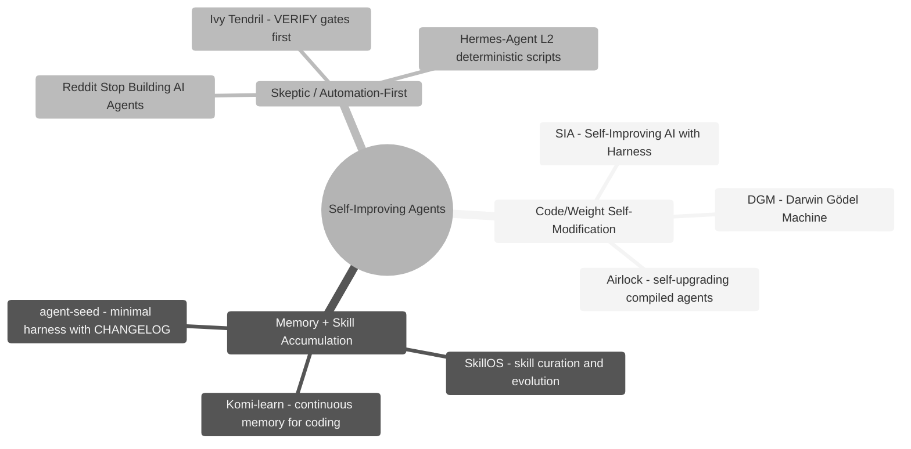
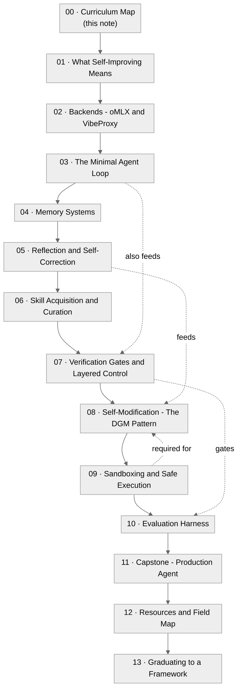

# 00 · Curriculum Map

**What you'll learn:** This note is the hub for the entire "Building Self-Improving Agents" curriculum. It explains the central thesis - that for local/subscription builders the pragmatic sweet spot is **memory + skill accumulation** combined with rigorous **VERIFY gates**, while code or weight self-modification is reserved for narrow, sandboxed, benchmarkable sub-problems - and orients you to the three camps of self-improvement research, the canonical ACT -> RECORD -> REFLECT -> LEARN loop, and how the 13 modules build on each other.

> [!info] Prerequisites
> No prerequisites. This is the starting point. If you want to jump in, go to [[01 - What Self-Improving Means]].

---

## Learning Objectives

- [ ] Articulate the curriculum's core thesis: why memory+skill accumulation beats code self-rewriting for most local builders
- [ ] Name the three camps of self-improvement research and give one example project per camp
- [ ] Trace the canonical ACT -> RECORD -> REFLECT -> LEARN loop and identify which module covers each stage
- [ ] Understand the two supported backends (oMLX, VibeProxy) and the single critical architectural constraint (embeddings are always local)
- [ ] Navigate the 13-module sequence and know when to skip vs. read in depth

---

## The Thesis

Self-improving agents are a spectrum. At one extreme, the [Darwin Gödel Machine (DGM)](https://arxiv.org/abs/2505.22954) rewrites its own source code and validates each revision on benchmarks, lifting SWE-bench scores from ~20% to ~50%. At the other extreme, the Reddit community's "[Stop building AI agents](https://www.reddit.com/r/AI_Agents/comments/1taei9m/stop_building_ai_agents/)" framework (1,447 upvotes at time of writing) argues that most production "agents" are just automations with one LLM call, and that adding agentic loops mostly adds 3am Slack messages when something goes wrong.

This curriculum sits deliberately between those poles, targeting the **subscription-local developer** who:

- Runs generation through [oMLX](https://omlx.ai) (Apple Silicon MLX inference, OpenAI-compatible on `http://localhost:8000/v1`) OR [VibeProxy](https://github.com/automazeio/vibeproxy) (local OAuth proxy for Claude MAX/ChatGPT subscriptions, OpenAI-compatible on `http://localhost:8317`)
- Cannot or does not want to pay per-token for reflection loops
- Wants genuine, measurable improvement - not just "the agent remembers things"

The thesis in one sentence: **accumulate verified knowledge and reusable skills; self-modify code only in a sandboxed, benchmarkable sub-loop.**

---

## The Three Layers: Brain, Harness, Agent

Before the camps, one framing the rest of this curriculum depends on. An agent is not just a model with a prompt. There are three layers, and conflating them is why most agent projects stall:

- **The LLM is the brain.** Text in, text out. It cannot read a file, run a test, wait 5 seconds, or remember the last session. The smartest brain on a table does nothing on its own.
- **The agent *harness* is the body and nervous system.** It gives the brain meta-abilities: assembling the right context each turn, defining and dispatching tools, running code in a sandbox, storing state and memory, deciding when to continue/stop/reflect, retrying failed API calls, logging every step for replay, blocking dangerous operations. A production harness is at least ten distinct subsystems (enumerated as a checklist in [[11 - Capstone - Production Agent]] §4.0).
- **The agent is a trained professional.** Brain + body + domain knowledge, tools, and success criteria for one job. A sales agent and a coding agent can share the same LLM and the same harness, yet be completely different products - the difference is the profession, not the brain.

The load-bearing claim, now a 2026 community consensus, is that **the harness matters as much as the model**: the same Claude that feels like a senior engineer inside Claude Code feels like a confused intern in a hand-rolled demo - because Claude Code's harness assembles context per request, applies structured diffs with rollback, feeds test/compile failures back into the next turn, and routes work across models. None of that is model capability; all of it is harness engineering. ([Anthropic's agent-harness masterclass](https://www.youtube.com/watch?v=efRIrLXoOVA), 49K views: *"the harness matters as much as the model"*; [O'Reilly, "Agent Harness Engineering"](https://www.oreilly.com/radar/agent-harness-engineering/).)

This curriculum teaches you to **build** the harness from primitives so you understand the layer - then, in [[13 - Graduating to a Framework]], when to **stop hand-rolling it** and adopt a platform ([deepagents](https://github.com/langchain-ai/deepagents), [OpenHarness](https://github.com/HKUDS/OpenHarness)) instead. A *teaching* lab is the one place hand-rolling is correct; a *business* shipping an agent is usually not.

---

## The Three Camps



*Three camps of self-improvement research: the curriculum's practical focus is camp 2, with camp 3 as a constant reality check and camp 1 unlocked in Module 08.*

### Camp 1 - Code / Weight Self-Modification

The system rewrites its own source code or fine-tunes its own weights based on task outcomes. Impressive on closed benchmarks; fragile in open-ended production use without strong sandboxing.

- [DGM](https://arxiv.org/abs/2505.22954) - full code self-rewrite with benchmark validation
- [SIA](https://arxiv.org/abs/2605.27276) - harness + weight updates for foundation agents
- [Airlock](https://github.com/airlockrun/airlock/) - self-upgrading compiled AI agents

### Camp 2 - Memory + Skill Accumulation

The system keeps its code fixed but grows a retrievable memory of past experiences and a library of reusable skills. Lower risk, immediately practical for local builders.

- [SkillOS](https://arxiv.org/abs/2605.06614) - learning skill curation for self-evolving agents
- [Komi-learn](https://github.com/kurikomi-labs/komi-learn) - continuous memory + self-improvement for coding agents
- [agent-seed](https://github.com/B67687/agentic-workflows/pull/82) - minimal harness: GOAL.md + scripts/go + AGENTS.md + CHANGELOG.md

### Camp 3 - Skeptic / Automation-First

Most things that look like agents are automations. The discipline is knowing when NOT to add a loop.

- [Reddit "Stop building AI agents"](https://www.reddit.com/r/AI_Agents/comments/1taei9m/stop_building_ai_agents/) - decision tree: can you draw it as clear steps? Use automation.
- [Ivy Tendril](https://github.com/yeaight7/awesome-ai-devtools/pull/3) - plan-lifecycle + VERIFY gates before any self-modification
- [Hermes-Agent issue #29652](https://github.com/NousResearch/hermes-agent/issues/29652) - production finding: move deterministic steps to L2 scripts, not LLM

---

## The Canonical Loop

Every module is consistent with one vocabulary:

```
ACT  ->  RECORD  ->  REFLECT  ->  LEARN
                                    |
                                 VERIFY (gate)
                                    |
                              accept / discard
```

| Stage | What happens | Module |
|-------|-------------|--------|
| **ACT** | Agent performs a task in the baseline loop | [[03 - The Minimal Agent Loop]] |
| **RECORD** | Capture full trajectory: inputs, tool calls, outputs, errors | [[04 - Memory Systems]] |
| **REFLECT** | Critique the trajectory, extract heuristics and lessons | [[05 - Reflection and Self-Correction]] |
| **LEARN** | Write a reusable skill or update the memory store | [[06 - Skill Acquisition and Curation]], [[08 - Self-Modification - The DGM Pattern]] |
| **VERIFY** | External evaluation gates every LEARN step | [[07 - Verification Gates and Layered Control]], [[10 - Evaluation Harness]] |

> [!tip] Why VERIFY is non-negotiable
> Without a gate on the LEARN step, each reflection pass can drift the agent further from correct behavior. The [Continual Harness paper](https://arxiv.org/abs/2605.09998) calls this "recursive drift." Strong VERIFY is what separates a self-improving agent from a self-corrupting one.

---

## The Two Backends in One Line Each

- **oMLX** - local Apple Silicon inference server; serves text, vision, embeddings, and rerankers at `http://localhost:8000/v1`; no subscription needed; rate-limited by your hardware
- **VibeProxy** - local OAuth proxy for your existing Claude MAX / ChatGPT / Gemini subscription at `http://localhost:8317`; chat only, no embeddings endpoint; ToS caveat: proxy usage may violate provider terms of service - check before using in production

> [!warning] Embeddings are always local
> VibeProxy exposes chat completion only. Every memory and vector operation in this curriculum uses oMLX's `/v1/embeddings` endpoint (or sentence-transformers as fallback). This is true even when generation runs through VibeProxy. The generation backend is swappable; the embedding backend is not.

---

## How to Use This Curriculum

1. **Read Module 01** to understand what "self-improvement" actually means and set expectations.
2. **Set up your backend** in Module 02 - oMLX, VibeProxy, or both.
3. **Build the baseline loop** in Module 03. Everything else extends this scaffold.
4. **Follow modules 04-07 in order** - memory, reflection, skills, and verification form a dependency chain.
5. **Choose your depth** for Modules 08-10 based on your goals - DGM-style self-modification (08) requires the sandbox work in 09 and the eval harness in 10 before it is safe to attempt.
6. **Module 11** is the capstone integration; Module 12 is a field map for continuing education.

The **runnable scaffold** lives outside the vault at `/Users/yuxinliu/self-improving-agent-lab`. Each module's hands-on lab references specific files in that directory. Clone or initialize it before starting Module 03.

> [!note] Economics matter here
> These backends are **rate-limited, not per-token-metered**. A reflection loop that makes 20 LLM calls costs ~$0 in dollar terms but may hit rate limits or saturate your local GPU. Design for throughput, not cost. This is the opposite mental model from paid-API development.

---

## Roadmap



*Module dependency graph: solid arrows are the primary reading order; dashed arrows show cross-module dependencies that matter when implementing.*

---

## Annotated Module List

| # | Note | One-line summary |
|---|------|-----------------|
| 00 | [[00 - Curriculum Map]] | This hub note - thesis, loop vocabulary, roadmap |
| 01 | [[01 - What Self-Improving Means]] | Definitions, the three camps, benchmarks vs. open-world criteria |
| 02 | [[02 - Backends - oMLX and VibeProxy]] | Install, configure, and test both local backends |
| 03 | [[03 - The Minimal Agent Loop]] | Baseline ACT loop in ~100 lines with the unified adapter |
| 04 | [[04 - Memory Systems]] | Episodic + semantic memory, vector store, local embeddings |
| 05 | [[05 - Reflection and Self-Correction]] | Critique loops, ERL pattern, extracting reusable heuristics |
| 06 | [[06 - Skill Acquisition and Curation]] | SkillOS-style skill library, keep/discard gate, SKILLS/ directory |
| 07 | [[07 - Verification Gates and Layered Control]] | L0-L3 rule hierarchy, deterministic script gates, anti-drift |
| 08 | [[08 - Self-Modification - The DGM Pattern]] | Sandboxed code self-rewriting validated on micro-benchmarks |
| 09 | [[09 - Sandboxing and Safe Execution]] | Containarium, Docker, firejail - safe substrates for camp-1 work |
| 10 | [[10 - Evaluation Harness]] | Eval tasks, regression suite, the continual harness pattern |
| 11 | [[11 - Capstone - Production Agent]] | Assemble all layers into a monitored, versioned production agent |
| 12 | [[12 - Resources and Field Map]] | Papers, repos, community links, what to read next |
| 13 | [[13 - Graduating to a Framework]] | Optional: when and how to adopt mem0, Pydantic AI, or the Claude Agent SDK on our backends |
| 14 | [[14 - Framework Capstone - Shipping on deepagents]] | Optional: the buy-path capstone - ship a real self-improving code-fix agent on deepagents, backend-swappable to oMLX/VibeProxy |

---

## Hands-On Lab - Verify Your Environment

Before any other module, confirm both backends respond. This is the only lab in Module 00 - it gates everything else.

**Scaffold file:** `backends/adapter.py`

```python
# backends/adapter.py - one client, both backends
import os
from openai import OpenAI

BACKENDS = {
    "omlx":      {"base_url": "http://localhost:8000/v1", "model": os.getenv("OMLX_MODEL", "qwen2.5-coder-7b")},
    "vibeproxy": {"base_url": "http://localhost:8317/v1",  "model": os.getenv("VIBE_MODEL", "claude-sonnet-4-5-20250929")},
}

def make_client(backend=None):
    key = backend or os.getenv("AGENT_BACKEND", "omlx")
    b = BACKENDS[key]
    # oMLX may require a key (OMLX_API_KEY); VibeProxy uses OAuth and ignores it.
    api_key = os.getenv("OMLX_API_KEY", "not-needed") if key == "omlx" else os.getenv("LLM_API_KEY", "not-needed")
    return OpenAI(base_url=b["base_url"], api_key=api_key), b["model"]
```

**Smoke-test script** - run this from `self-improving-agent-lab/`:

```python
# scripts/smoke_test.py
import sys
from backends.adapter import make_client

def ping(backend: str) -> str:
    client, model = make_client(backend)
    resp = client.chat.completions.create(
        model=model,
        messages=[{"role": "user", "content": "Reply with exactly: OK"}],
        max_tokens=8,
    )
    return resp.choices[0].message.content.strip()

def ping_embeddings() -> int:
    from openai import OpenAI
    emb = OpenAI(base_url="http://localhost:8000/v1", api_key="not-needed")
    v = emb.embeddings.create(model="nomic-embed-text", input="test").data[0].embedding
    return len(v)

results = {}

# Test oMLX generation
try:
    results["omlx_gen"] = ping("omlx")
except Exception as e:
    results["omlx_gen"] = f"FAIL: {e}"

# Test VibeProxy generation (skip if not configured)
try:
    results["vibeproxy_gen"] = ping("vibeproxy")
except Exception as e:
    results["vibeproxy_gen"] = f"SKIP/FAIL: {e}"

# Test local embeddings (always required)
try:
    results["embeddings_dim"] = ping_embeddings()
except Exception as e:
    results["embeddings_dim"] = f"FAIL: {e}"

for k, v in results.items():
    status = "PASS" if not str(v).startswith("FAIL") else "FAIL"
    print(f"  [{status}] {k}: {v}")

if any(str(v).startswith("FAIL") for v in results.values()):
    sys.exit(1)
```

Run with:
```bash
# Test oMLX only (default)
AGENT_BACKEND=omlx python scripts/smoke_test.py

# Test VibeProxy (requires VibeProxy running and Claude MAX auth)
AGENT_BACKEND=vibeproxy python scripts/smoke_test.py
```

Expected output:
```
  [PASS] omlx_gen: OK
  [PASS] vibeproxy_gen: OK
  [PASS] embeddings_dim: 768
```

> [!example] If oMLX embeddings fail
> Open the oMLX menu-bar app and confirm a model with "embed" in the name is loaded. `nomic-embed-text` is a good default. The generation model and the embedding model are separate - you can have generation fail but embeddings pass, or vice versa.

---

## Common Pitfalls

> [!danger] Skipping VERIFY and calling it "self-improving"
> The most common mistake is building the ACT -> RECORD -> REFLECT -> LEARN loop without the VERIFY gate, then observing the agent get confidently worse over time. [ERL](https://arxiv.org/pdf/2603.24639) and [Continual Harness](https://arxiv.org/abs/2605.09998) both quantify this degradation. Every LEARN step must be gated. No exceptions.

> [!warning] Treating VibeProxy as a drop-in for all API calls
> VibeProxy handles chat completions. It does NOT expose `/v1/embeddings`. If you point your memory store at `http://localhost:8317/v1/embeddings` you will get a 404. Use oMLX for all embedding work, even when generation goes through VibeProxy.

> [!warning] Defaulting to the largest model for every step
> The [Reddit "Stop building AI agents"](https://www.reddit.com/r/AI_Agents/comments/1taei9m/stop_building_ai_agents/) framework makes this point for paid APIs; it applies equally here. A 7B oMLX model handles classification, keep/discard, and formatting steps faster and with less rate-limit pressure than routing everything to Claude Sonnet via VibeProxy. Use `backends/router.py` (Module 02) to assign model tiers per task type.

> [!tip] The harness is not optional overhead
> [agent-seed](https://github.com/B67687/agentic-workflows/pull/82) ships a minimal but complete harness: GOAL.md (north star), AGENTS.md (operating contract), scripts/go (iteration entrypoint), scripts/commit (safe wrapper), CHANGELOG.md (audit trail). This is not ceremony - it is the substrate that makes self-improvement auditable and reversible. Module 03 builds exactly this structure.

---

> [!question] Checkpoint
> 1. What is the curriculum's core argument for preferring memory+skill accumulation over code self-modification for local builders?
> 2. Which module covers the VERIFY gate, and why does it sit between REFLECT and LEARN rather than after LEARN?
> 3. You want to run a reflection loop that calls the LLM 30 times per task. Under the paid-API mental model this is expensive - why is the economics calculation different here, and what constraint replaces cost?
> 4. A colleague points to DGM's 20%-to-50% SWE-bench improvement and says "just do that." What two prerequisites does the curriculum say must be in place before attempting DGM-style self-modification?
> 5. You set `AGENT_BACKEND=vibeproxy` and your memory store fails to store any embeddings. What is the most likely cause and how do you fix it?

---

## Navigation

[[00 - Curriculum Map]] (home) · [[01 - What Self-Improving Means]] →
