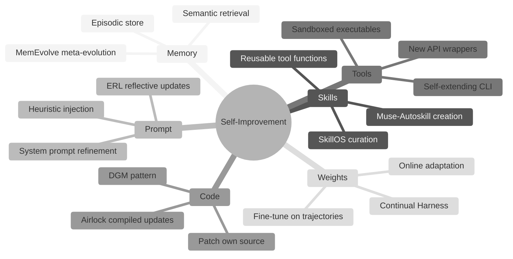
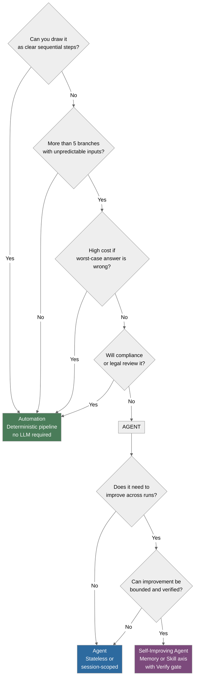
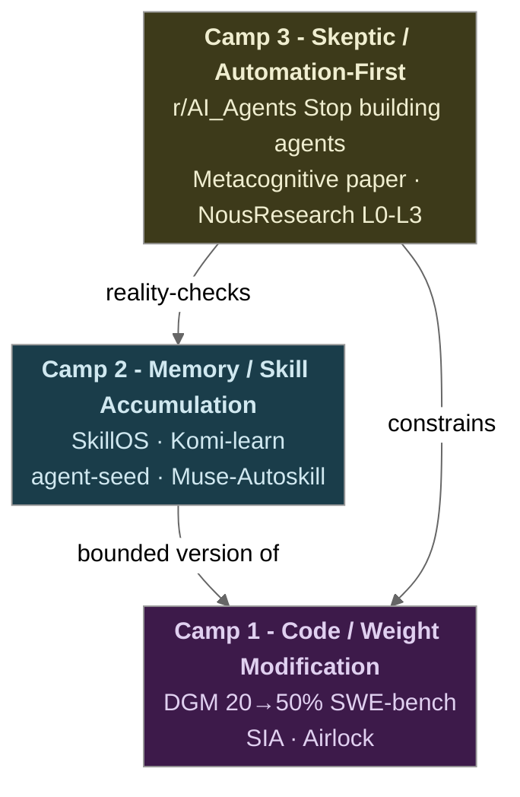

# 01 · What Self-Improving Means (and When NOT to Build One)

**What you'll learn** - This note builds the conceptual foundation for the entire curriculum. You will develop precise language for what "self-improving" actually means across three distinct research and practitioner camps, learn a six-axis taxonomy of *how* agents improve, apply a four-question decision framework to determine whether your use case actually warrants a self-improving agent at all, and understand why self-improvement *raises* the verification bar rather than lowering it. By the end you should be able to look at any proposed agent project and give a principled answer to the question: automation, agent, or self-improving agent?

> [!info] Prerequisites
> - [[00 - Curriculum Map]] - read the full note list and learning arc before starting here

---

## Learning Objectives

- [ ] Define "self-improving agent" in terms of each of the three camps (code/weight modification, memory/skill accumulation, skeptic's automation-first view)
- [ ] Name and describe all six axes of the improvement taxonomy
- [ ] Apply the four-question decision framework to a real scenario
- [ ] Explain why self-improvement increases unpredictable surface area and what that demands of verification
- [ ] List at least three conditions under which self-improvement is genuinely justified

---

## 1. Three Camps, One Term

The phrase "self-improving agent" is used loosely across research papers, GitHub repos, and Reddit threads. Before you build anything, pin down which camp you are actually talking about.

### Camp 1 - Code and Weight Self-Modification

The most aggressive form: the agent rewrites its own code, modifies its own prompts, or fine-tunes its own weights based on performance feedback. The canonical research example is [Darwin Gödel Machine (DGM)](https://arxiv.org/abs/2505.22954), a self-rewriting coding agent that improved its SWE-bench score from 20% to 50% by iteratively proposing and validating patches to its own source code. The [SIA paper](https://arxiv.org/abs/2605.27276) extends this to include weight update loops alongside harness evolution.

This camp is powerful and dangerous in equal measure. Every self-modification that passes a verification gate is a permanent change to the agent's behaviour surface. Drift is not hypothetical - it is the default outcome without strong gating.

### Camp 2 - Memory and Skill Accumulation

The agent does not touch its own weights or core code. Instead, it accumulates: reusable skill functions, episodic memories, curated heuristics, and refined system prompts. Projects like [SkillOS](https://arxiv.org/abs/2605.06614), [Komi-learn](https://github.com/kurikomi-labs/komi-learn), and [agent-seed](https://github.com/B67687/agentic-workflows/pull/82) sit here. The agent gets better at tasks because its *context* at inference time improves - not because the underlying model changed.

This is the pragmatic sweet spot for local/subscription builders. Skill files and memory stores are inspectable, diffable, and rollback-able. The curriculum's [[11 - Capstone - Production Agent]] targets this camp with strong [[07 - Verification Gates and Layered Control]] wrapping around every learn step.

### Camp 3 - The Skeptic's View

The most practically important camp for most readers. The [metacognitive position paper](https://openreview.net/forum?id=4KhDd0Ozqe) argues that truly self-improving agents require intrinsic metacognitive learning - something current LLM-based systems approximate but do not achieve. The practitioner corollary is documented in the [r/AI_Agents "Stop building AI agents" thread](https://www.reddit.com/r/AI_Agents/comments/1taei9m/stop_building_ai_agents/) (1,447 upvotes): most systems shipping to businesses as "agents" are actually automations with one LLM call bolted on.

The skeptic's camp is not nihilism - it is discipline. Understanding where the bar actually is prevents you from architecting a self-improving system when a deterministic pipeline would be cheaper, safer, and more maintainable.

---

## 2. The Improvement Taxonomy

Self-improvement is not a single mechanism. The following six axes describe *what* changes when an agent improves.



*The six axes of agent self-improvement - each axis has different risk, reversibility, and verification requirements.*

| Axis | Reversible? | Verification difficulty | Example |
|------|-------------|------------------------|---------|
| Memory | Yes (delete record) | Low | [[04 - Memory Systems]] |
| Skills | Yes (remove file) | Medium | [[06 - Skill Acquisition and Curation]] |
| Prompt | Yes (git revert) | Medium | [[05 - Reflection and Self-Correction]] |
| Tools | Partly | High | [[08 - Self-Modification - The DGM Pattern]] |
| Code | Partly | High | DGM, Airlock |
| Weights | No (without checkpoint) | Very high | Continual Harness |

> [!tip] For this curriculum
> Modules 03-07 build competence on the Memory and Skills axes. The Code and Weights axes appear in Module 08 as bounded, benchmarkable sub-problems. Treat Weights as out-of-scope unless you have a dedicated eval harness (Module 10).

---

## 3. The Community Reality Check

Before designing anything, read the signal from [r/AI_Agents "Stop building AI agents"](https://www.reddit.com/r/AI_Agents/comments/1taei9m/stop_building_ai_agents/):

> "Most agents shipping to business are just automations + one LLM call."

The thread's two most actionable production lessons:

1. **Maintenance burden is the real cost.** A "3am Slack message when the agent approves the wrong invoices" is not a hypothetical - it is the failure mode that kills agent projects. Self-improving agents amplify this: if the agent *modified itself* before the bad approval, your debugging surface now includes its own change history.

2. **Human-in-the-loop on the final execution step saves 90% of the headache.** This maps directly to [[07 - Verification Gates and Layered Control]] - the canonical loop in this curriculum (ACT -> RECORD -> REFLECT -> LEARN) gates every LEARN step with VERIFY before any persistent change lands.

The [NousResearch hermes-agent production finding](https://github.com/NousResearch/hermes-agent/issues/29652) reinforces this with a concrete rule priority hierarchy: Layer 1 (Prompt) alone failed in production - agents skipped explicit instructions. Teams moved deterministic steps to L2 scripts. Self-improvement at the prompt or code layer must respect this hierarchy, not bypass it.

---

## 4. The Four-Question Decision Framework

Apply these questions in order to any proposed system. Stop when you have an answer.



*Four-question decision framework - most projects exit at "Automation" or plain "Agent"; reach Self-Improving Agent only when improvement is both needed and verifiable.*

> [!warning] The framework is asymmetric
> It is biased toward automations and plain agents. Self-improving agents are the exit only when (a) the task genuinely cannot be drawn as clear steps, (b) wrong answers are survivable, (c) compliance is not in the loop, *and* (d) cross-run improvement is measurable. Passing all four conditions is rarer than most architecture discussions assume.

Questions 1-4 come verbatim from the [r/AI_Agents community thread](https://www.reddit.com/r/AI_Agents/comments/1taei9m/stop_building_ai_agents/). Questions 5-6 are the curriculum's extension for distinguishing stateless agents from self-improving ones.

---

## 5. Camp Positioning Map

The three camps do not form a linear progression - they are parallel architectural philosophies with different risk profiles.



*Three camps and their relationships - the skeptic camp (Camp 3) does not oppose the others; it constrains them.*

---

## 6. Why Self-Improvement Raises the Verification Bar

An agent that does not improve is a *fixed* system. Its failure modes are bounded and reproducible. An agent that improves is a *moving* system - each improvement cycle changes the behaviour surface that the next cycle operates on.

This creates compounding unpredictability:

- A memory entry written in run 3 shapes the reflection in run 7, which writes a skill in run 9, which changes tool selection in run 12.
- A prompt heuristic that improves accuracy on task A may degrade accuracy on task B in ways that only appear at run 20.
- A code patch validated on benchmark X may introduce subtle regressions on benchmark Y.

[Experiential Reflective Learning (ERL)](https://arxiv.org/pdf/2603.24639) documents this explicitly: reflection without verification gates produces confident-but-wrong heuristics that compound over time. The [DGM paper](https://arxiv.org/abs/2505.22954) controls for this with an archive of all ancestor agents and regression benchmarks at every self-modification step.

> [!danger] Recursive drift is the default, not the exception
> Without external VERIFY gates, a self-improving agent will optimize toward whatever signal it can measure most easily - which is rarely the signal you actually care about. See [[07 - Verification Gates and Layered Control]] for the concrete gate designs used in this curriculum.

The practical consequence: **you need a working eval harness before you turn on self-improvement**. Module 10 covers the eval harness. Module 07 covers verification gates. Do not skip them.

---

## 7. When Self-Improvement Is Actually Justified

Given the above, here are conditions under which self-improvement earns its complexity cost:

1. **The task domain is large, variable, and long-lived.** A coding assistant used daily for months across many codebases will encounter patterns that cannot be anticipated at design time. Memory accumulation pays off.

2. **Failures are recoverable and cheap.** A research summarization agent making a wrong inference is recoverable. A payment approval agent making a wrong decision is not. Only the first warrants self-modification.

3. **You have a working eval harness before you start.** [DGM](https://arxiv.org/abs/2505.22954), [SIA](https://arxiv.org/abs/2605.27276), and [Continual Harness](https://arxiv.org/abs/2605.09998) all share this prerequisite. The harness is not optional - it is the precondition.

4. **The improvement axis is reversible.** Memory and skills can be deleted. Prompts can be reverted. Code patches can be rolled back from an archive. Weight updates cannot. Choose axes with rollback paths.

5. **Rate limits, not token cost, are your constraint.** This curriculum's backends (oMLX and VibeProxy) are rate-limited, not per-token-metered. Reflection loops, critique calls, and N-sample voting are economically ~free. This changes the calculus compared to paid API usage where every reflective call costs money - it makes iterative improvement loops feasible at zero marginal dollar cost.

> [!example] The economics argument for local builders
> On a paid API, running five self-critique passes on every agent output might cost $0.05-0.50 per task. Across thousands of runs this is a real budget line. On oMLX or VibeProxy, the same five passes cost rate-limit headroom, not dollars. This means you can afford more aggressive reflection and verification loops than a cloud-API budget would allow.

---

## 8. Hands-On Lab - Classify Three Projects

This lab uses the four-question framework concretely. No new code is needed - this is an analysis exercise. Then you will write the classification logic as a small Python script that can serve as a reusable decision-support tool.

### Step 1 - Apply the framework manually

Work through these three scenarios before looking at the code:

**Scenario A** - "I want to automatically tag incoming support tickets by category."
**Scenario B** - "I want an agent that helps me draft and iterate on technical blog posts."
**Scenario C** - "I want a coding assistant that learns from my past PR review feedback."

*Your answers:* A = Automation (clear steps, high cost of mis-tagging at scale). B = Agent (unpredictable inputs, survivable wrong answers, no compliance review, but no cross-run improvement needed). C = Self-Improving Agent (passes all six questions - variable domain, recoverable failures, measurable improvement via PR merge rate).

### Step 2 - Encode the framework as a runnable script

This lives at `/Users/yuxinliu/self-improving-agent-lab/agent/classify_project.py`. It uses the unified adapter so you can run it against either backend.

```python
# agent/classify_project.py
# Usage:
#   AGENT_BACKEND=omlx python agent/classify_project.py
#   AGENT_BACKEND=vibeproxy python agent/classify_project.py
import sys
import os
sys.path.insert(0, os.path.join(os.path.dirname(__file__), ".."))
from backends.adapter import make_client

DECISION_PROMPT = """You are a system architect. Classify a project into EXACTLY ONE of three build
types using the framework below, then pick ONE improvement axis. Follow the definitions and the
decision procedure LITERALLY — do not invent your own criteria, and do not let the word "learns" or
"adapt" in the project description override the rules (many projects say "learn" but are still Agents).

ASSUME the project will be built as an LLM-based system — the question is which of the three
LLM-system SHAPES fits, NOT "LLM vs classic ML / vs a trained classifier." So an LLM reasoning over
open-ended, unstructured input (any free-form natural language, document, or request) is AT LEAST an
Agent — never Automation — even if the output is a small fixed set of categories. "Automation" here
means a deterministic pipeline whose *inputs* are structured/predictable, not "a model does the work."

## The three build types

- **Automation** — a fixed, mostly-deterministic pipeline (few branches, an LLM is optional). Pick it
  when EITHER the task is predictable sequential steps, OR a wrong answer is high-stakes /
  compliance-gated (you want a deterministic, auditable path). NOTE: free-text / open-ended input
  is NOT predictable — classifying arbitrary natural-language input is NOT Automation just because the
  output set is small.
- **Agent** — an LLM-driven loop that reasons over UNPREDICTABLE, open-ended input and chooses among
  many branches at runtime, using a FIXED model + prompt that does NOT change across runs. Pick it when
  the input is open-ended and the cost of a wrong answer is low, AND either it does not need to get
  better run-over-run, OR it does but that improvement cannot be objectively bounded/verified.
- **Self-Improving Agent** — an Agent that MEASURABLY improves across runs from its own experience,
  where that improvement is BOUNDED and VERIFIABLE: you can name a metric that should go up and a
  rollback when it goes down. Pick it ONLY when BOTH hold: (a) it must improve across runs, AND (b) the
  improvement signal is bounded + verifiable. If improvement is desired but NOT verifiable, it is an
  Agent (self-improvement would silently drift).

## Decision procedure (apply IN ORDER; the FIRST rule that fires wins)

1. Predictable, sequential steps with few branches AND structured/predictable input
   (NOT free-form natural-language text)? -> **Automation**
   (Classifying, tagging, or triaging arbitrary free-text input FAILS this rule — the input is
    open-ended — so it is NOT Automation; continue to the rules below.)
2. Worst-case wrong answer high-stakes, OR compliance/legal must sign off? -> **Automation**
3. Input is open-ended but the system does NOT need to improve across runs? -> **Agent**
4. It should improve across runs, but the improvement CANNOT be bounded + verified
   (no objective metric, no rollback)? -> **Agent**
5. Otherwise — improves across runs AND the signal is bounded + verifiable -> **Self-Improving Agent**

## Improvement axis (pick the LIGHTEST one that delivers the needed improvement)

- **None** — Automation, OR any Agent that does not change its behavior across runs. An Agent that
  merely READS a fixed dataset for context, or uses feedback only within a single session, is NOT
  learning -> None. The Memory/Skills/Prompt/Code/Weights axes below describe HOW a *Self-Improving
  Agent* improves — so if Classification is Agent (not Self-Improving), the axis is almost always
  None; if Automation, ALWAYS None.
- **Memory** — improves by accumulating + retrieving past cases/feedback across runs (learns from its
  own history). Default axis for a Self-Improving Agent that learns from its own runs.
- **Skills** — improves by adding/refining reusable tools or procedures it can call.
- **Prompt** — improves by editing its own instructions/templates.
- **Code** — improves by writing/modifying its own code paths.
- **Weights** — improves by fine-tuning model weights (heaviest; rarely justified).

## Output format — emit ONLY these four lines, with these EXACT labels, in this order, no preamble:

- **Classification:** <Automation | Agent | Self-Improving Agent>
- **Recommended improvement axis:** <None | Memory | Skills | Prompt | Code | Weights>
- **Rationale:** <one sentence naming WHICH decision rule (1-5) fired and why>
- **Top risk if you build the more complex option anyway:** <one sentence>

## Worked examples (different domains — use them only to learn the FORMAT and the rule mapping)

Project: "Generate a weekly sales summary email from a fixed SQL query."
- **Classification:** Automation
- **Recommended improvement axis:** None
- **Rationale:** Rule 1 — predictable sequential steps (query -> format -> send), few branches, no learning needed.
- **Top risk if you build the more complex option anyway:** An agent adds nondeterminism + cost to a task a cron job does reliably.

Project: "Triage open-ended customer emails and draft replies; the model does not learn across emails."
- **Classification:** Agent
- **Recommended improvement axis:** None
- **Rationale:** Rule 3 — open-ended input needs flexible reasoning, low stakes, but it does not improve across runs.
- **Top risk if you build the more complex option anyway:** A self-improving loop optimizes a proxy (e.g. reply speed) and drifts from answer quality with no rollback.

Project: "Support bot that uses thumbs-up/down on its past answers to raise its resolution rate over time."
- **Classification:** Self-Improving Agent
- **Recommended improvement axis:** Memory
- **Rationale:** Rule 5 — must improve across runs AND the signal (resolution rate) is bounded + verifiable.
- **Top risk if you build the more complex option anyway:** Training-signal corruption — biased/adversarial feedback silently degrades answers before it is detected.

Now classify the project below. Output ONLY the four labeled lines.

Project: {description}"""

def classify(description: str) -> str:
    client, model = make_client()
    response = client.chat.completions.create(
        model=model,
        messages=[
            {"role": "user", "content": DECISION_PROMPT.format(description=description)}
        ],
        temperature=0.0,   # deterministic — this is a classification, not generation
        max_tokens=320,
    )
    return response.choices[0].message.content or ""

if __name__ == "__main__":
    scenarios = [
        "Auto-tag incoming support tickets by category using past ticket data.",
        "Help draft and iterate technical blog posts with style feedback.",
        "Coding assistant that learns from past PR review comments across projects.",
    ]
    backend = os.getenv("AGENT_BACKEND", "omlx")
    print(f"Backend: {backend}\n{'='*60}")
    for i, scenario in enumerate(scenarios, 1):
        print(f"\nScenario {i}: {scenario}")
        print("-" * 40)
        result = classify(scenario)
        print(result)
```

### Step 3 - Run it

```bash
cd /Users/yuxinliu/self-improving-agent-lab

# With oMLX (local model)
AGENT_BACKEND=omlx python agent/classify_project.py

# With VibeProxy (Claude via subscription)
# Note: using a subscription via proxy may violate provider ToS
AGENT_BACKEND=vibeproxy python agent/classify_project.py
```

> [!note] What to observe
> The LLM classification should agree with your manual analysis on Scenarios A and B. Scenario C is the interesting one - watch whether the model correctly identifies "PR merge rate" as a verifiable improvement signal. If it classifies C as plain "Agent", the rationale will reveal what information is missing from the description.

---

## Pitfalls

> [!warning] Pitfall 1 - Conflating complexity with sophistication
> Adding a self-improvement loop to a system that should be an automation does not make it better - it makes it harder to debug and more expensive to maintain. The framework is a filter, not a ladder to climb.

> [!warning] Pitfall 2 - Building self-improvement before building evals
> Every research project that successfully implements self-improvement (DGM, SIA, Continual Harness) starts with a working benchmark. If you cannot measure improvement, you cannot verify it. If you cannot verify it, the loop will optimize for the wrong signal. Build Module 10 (evals) before Module 08 (self-modification).

> [!warning] Pitfall 3 - Treating the Weights axis as equivalent to the Memory axis
> Memory is a file you can delete. A fine-tuned weight checkpoint is a new model version. These have completely different rollback characteristics. Never choose the Weights axis without an explicit checkpoint and regression plan.

> [!warning] Pitfall 4 - Ignoring the rate-limit vs token-cost distinction
> If you have used paid APIs before, your intuition says "minimize LLM calls". On oMLX and VibeProxy, the constraint is local throughput and rate-limit windows, not per-call cost. This means reflection loops that would be cost-prohibitive on a paid API are economically feasible here - but you still need to design for throughput, not assume infinite concurrency.

> [!danger] Pitfall 5 - Skipping the four-question framework because the use case "feels like an agent"
> The [community thread](https://www.reddit.com/r/AI_Agents/comments/1taei9m/stop_building_ai_agents/) documents this failure mode extensively. The feeling that a problem "needs an agent" is not the same as the problem actually requiring one. Apply the framework before you write any architecture doc.

---

> [!question] Checkpoint
> Test your understanding before moving to the next module.
>
> 1. A colleague says they are building a "self-improving agent" that uses RAG to retrieve past answers and include them in the next query. Which improvement axis is this? Is it self-improving in the Camp 1, Camp 2, or Camp 3 sense?
>
> 2. You are building an agent that automates monthly financial report generation. Walk through the four-question framework. What is the correct classification and why?
>
> 3. DGM improved its SWE-bench score from 20% to 50% through self-modification. What structural mechanism prevented it from drifting into arbitrary self-modification that broke the benchmark?
>
> 4. Why does the curriculum's economics argument (rate-limited vs per-token-metered) change the design decisions for reflection loops? Give a concrete example of a loop that is viable here but would require cost justification on a paid API.
>
> 5. The [metacognitive position paper](https://openreview.net/forum?id=4KhDd0Ozqe) argues that truly self-improving agents require intrinsic metacognitive learning. How does this relate to the Camp 2 (memory/skill accumulation) approach taken in this curriculum? Is Camp 2 "truly" self-improving by the paper's definition?

---

## Navigation

← [[00 - Curriculum Map]] · [[00 - Curriculum Map]] (home) · [[02 - Backends - oMLX and VibeProxy]] →

*Cross-references: [[07 - Verification Gates and Layered Control]] (why self-improvement demands gating) · [[11 - Capstone - Production Agent]] (where Camp 2 lands in production)*
