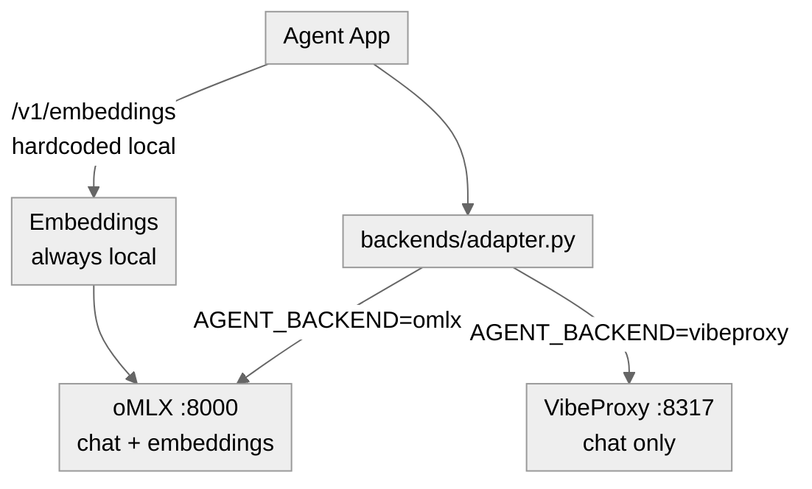
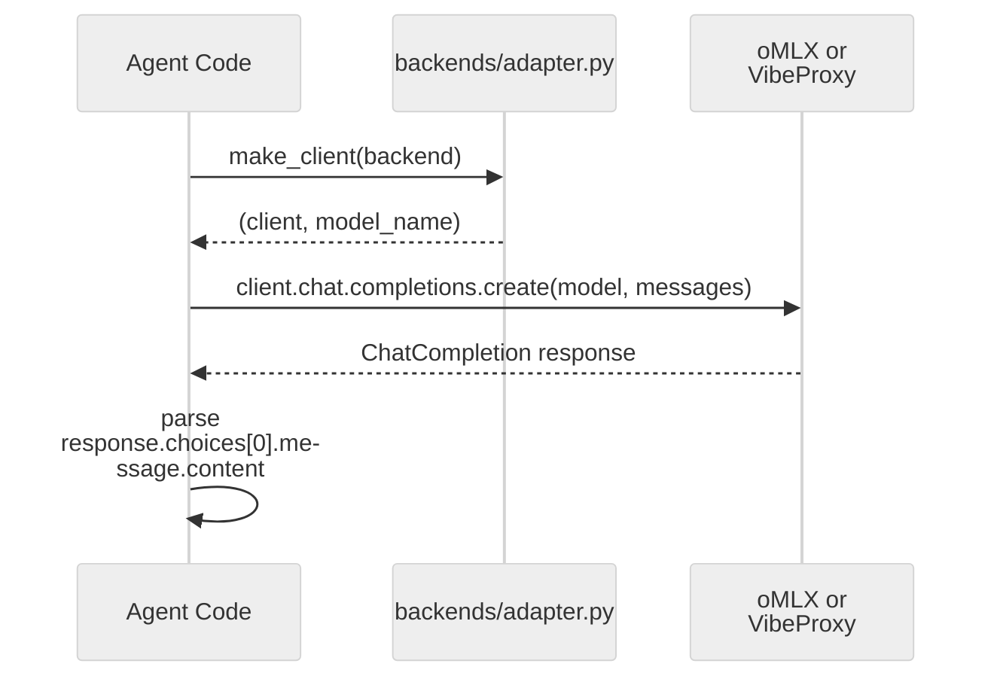

# 02 · Backends - Local oMLX and Claude MAX via VibeProxy

**What you'll learn.** This module walks you through installing and starting both local inference backends - oMLX for Apple Silicon and VibeProxy for routing your Claude MAX subscription - then wires them together behind a single unified OpenAI-compatible adapter. You will understand why embeddings always run locally regardless of which generation backend you choose, how the rate-limited (not per-token) economics change your design instincts, and how to route cheap vs. hard tasks to the right model. By the end you will have both backends running and a smoke test confirming they respond correctly.

> [!info] Prerequisites
> - [[01 - What Self-Improving Means]] - you should know what ACT → RECORD → REFLECT → LEARN means and why local-first inference matters for iterative loops

---

## Learning Objectives

- [ ] Install and start oMLX; confirm it serves chat, embeddings, and the admin UI
- [ ] Install and start VibeProxy; authenticate via OAuth with your Claude MAX subscription
- [ ] Explain the architecture split: generation = swappable, embeddings = always local
- [ ] Use `backends/adapter.py` to target either backend with one env variable
- [ ] Describe the economic model: rate-limited loops are near-free in dollars
- [ ] Apply basic model routing: small model for cheap steps, large for hard steps
- [ ] Run the smoke-test lab and interpret successful output from both backends

---

## 0. Preparation - which models to install (16-32 GB Macs)

Apple Silicon uses **unified memory** (CPU and GPU share one RAM pool), so your usable
model size is "total RAM minus what macOS + apps need" - budget roughly **6-8 GB for the
system**. A 4-bit quantized model needs about **0.5 GB per billion parameters** plus KV-cache
for context. Download these from oMLX's model browser (they come from `mlx-community` on
HuggingFace).

### If you use the LOCAL (oMLX) track

| RAM       | Cheap / router model                       | Main agent model                            | Embeddings (always local)                                 |
| --------- | ------------------------------------------ | ------------------------------------------- | --------------------------------------------------------- |
| **16 GB** | `Qwen2.5-3B-Instruct-4bit` (~2 GB)         | `Qwen2.5-Coder-7B-Instruct-4bit` (~4.5 GB)  | `Qwen3-Embedding-0.6B-4bit-DWQ` (~0.4 GB)                 |
| **32 GB** | `Qwen2.5-Coder-7B-Instruct-4bit` (~4.5 GB) | `Qwen2.5-Coder-14B-Instruct-4bit` (~8.5 GB) | `Qwen3-Embedding-0.6B` or `nomicai-modernbert-embed-base` |

Exact oMLX / HuggingFace model IDs:

- Chat 3B:  `mlx-community/Qwen2.5-3B-Instruct-4bit`
- Chat 7B:  `mlx-community/Qwen2.5-Coder-7B-Instruct-4bit`
- Chat 14B: `mlx-community/Qwen2.5-Coder-14B-Instruct-4bit`  *(32 GB)*
- Embed:    `mlx-community/Qwen3-Embedding-0.6B-4bit-DWQ`  (alts: `mlx-community/bge-small-en-v1.5-bf16`, `mlx-community/nomicai-modernbert-embed-base-bf16`)

> [!tip] 16 GB rule of thumb
> Run **one** chat model at a time, keep context <= 8-16k tokens, and prefer **7B-4bit**.
> A 7B-4bit chat model (~4.5 GB) + the embedding model (~0.5 GB) leaves ~6 GB for macOS.
> Avoid 14B+ on 16 GB - you will swap to disk and the agent loop will crawl.

> [!tip] 32 GB unlocks real model routing
> You can keep a small router model **and** a 14B worker loaded at once - exactly what
> [[08 - Self-Modification - The DGM Pattern]] uses: a strong model PROPOSES mutations, a cheap
> local model EVALUATES them. A 32B-4bit model (~18 GB) also fits if you run it solo.

### If you use the CLAUDE (VibeProxy) track

You do **not** need a local chat model - Claude does generation. But you **still must install a
local embedding model**, because VibeProxy has no embeddings endpoint and the memory layer
([[04 - Memory Systems]]) always embeds locally:

- Embed only: `mlx-community/Qwen3-Embedding-0.6B-4bit-DWQ` (~0.4 GB - fits any Mac)

> [!warning] Everyone installs the embedding model
> Both tracks need a local embedding model (e.g. `Qwen3-Embedding-0.6B-4bit-DWQ`) running in oMLX. On the Claude track, oMLX runs purely
> as a local **embeddings** server on `:8000` while generation goes to VibeProxy `:8317`.

---

## 1. oMLX - Apple Silicon Inference Server

[oMLX](https://omlx.ai) is a native macOS menu-bar application that turns your Apple Silicon chip into an OpenAI-compatible inference server. It downloads models from HuggingFace, manages model subdirectories, and auto-discovers text LLMs, VLMs, embedding models, and rerankers from those directories.

### Install and Start

1. Download the latest release from [github.com/jundot/omlx](https://github.com/jundot/omlx) and open the `.dmg`.
2. Move `oMLX.app` to `/Applications` and launch it. A menu-bar icon appears.
3. Click the icon → **Preferences** → set your models directory (e.g. `~/omlx-models`).
4. Click **Download Model** and fetch at minimum:
   - A chat model: `mlx-community/Qwen2.5-Coder-7B-Instruct-4bit` (recommended for code tasks)
   - An embedding model: `mlx-community/Qwen3-Embedding-0.6B-4bit-DWQ`
5. Click **Start Server**. The menu bar shows a green dot.

oMLX exposes two compatible APIs on the same port:

| Endpoint | Protocol |
|---|---|
| `http://localhost:8000/v1/chat/completions` | OpenAI-compatible |
| `http://localhost:8000/v1/messages` | Anthropic-compatible |
| `http://localhost:8000/v1/embeddings` | OpenAI-compatible |
| `http://localhost:8000/admin/chat` | Browser chat UI |

> [!tip] Admin Chat UI
> Visit `http://localhost:8000/admin/chat` in your browser to test a model interactively before wiring it into code. It also shows which models are loaded and their memory footprint.

> [!warning] oMLX may require an API key
> If you enabled authentication in oMLX (**Preferences -> API**), every request needs an
> `Authorization: Bearer <key>` header. Set `OMLX_API_KEY` to that key - it is used for oMLX
> **chat and embeddings**. You need it even on the Claude/VibeProxy track, because embeddings
> always go to oMLX. (A `not-needed` placeholder only works when oMLX auth is OFF.)

Verify oMLX is responding (include your key if auth is on):

```bash
curl http://localhost:8000/v1/models -H "Authorization: Bearer $OMLX_API_KEY" | python3 -m json.tool
```

You should see a list of your downloaded models with their IDs.

---

## 2. VibeProxy - Claude MAX Subscription via Local OAuth Proxy

[VibeProxy](https://github.com/automazeio/vibeproxy) is a macOS menu-bar app that authenticates you with Anthropic (and optionally OpenAI/Google) via OAuth - using your existing Claude MAX subscription - and exposes a local proxy on `http://localhost:8317`. Your code talks to VibeProxy exactly like it would talk to any OpenAI-compatible server.

> [!warning] Terms of Service
> Routing a Claude MAX subscription through a proxy may violate Anthropic's Terms of Service. Review the ToS before using VibeProxy in any production or commercial context. This curriculum uses it strictly for local, personal development.

### Install and Start

1. Download from [github.com/automazeio/vibeproxy](https://github.com/automazeio/vibeproxy) and install the `.dmg`.
2. Launch `VibeProxy.app`. A menu-bar icon appears.
3. Click the icon → **Sign in with Anthropic**. Complete the OAuth flow in your browser using your Claude MAX account.
4. The menu bar shows **Connected**. The proxy is now live at `http://localhost:8317`.

> [!tip] Find your exact model IDs
> VibeProxy exposes Anthropic-style **dated** IDs (e.g. `claude-sonnet-4-5-20250929`, `claude-sonnet-4-6`, `claude-opus-4-8`), not the bare `claude-sonnet-4-5-20250929`. List yours with `curl http://localhost:8317/v1/models` and set `VIBE_MODEL` to one of them.

VibeProxy supports the same dual-protocol surface as oMLX:

| Endpoint | Protocol |
|---|---|
| `http://localhost:8317/v1/chat/completions` | OpenAI-compatible |
| `http://localhost:8317/v1/messages` | Anthropic-compatible |

> [!danger] No Embeddings on VibeProxy
> VibeProxy exposes **chat completions only**. There is **no `/v1/embeddings` endpoint**. The Claude subscription has no embeddings API. This is the single most important architectural constraint in this curriculum - see Section 3 below.

---

## 3. The Critical Architecture Split

Every note in this curriculum builds on one fixed rule:

**Generation backend = swappable. Embeddings = always local via oMLX.**

When your agent stores memories, retrieves context, or runs similarity search (covered in [[04 - Memory Systems]]), it always calls `http://localhost:8000/v1/embeddings` regardless of which backend is running generation. This is not a workaround - it is the intended design.

```
Diagram A: Architecture overview
```



*Diagram A - The adapter routes chat generation to either backend; the embeddings path always targets oMLX directly, bypassing the adapter's backend selection.*



*Diagram B - One call through the adapter: the agent requests a client, receives an OpenAI SDK instance pointed at the correct base URL, and calls `chat.completions.create` without knowing which backend handles it.*

---

## 4. The Unified Adapter

The scaffold file `backends/adapter.py` implements the single-client pattern. Reference it in every hands-on lab rather than hardcoding URLs.

```python
# backends/adapter.py — one client, both backends
import os
from openai import OpenAI  # OpenAI SDK speaks to any OpenAI-compatible server

BACKENDS = {
    "omlx":      {"base_url": "http://localhost:8000/v1", "model": os.getenv("OMLX_MODEL", "qwen2.5-coder-7b")},
    "vibeproxy": {"base_url": "http://localhost:8317/v1", "model": os.getenv("VIBE_MODEL", "claude-sonnet-4-5-20250929")},
}

def make_client(backend=None):
    key = backend or os.getenv("AGENT_BACKEND", "omlx")
    b = BACKENDS[key]
    # oMLX may require a key (OMLX_API_KEY); VibeProxy uses OAuth and ignores it.
    api_key = os.getenv("OMLX_API_KEY", "not-needed") if key == "omlx" else os.getenv("LLM_API_KEY", "not-needed")
    return OpenAI(base_url=b["base_url"], api_key=api_key), b["model"]
```

Switch backends with a single environment variable:

```bash
# Use oMLX (default)
AGENT_BACKEND=omlx python agent/loop.py

# Use VibeProxy + Claude
AGENT_BACKEND=vibeproxy python agent/loop.py
```

The embeddings client is always hardcoded to oMLX:

```python
# Use this pattern wherever you need embeddings (see memory/store.py)
from openai import OpenAI

def make_embedding_client():
    # Always local - never routed through the generation adapter
    return OpenAI(base_url="http://localhost:8000/v1", api_key="not-needed")

def embed(text: str) -> list[float]:
    client = make_embedding_client()
    return client.embeddings.create(
        model=os.getenv("EMBED_MODEL", "nomic-embed-text"),
        input=text
    ).data[0].embedding
```

> [!note] Why not abstract embeddings through the adapter too?
> Because the abstraction would be a lie - VibeProxy has no embeddings. Hardcoding the embeddings path to oMLX makes the constraint visible and prevents a confusing runtime error when someone switches `AGENT_BACKEND=vibeproxy` and wonders why their memory layer breaks.

---

## 5. Economics - Rate-Limited, Not Per-Token

This is the mental model shift that makes iterative self-improvement practical on these backends.

**Paid API model:** every reflection call, every critique, every N-sample vote costs real money. Developers minimize LLM calls to control costs. Agentic loops with 20+ calls per task feel expensive.

**Local/subscription model:** you are rate-limited (requests per minute, tokens per minute) but not per-token-metered. A reflection loop that calls the model 15 times costs the same as a loop that calls it once - zero marginal dollars. The constraint shifts from **cost** to **throughput and rate limits**.

This matters because the patterns in this curriculum - reflection, critique, keep/discard voting, multi-sample generation - were often dismissed as "too expensive" in paid-API tutorials. Here they are essentially free in dollar terms.

> [!tip] Design For Throughput, Not Cost
> When you design loops in this curriculum, ask: "how fast can I run this?" not "how much does this call cost?". Use `asyncio` to parallelize independent calls. Batch embedding requests. Measure wall-clock latency, not token count.

The community reality check from [Reddit r/AI_Agents](https://www.reddit.com/r/AI_Agents/comments/1taei9m/stop_building_ai_agents/) makes the same point about model routing: don't default to a flagship model for every call. Cheaper and smaller models often match quality for routine steps at a fraction of the latency.

---

## 6. Model Routing

Even within a single backend, routing tasks to appropriately-sized models reduces latency and rate-limit pressure. This pattern scales up significantly when working with multiple backends - see [[08 - Self-Modification - The DGM Pattern]] for how routing decisions can themselves be self-improved.

The routing pattern in `backends/router.py` exposes a single `route()` function that maps a step's *difficulty* to a `RouteDecision` (which backend + which model + why):

```python
# backends/router.py (shipped API)
import os
from dataclasses import dataclass

@dataclass
class RouteDecision:
    backend: str       # "omlx" | "vibeproxy"
    model: str         # concrete model id to pass to chat(..., model=)
    rationale: str

# Small vs large per backend. Give these DISTINCT values in .env or routing is a no-op:
#   OMLX_SMALL_MODEL=qwen2.5-coder-3b-instruct-4bit   OMLX_LARGE_MODEL=qwen2.5-coder-7b
_OMLX_SMALL = os.getenv("OMLX_SMALL_MODEL", os.getenv("OMLX_MODEL", "qwen2.5-coder-7b"))
_OMLX_LARGE = os.getenv("OMLX_LARGE_MODEL", os.getenv("OMLX_MODEL", "qwen2.5-coder-7b"))

def route(step_difficulty: str) -> RouteDecision:
    """Map 'trivial'|'easy'|'medium'|'hard' to a backend+model choice."""
    # ... returns RouteDecision(backend=..., model=_OMLX_SMALL or _OMLX_LARGE, rationale=...)
```

Callers then pass the chosen model through: `chat(prompt, system=..., backend=d.backend, model=d.model)` - `chat()` accepts a `model=` override, so the routed model size actually takes effect.

> [!warning] Distinct small/large models or routing is a no-op
> `_OMLX_SMALL` and `_OMLX_LARGE` both fall back to `OMLX_MODEL` when `OMLX_SMALL_MODEL` / `OMLX_LARGE_MODEL` are unset. If your `.env` sets only `OMLX_MODEL`, every tier resolves to the same model and routing does nothing. Set distinct small/large model ids to see the effect.

Practical routing heuristics (the `difficulty` a step maps to):

| Task | difficulty | Rationale |
|---|---|---|
| Extract JSON fields from a response | trivial/easy | Deterministic pattern, small context |
| Classify whether a result is correct | easy | Binary judgment, short prompt |
| Generate a new agent skill from scratch | hard | Requires creativity + correctness |
| Debug a failing tool call | hard | Multi-step reasoning over stack traces |
| Summarize a long CHANGELOG entry | easy | Compression, not reasoning |
| Evaluate two approaches and choose one | hard | Comparative judgment with nuance |

> [!tip] Lite-Harness Approach
> [Lite-Harness](https://github.com/LiteLLM-Labs/lite-harness) uses a similar tiered routing pattern to keep self-hosting costs predictable - cheap models handle scaffolding work, flagship models handle the hard evals. Adopt this frugal mindset even when marginal cost is zero; it keeps latency low.

---

## 7. Hands-On Lab - Smoke Test Both Backends

**Goal:** confirm chat completions work on both oMLX and VibeProxy, and that embeddings work locally.

**Prerequisites:** oMLX running with at least one chat model and `nomic-embed-text`; VibeProxy running and authenticated.

**File:** create `scripts/smoke_test.py` in the scaffold directory.

```python
# scripts/smoke_test.py
# Smoke test: verify both backends respond and embeddings work locally.
# Run with:
#   AGENT_BACKEND=omlx      python scripts/smoke_test.py
#   AGENT_BACKEND=vibeproxy python scripts/smoke_test.py

import os
import sys
from openai import OpenAI
from backends.adapter import make_client

PROMPT = "Reply with exactly one sentence: what is 2 + 2 and why?"

def test_chat():
    backend = os.getenv("AGENT_BACKEND", "omlx")
    client, model = make_client()
    print(f"\n[Chat] backend={backend}  model={model}")
    resp = client.chat.completions.create(
        model=model,
        messages=[{"role": "user", "content": PROMPT}],
        max_tokens=80,
        temperature=0.0,
    )
    text = resp.choices[0].message.content.strip()
    print(f"  Response: {text}")
    assert len(text) > 5, "Response too short - backend may not be running"
    print("  PASS")

def test_embeddings():
    # Always oMLX regardless of AGENT_BACKEND
    embed_model = os.getenv("EMBED_MODEL", "nomic-embed-text")
    client = OpenAI(base_url="http://localhost:8000/v1", api_key="not-needed")
    print(f"\n[Embeddings] model={embed_model}  (always oMLX :8000)")
    result = client.embeddings.create(model=embed_model, input="hello world")
    vec = result.data[0].embedding
    assert len(vec) > 10, "Embedding vector is too short"
    print(f"  Vector dims: {len(vec)}")
    print("  PASS")

def test_model_routing():
    from backends.router import route
    from backends.adapter import chat
    print(f"\n[Routing] backend={os.getenv('AGENT_BACKEND', 'omlx')}")
    for difficulty in ("easy", "hard"):
        d = route(difficulty)
        reply = chat([{"role": "user", "content": f"difficulty={difficulty}: say OK"}],
                     backend=d.backend, model=d.model, max_tokens=10)
        print(f"  {difficulty:5s} -> backend={d.backend} model={d.model}  reply={reply.strip()!r}")
    print("  PASS")

if __name__ == "__main__":
    errors = []
    for test_fn in (test_chat, test_embeddings, test_model_routing):
        try:
            test_fn()
        except Exception as e:
            errors.append(f"{test_fn.__name__}: {e}")
            print(f"  FAIL: {e}")

    print("\n--- Summary ---")
    if errors:
        print(f"FAILED ({len(errors)} errors):")
        for err in errors:
            print(f"  - {err}")
        sys.exit(1)
    else:
        print("All checks passed.")
```

**Expected output (omlx backend):**

```
[Chat] backend=omlx  model=qwen2.5-coder-7b
  Response: 2 + 2 equals 4 because addition combines two equal quantities.
  PASS

[Embeddings] model=nomic-embed-text  (always oMLX :8000)
  Vector dims: 768
  PASS

[Routing] backend=omlx
  cheap  -> model=qwen2.5-coder-1.5b  reply='OK'
  hard   -> model=qwen2.5-coder-7b    reply='OK'
  PASS

--- Summary ---
All checks passed.
```

**Expected output (vibeproxy backend):**

```
[Chat] backend=vibeproxy  model=claude-sonnet-4-5-20250929
  Response: 2 + 2 equals 4 because ...
  PASS

[Embeddings] model=nomic-embed-text  (always oMLX :8000)
  Vector dims: 768
  PASS
```

Note that embeddings always show `oMLX :8000` even when `AGENT_BACKEND=vibeproxy`.

> [!example] Running the smoke test
> ```bash
> cd /Users/yuxinliu/self-improving-agent-lab
> pip install openai  # if not already installed
> AGENT_BACKEND=omlx python scripts/smoke_test.py
> AGENT_BACKEND=vibeproxy python scripts/smoke_test.py
> ```

---

## 8. Common Pitfalls

> [!warning] oMLX model ID mismatch
> The model ID you pass to the API must match what oMLX reports in `GET /v1/models`. If you installed `Qwen2.5-Coder-7B-Instruct` the ID might be `qwen2.5-coder-7b-instruct` (lowercase, with suffix). Check with `curl http://localhost:8000/v1/models` and set `OMLX_MODEL` accordingly in your `.env`.

> [!warning] VibeProxy session expiry
> The OAuth token expires. If you see 401 errors from `:8317`, click the VibeProxy menu-bar icon and re-authenticate. This happens most often after leaving the laptop idle overnight.

> [!danger] Using the adapter for embeddings when AGENT_BACKEND=vibeproxy
> If you accidentally call `make_client()` and then use the returned client for `.embeddings.create()` while `AGENT_BACKEND=vibeproxy`, you will get a 404 from VibeProxy. Always use the hardcoded `OpenAI(base_url="http://localhost:8000/v1")` client for embeddings. The [affordably self-training](https://news.ycombinator.com/item?id=48075805) approach depends on this local embedding path being reliable.

> [!warning] Port conflicts
> oMLX defaults to `:8000`. If another service (Django dev server, a Python HTTP server) is on that port, oMLX will fail silently or refuse to start. Check with `lsof -i :8000` before starting.

> [!tip] .env.example in the scaffold
> The scaffold includes `.env.example` at `/Users/yuxinliu/self-improving-agent-lab/.env.example`. Copy it to `.env` and fill in `OMLX_MODEL`, `EMBED_MODEL`, `VIBE_MODEL`, and `AGENT_BACKEND`. All labs load these via `python-dotenv` or shell export.

---

## 9. Self-Improvement Connection

These two backends are not just infrastructure - they shape what self-improvement patterns are tractable. The [Lite-Harness](https://github.com/LiteLLM-Labs/lite-harness) project demonstrates that self-hosted harnesses running on local inference can sustain hundreds of iteration cycles per hour without billing concerns. The fact that reflection loops and N-sample voting are near-free changes which algorithms you should reach for first.

When the curriculum reaches [[04 - Memory Systems]], the embeddings-always-local constraint becomes concrete: your agent's episodic memory, skill retrieval, and similarity search all depend on oMLX being healthy. When it reaches [[08 - Self-Modification - The DGM Pattern]], the routing logic in `backends/router.py` becomes an input to the agent's self-improvement - the agent can propose changes to its own routing thresholds based on observed task outcomes.

---

> [!question] Checkpoint
> 1. Why does the embeddings client ignore `AGENT_BACKEND` and always target `localhost:8000`?
> 2. You have a task that classifies a tool-call result as "success" or "failure". Which routing tier would you use, and why?
> 3. What command would you run to verify that oMLX is serving the model ID your code expects?
> 4. A colleague suggests wrapping the embeddings call in `make_client()` so the code is "consistent". What is the specific failure mode that would cause?
> 5. In a paid-API world you would minimize reflection calls to control cost. In this setup, what constraint replaces dollar cost as your primary design concern?

---

## Navigation

← [[01 - What Self-Improving Means]] · [[00 - Curriculum Map]] (home) · [[03 - The Minimal Agent Loop]] →
