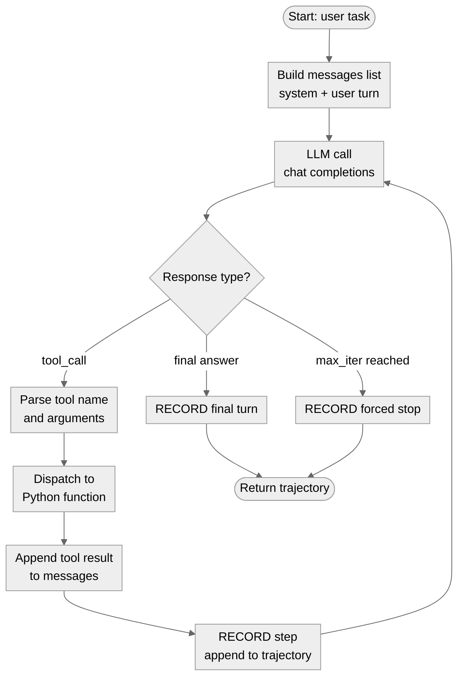
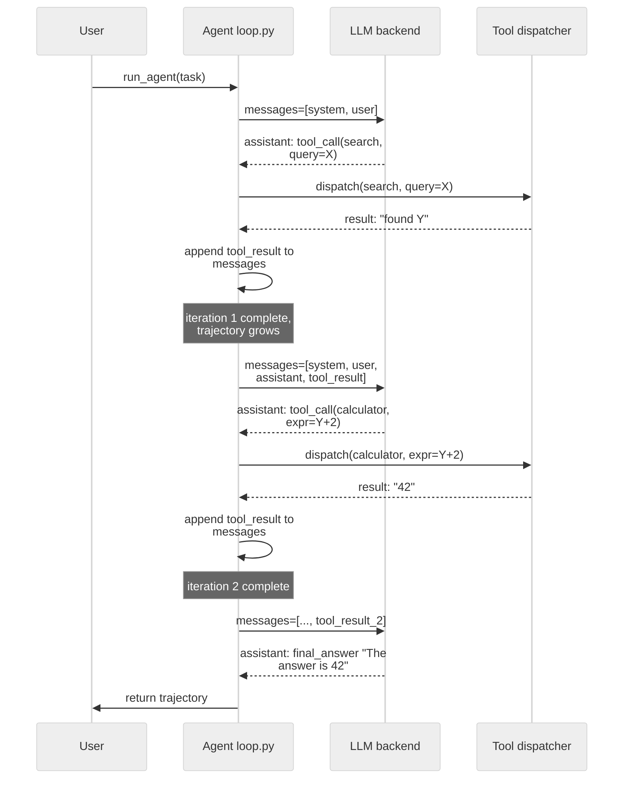

# 03 · The Minimal Agent Loop (Baseline)

**What you'll learn** - This module builds the simplest working agent loop you should ever ship: a ReAct-style ACT->observe cycle that calls tools, accumulates observations, and halts when done. More importantly, you will understand *why* this baseline comes first - without a measured baseline you have no signal to improve against. The loop you write here is also the seam every later module hooks into: memory (RECORD), reflection (REFLECT), and evaluation (VERIFY) all attach to this skeleton. By the end you will have a fully runnable `agent/loop.py` and `agent/tools.py` that works on both your local oMLX server and VibeProxy.

> [!info] Prerequisites
> - [[02 - Backends - oMLX and VibeProxy]] - you need a working backend before running the loop

---

## Learning Objectives

- [ ] Explain the ACT->observe loop and why a stop condition is non-trivial
- [ ] Describe what a tool schema is and how the LLM uses it to emit structured calls
- [ ] Implement a minimal dispatcher that routes tool calls to Python functions
- [ ] Understand "trajectory capture" as the architectural seam for RECORD and REFLECT
- [ ] Run the baseline loop against both `AGENT_BACKEND=omlx` and `AGENT_BACKEND=vibeproxy`
- [ ] Articulate why a stable, measured baseline is required before any self-improvement attempt

---

## 1 · Why Start With a Baseline?

The entire curriculum follows ACT -> RECORD -> REFLECT -> LEARN, gated by VERIFY. Every arrow after ACT is about *improving* the agent. But improvement is a relative term - you need a reference point.

> [!warning] You cannot improve what you cannot measure
> If you skip the baseline and jump straight to self-modification, you have no ground truth. Did the reflection step actually help? Did the new skill make things faster or just different? Without a baseline trajectory to compare against, you are optimizing blindly. The [[10 - Evaluation Harness]] module will automate this comparison, but it compares *against* the runs you capture here.

The baseline also serves as a stability check. [henrypan's 1,000-harness-experiment writeup](https://www.henrypan.com/blog/2026-05-25-self-improvement-harness/) identifies "baseline drift" as the top cause of false positives in self-improvement metrics - agents that appear to improve but are actually just behaving differently on shifted inputs. Lock in the baseline first.

---

## 2 · The ReAct Loop, Explained

ReAct (Reason + Act) is the pattern where the model alternates between a reasoning step ("I need to look up X") and an action step (calling a tool). The loop runs until the model emits a special stop signal instead of a tool call.

The minimal loop has four elements:

| Element | What it is | Where it lives |
|---|---|---|
| **System prompt** | Defines the agent's role, available tools, and output format | `agent/loop.py` |
| **Tool schema** | JSON description of each tool (name, description, parameters) | `agent/tools.py` |
| **Dispatcher** | Routes a parsed tool call to a Python function, returns the result | `agent/tools.py` |
| **Trajectory** | The full list of messages (user, assistant, tool_result) from start to finish | `agent/loop.py` |

The trajectory is the most important data structure in the curriculum. It is the raw material for RECORD ([[04 - Memory Systems]]), the input to REFLECT ([[05 - Reflection and Self-Correction]]), and the unit of measurement for VERIFY ([[10 - Evaluation Harness]]).

> [!note] The loop you are building IS the harness
> These four elements - prompt, tool schema, dispatcher, trajectory - are collectively the agent's **harness**: the code *around* the model. In 2026 this became a named discipline, "harness engineering," framed as the third phase after prompt engineering and context engineering ([O'Reilly Radar](https://www.oreilly.com/radar/agent-harness-engineering/)). [OpenAI's account of building Codex agent-first](https://openai.com/index/harness-engineering/) captures the mindset shift: "Humans steer. Agents execute," and "give the agent a map, not a 1,000-page instruction manual." Why it matters for a *self-improving* agent: most of the surface a subscription/local builder can actually change to get better is the harness (the model weights are frozen), and harness choices alone can swing benchmark performance by multiples (see [[10 - Evaluation Harness]]). Everything you self-modify in [[08 - Self-Modification - The DGM Pattern]] lives in this harness.
>
> The operational, scheduling-and-stopping side of this - turning a one-shot run into a recurring process with memory, verification, and boundaries - is increasingly called *loop engineering* ([explainx.ai](https://explainx.ai/blog/loop-engineering-coding-agents-claude-code-guide-2026)). Without a verifiable stopping condition a loop either ends prematurely or spins forever, which is why the VERIFY gate in [[07 - Verification Gates and Layered Control]] is load-bearing for any loop you leave running unattended.

---

## 3 · Diagrams

### 3.1 - ACT/Observe Flowchart



*The loop re-enters the LLM after every tool result. The only exits are a final-answer turn or a hard iteration cap.*

---

### 3.2 - Sequence Over Two Iterations



*Each LLM call receives the full accumulated message history. The agent has no memory beyond what is in `messages`.*

---

## 4 · Tool Schema and Dispatch

The LLM does not call Python functions directly - it emits a structured JSON object describing what it wants to call. Your dispatcher translates that into an actual function call.

### 4.1 - Defining a Tool

Tools are described in JSON Schema format. The OpenAI `tools` parameter expects a list of objects with this shape:

```python
# agent/tools.py

TOOLS = [
    {
        "type": "function",
        "function": {
            "name": "web_search",
            "description": "Search the web for up-to-date information. Use when the task requires facts you do not have.",
            "parameters": {
                "type": "object",
                "properties": {
                    "query": {
                        "type": "string",
                        "description": "The search query string"
                    }
                },
                "required": ["query"]
            }
        }
    },
    {
        "type": "function",
        "function": {
            "name": "calculator",
            "description": "Evaluate a simple arithmetic expression. Returns a number.",
            "parameters": {
                "type": "object",
                "properties": {
                    "expression": {
                        "type": "string",
                        "description": "A Python-evaluable arithmetic expression, e.g. '3 * (7 + 2)'"
                    }
                },
                "required": ["expression"]
            }
        }
    },
    {
        "type": "function",
        "function": {
            "name": "read_file",
            "description": "Read the contents of a file by path. Returns the text content.",
            "parameters": {
                "type": "object",
                "properties": {
                    "path": {
                        "type": "string",
                        "description": "Absolute or relative path to the file"
                    }
                },
                "required": ["path"]
            }
        }
    }
]
```

### 4.2 - Implementing the Dispatcher

The dispatcher is a simple registry pattern - a dict mapping tool names to callables.

```python
# agent/tools.py (continued)

import math
import pathlib
import json

# --- Tool implementations ---

def _web_search(query: str) -> str:
    """Stub - replace with real search (e.g., DuckDuckGo API or Exa)."""
    return f"[stub] Search results for: {query}\n- Result 1\n- Result 2"

def _calculator(expression: str) -> str:
    """Evaluate a safe arithmetic expression."""
    # Restrict to math operations - never use bare eval on untrusted input.
    allowed_names = {k: v for k, v in math.__dict__.items() if not k.startswith("_")}
    allowed_names.update({"abs": abs, "round": round})
    try:
        result = eval(expression, {"__builtins__": {}}, allowed_names)  # noqa: S307
        return str(result)
    except Exception as exc:
        return f"Error evaluating expression: {exc}"

def _read_file(path: str) -> str:
    """Read a file, truncate to 4 KB to avoid blowing up the context."""
    try:
        content = pathlib.Path(path).read_text(encoding="utf-8")
        if len(content) > 4096:
            content = content[:4096] + "\n... [truncated at 4 KB]"
        return content
    except Exception as exc:
        return f"Error reading file: {exc}"


# Registry: name -> callable with keyword arguments matching the schema
TOOL_REGISTRY: dict[str, callable] = {
    "web_search": lambda **kw: _web_search(**kw),
    "calculator": lambda **kw: _calculator(**kw),
    "read_file":  lambda **kw: _read_file(**kw),
}


def dispatch(tool_name: str, tool_args: dict) -> str:
    """Route a parsed tool call to its implementation. Always returns a string."""
    fn = TOOL_REGISTRY.get(tool_name)
    if fn is None:
        return f"Unknown tool: {tool_name}"
    try:
        return fn(**tool_args)
    except Exception as exc:
        return f"Tool error in {tool_name}: {exc}"
```

> [!tip] Keep tool implementations thin
> The dispatcher layer is not the place for complex logic. Each tool function should do one thing and return a string. Complex orchestration belongs in `loop.py`.

---

## 5 · The Full Minimal Loop

The loop is built on **agentkit** — a thin, production-shaped library that provides the ReAct cycle, tool dispatch, and trajectory capture so the scaffold code stays focused on wiring, not re-implementing the wheel.

> [!info] In the lab: `agentkit.agent`
> The lab's `agent/loop.py` is a thin wrapper that wires the oMLX/VibeProxy client and the tools dict, then delegates to `agentkit.run_agent`. The whole agent is composed in `scaffold/lab_agent.py` as `agentkit.SelfImprovingAgent.from_config(cfg, backend=OMLXClient(), embedder=OMLXEmbedder(), memory_path=...)`. You do not need to hand-roll the iteration loop — agentkit owns it.
>
> Install: `pip install "git+https://github.com/shaneliuyx/agentkit"` or from source `pip install -e path/to/agentkit`.

### The agentkit API (what the loop uses)

```python
from agentkit import run_agent, run_role, AgentResult, RESEARCHER, REVIEWER
```

`run_agent` is the core entry point:

```python
result: AgentResult = run_agent(
    task,                  # str — the user task
    client,                # LLMClient — injected backend (oMLX or VibeProxy adapter)
    tools=TOOL_REGISTRY,   # dict[str, handler] or ToolRegistry
    system_prompt=SYSTEM_PROMPT,
    max_rounds=MAX_ROUNDS,
    memory=None,           # optional MemoryStore (wired in module 04)
)
```

`AgentResult` fields you will use throughout the curriculum:

| Field | Type | Meaning |
|---|---|---|
| `.answer` | `str` | The agent's final answer text |
| `.trajectory` | `list[TrajectoryStep]` | Every (action, observation) pair — the RECORD/REFLECT seam |
| `.stop_reason` | `str` | `"answer"` \| `"max_rounds"` \| `"error"` \| `"interrupted"` |
| `.rounds_used` | `int` | How many tool-call rounds were consumed |
| `.success` | `bool` | `True` when `stop_reason == "answer"` |

`run_role` is a convenience wrapper when you want a preconfigured system prompt:

```python
result = run_role(RESEARCHER, task, client, tools=TOOL_REGISTRY, max_rounds=10)
```

Presets — `RESEARCHER`, `REVIEWER`, `WRITER`, `VERIFIER` — each supply a role-specific system prompt. Used in later modules; mentioned here so the API surface is clear.

### What `agent/loop.py` looks like in the lab

The lab keeps a thin `agent/loop.py` that wires the oMLX client and the tool registry, then delegates entirely to agentkit:

```python
# agent/loop.py
"""
Minimal ReAct agent loop — delegates to agentkit.run_agent.

Usage:
    AGENT_BACKEND=omlx      python -m agent.loop
    AGENT_BACKEND=vibeproxy python -m agent.loop

Environment:
    AGENT_BACKEND  - "omlx" or "vibeproxy" (default: omlx)
    OMLX_MODEL     - model name served by oMLX (default: qwen2.5-coder-7b)
    VIBE_MODEL     - model name for VibeProxy (default: claude-sonnet-4-5-20250929)
    MAX_ROUNDS     - hard cap on tool-call rounds (default: 10)
"""

import os
import sys

from agentkit import run_agent, AgentResult
from backends.adapter import make_client
from agent.tools import TOOL_REGISTRY   # dict[str, handler]


MAX_ROUNDS = int(os.getenv("MAX_ROUNDS", "10"))

SYSTEM_PROMPT = """\
You are a precise, tool-using assistant. You have access to tools described in the tools list.

Rules:
1. Think step by step before acting.
2. Call ONE tool at a time.
3. After each tool result, decide: do you have enough information to answer, or do you need another tool?
4. When you have a final answer, respond in plain text WITHOUT a tool call.
5. Be concise. Do not repeat information from tool results verbatim.
"""


def loop(task: str, verbose: bool = True) -> AgentResult:
    """
    Run the minimal agent loop for a given task.

    Returns an AgentResult whose .trajectory is the primary artifact
    for RECORD (module 04) and REFLECT (module 05).
    """
    client, _model = make_client()

    result: AgentResult = run_agent(
        task,
        client,
        tools=TOOL_REGISTRY,
        system_prompt=SYSTEM_PROMPT,
        max_rounds=MAX_ROUNDS,
    )

    if verbose:
        print(f"\nStop reason : {result.stop_reason}")
        print(f"Rounds used : {result.rounds_used}")
        print(f"Answer      : {result.answer}")

    return result


# --- CLI entry point ---
if __name__ == "__main__":
    task = " ".join(sys.argv[1:]) or "What is 17 * 23? Show your working."
    result = loop(task)
    print("\n=== Trajectory summary ===")
    print(f"Steps   : {len(result.trajectory)}")
    print(f"Success : {result.success}")
```

> [!note] `AgentResult.trajectory` is the RECORD seam
> `result.trajectory` is the list of `TrajectoryStep` objects agentkit accumulates across all rounds. When [[04 - Memory Systems]] introduces `memory/store.py`, it reads this field to index runs by task, model, backend, and outcome. When [[10 - Evaluation Harness]] compares runs, it reads `result.stop_reason` and `result.rounds_used`. The `_meta` dict from the hand-rolled version is superseded — downstream consumers should read `AgentResult` fields directly.

---

## 6 · Hands-On Lab

### Setup

Make sure your scaffold directory exists and your backend is running.

```bash
# oMLX must be running (menu-bar icon active, model loaded)
# OR VibeProxy must be running on port 8317

cd /Users/yuxinliu/self-improving-agent-lab
pip install openai python-dotenv   # if not already installed
```

Copy `.env.example` to `.env` and confirm:

```
AGENT_BACKEND=omlx
OMLX_MODEL=qwen2.5-coder-7b
MAX_ROUNDS=10
```

### Step 1 - Run a simple arithmetic task

```bash
AGENT_BACKEND=omlx python -m agent.loop "What is the square root of 144 plus 7?"
```

Expected flow: the agent calls `calculator` once, gets `12.0 + 7 = 19.0`, then returns a final answer. You should see `stop_reason: answer` and `rounds_used: 1` logged.

### Step 2 - Run the same task on VibeProxy

```bash
AGENT_BACKEND=vibeproxy python -m agent.loop "What is the square root of 144 plus 7?"
```

The output should be semantically identical. The only difference is the model wired into the injected client. This is the point of the unified adapter - backends are interchangeable for the loop.

> [!warning] VibeProxy ToS note
> Routing your Claude subscription through VibeProxy may violate Anthropic's Terms of Service. Use it for personal development only - do not build commercial products on top of it.

### Step 3 - Inspect the trajectory

Add a small script to pretty-print the trajectory:

```python
# scripts/show_trajectory.py
import sys
from agent.loop import loop

task = " ".join(sys.argv[1:]) or "Read the file GOAL.md and summarise it in one sentence."
result = loop(task, verbose=False)

print(f"stop_reason : {result.stop_reason}")
print(f"rounds_used : {result.rounds_used}")
print(f"answer      : {result.answer}")
print(f"\nTrajectory ({len(result.trajectory)} steps):")
for i, step in enumerate(result.trajectory):
    print(f"  [{i}] {step}")
```

Run it:

```bash
python scripts/show_trajectory.py "What is 6 * 7?"
```

You will see every `TrajectoryStep` agentkit accumulated — each (action, observation) pair. The `result.stop_reason` and `result.rounds_used` fields are what [[04 - Memory Systems]] will index when persisting this run.

### Step 4 - Observe the stop condition

Try a task that requires no tools:

```bash
python -m agent.loop "What is the capital of France? Answer directly without using any tools."
```

The agent should emit a final answer in round 1 with no tool calls. You should see `stop_reason: answer` and `rounds_used: 1`. This confirms that agentkit's stop condition fires correctly when the model skips tools entirely.

### Step 5 - Stress the round cap

```bash
MAX_ROUNDS=3 python -m agent.loop "Search for 'self-improving agents', then search for 'ReAct paper', then search for 'tool use survey', then give me a combined summary."
```

With `MAX_ROUNDS=3` and three required searches, the loop will exhaust rounds and report `stop_reason: max_rounds`. This is the failure mode [[05 - Reflection and Self-Correction]] addresses by teaching the agent to plan more efficiently before acting.

---

## 7 · Trajectory Capture as an Architectural Seam

`AgentResult.trajectory` is not just a log - it is the primary interface between modules:

```
agent/loop.py  -->  AgentResult.trajectory  (list[TrajectoryStep])
                         |
          ┌──────────────┼──────────────────┐
          v              v                  v
  memory/store.py   reflection/reflect.py   evals/run.py
  (RECORD step)     (REFLECT step)          (VERIFY step)
```

Every downstream module takes the trajectory as input and returns either a stored artifact (memory), a critique (reflection), or a score (eval). The loop itself never changes - only the consumers grow. This is the "open/closed" principle applied to agent architecture: the loop is closed for modification, open for extension.

> [!example] What a TrajectoryStep looks like
> Each `TrajectoryStep` in `result.trajectory` captures one (action, observation) pair:
> ```python
> step.action    # the tool call the agent chose: name + arguments
> step.observation  # the string result returned by the tool
> step.round     # which round this occurred in (1-indexed)
> ```
> The `action` field is what the reflection module reads to understand *what the agent chose to do*. The `observation` field records *what happened*. Together they form the atom of ReAct reasoning - the same concept as the message pairs in the old messages list, now surfaced through a typed interface.

---

## 8 · Economics of Looping on Local Backends

On paid APIs, every iteration of the loop costs money - a 10-iteration trace might cost $0.10-$0.50 depending on the model and context length. This creates pressure to minimize iterations, which can produce brittle, under-reasoned agents.

On oMLX or VibeProxy, the constraint is different: you are rate-limited by local throughput (tokens/second on your M-series chip) and, for VibeProxy, by Anthropic's subscription rate limits. You are NOT metered per token.

> [!tip] Design for throughput, not cost
> Because iterations are not per-token-billed, you can afford to be generous with the iteration cap. A cap of 20-30 is reasonable for complex tasks. What you DO need to guard against is infinite loops (bad stop conditions) and rate-limit exhaustion (too many parallel loops). The [community consensus](https://www.reddit.com/r/AI_Agents/comments/1taei9m/stop_building_ai_agents/) is that "human-in-the-loop on the final execution step saves 90% of the headache" - the iteration cap is your automated version of that gate.

---

## 9 · Common Pitfalls

> [!danger] Pitfall: forgetting the tool_call_id in tool results
> The OpenAI tool-use format requires every `role: tool` message to include the `tool_call_id` that matches the assistant's request. If you omit it, the API returns a 400 error or the model becomes confused. agentkit handles this internally; the pitfall re-surfaces if you ever bypass `run_agent` and assemble messages manually.

> [!danger] Pitfall: bare eval() in tool implementations
> The `calculator` tool uses `eval()` with a restricted namespace. Never use bare `eval(user_input)` in a tool - it is a code-injection vector. If you expose the agent to untrusted tasks, use a proper expression parser (e.g., `asteval`, `sympy.parsing.sympy_parser`).

> [!warning] Pitfall: mutable default arguments in message lists
> A common Python bug: `def run_agent(messages=[])`. Python creates one list object at import time. Use `messages: list | None = None` and initialize inside the function. agentkit's `run_agent` does this correctly internally; the pitfall applies to any hand-rolled helpers you write around it.

> [!warning] Pitfall: treating the baseline as permanent
> The baseline loop is NOT the target architecture - it is the measurement instrument. Do not add memory, reflection, or self-modification to `agent/loop.py`. Those belong in the modules that wrap or consume it. Mixing them in makes it impossible to isolate which change caused a performance difference.

> [!note] Pitfall: no stop condition beyond tool_calls
> What happens if the model returns `tool_calls=[]` but also returns empty `content`? This can happen with some local models that are not well-tuned for tool use. agentkit detects this and sets `stop_reason = "error"` rather than looping forever. Check `result.stop_reason` after every `run_agent` call.

> [!warning] Pitfall (verified on oMLX): small local models emit tool calls as TEXT
> Models like `Qwen2.5-Coder-7B` served by oMLX often do **not** return the structured `tool_calls` field - the call comes back inside `content` as text, e.g. `<tools>{"name": "calculator", "arguments": {"expression": "17 * 23 + 5"}}</tools>`. A loop that only checks `message.tool_calls` treats that as the final answer and never runs the tool. This fallback parsing lives in the lab's **adapter layer** (`backends/adapter.py`), not in agentkit itself. Verified live 2026-05-31: tool use now returns `396` on **both** oMLX (text fallback in adapter) and VibeProxy/Claude (native `tool_calls`).

---

## 10 · Forward References

The baseline loop you built here is the ACT step. The rest of the curriculum adds:

- [[04 - Memory Systems]] - the RECORD step: persist trajectories so the agent can learn from past runs
- [[05 - Reflection and Self-Correction]] - the REFLECT step: critique trajectories, extract heuristics
- [[10 - Evaluation Harness]] - the VERIFY gate: score trajectories against baseline to detect regression

The [Darwin Godel Machine paper](https://arxiv.org/abs/2505.22954) shows that even the most advanced self-modifying systems start from a stable agent baseline - their agents went from 20% to 50% on SWE-bench, but only because they had a rigorous baseline to measure improvement against. The lesson scales down: your local loop is your SWE-bench baseline.

---

> [!question] Checkpoint
> 1. Why must you establish a baseline before attempting any self-improvement? What goes wrong if you skip this step?
> 2. What is the role of `tool_call_id` in the OpenAI tool-use message format, and what error occurs if you omit it?
> 3. Trace through the sequence diagram in section 3.2: after iteration 2, the messages list has how many entries? List them in order by role.
> 4. `AgentResult` has five fields: `.answer`, `.trajectory`, `.stop_reason`, `.rounds_used`, `.success`. Which field does [[04 - Memory Systems]] use to index runs, and which does [[10 - Evaluation Harness]] use to detect regression?
> 5. On a local backend (oMLX or VibeProxy), what is the primary resource constraint on loop iterations? How does this differ from a paid API?

---

## Navigation

← [[02 - Backends - oMLX and VibeProxy]] · [[00 - Curriculum Map]] (home) · [[04 - Memory Systems]] →
