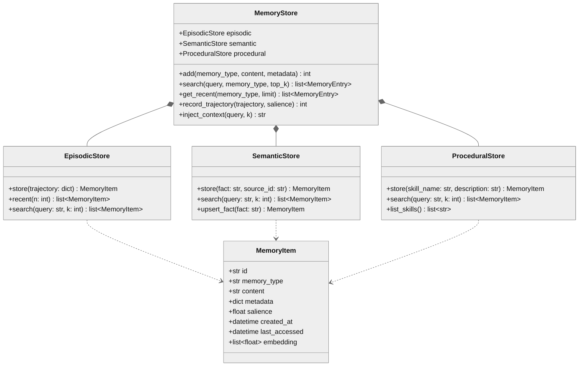
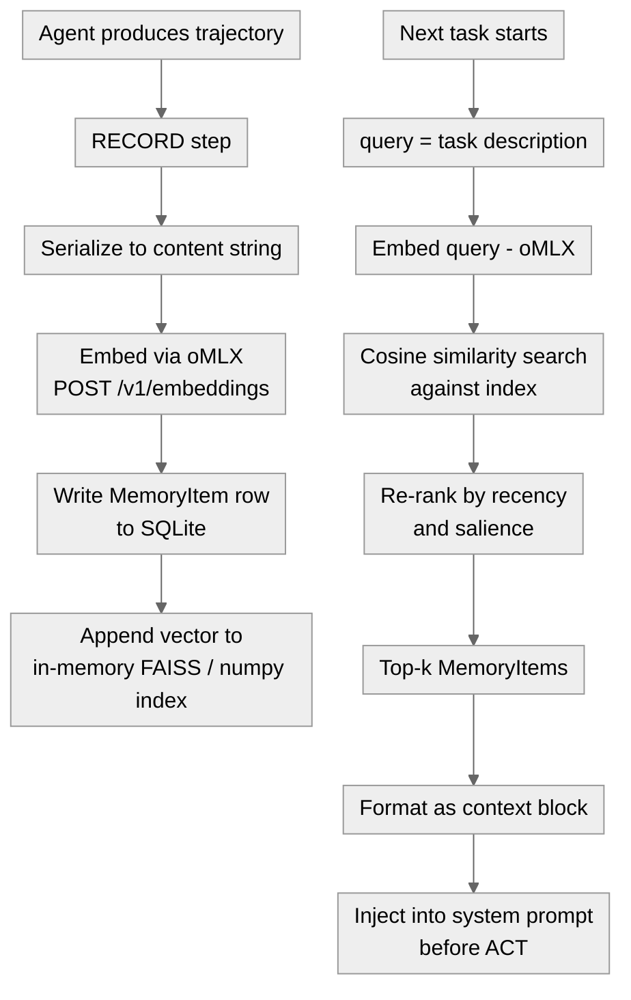

# 04 · Memory - Episodic, Semantic, Procedural

**What you'll learn:** Every time an agent acts, it generates raw experience - tool calls, reasoning traces, outcomes, failures. Without a memory layer, that experience evaporates and the agent restarts blind on every session. This module builds the "experience layer": how to classify what happened into three reusable memory types (episodic, semantic, procedural), store them in a lightweight SQLite + local-vector index, retrieve the right memories at query time using similarity and recency, and write them back as part of the RECORD step in the ACT - RECORD - REFLECT - LEARN loop. In the lab you will wire `agentkit.memory.MemoryStore` — a public SQLite + numpy vector store with an injected embedder — rather than building that plumbing from scratch.

> [!info] Prerequisites
> - [[03 - The Minimal Agent Loop]] - you need a running agent loop before adding a memory layer
> - [[02 - Backends - oMLX and VibeProxy]] - embeddings always run locally through oMLX

---

## Learning Objectives

- [ ] Distinguish episodic, semantic, and procedural memory and give one concrete agent example of each
- [ ] Explain why embeddings must be local even when generation runs through VibeProxy
- [ ] Use `agentkit.MemoryStore` (SQLite + numpy, injected embedder) to persist episodic and semantic entries
- [ ] Explain the blended retrieval score (cosine similarity + recency decay + salience) and why `agentkit` tracks `access_count`/`last_used` per entry
- [ ] Hook `.add()` into the agent loop's RECORD step and `.inject_context()` into the prompt-building step so experience accumulates automatically
- [ ] Describe what [MemEvolve](https://arxiv.org/pdf/2512.18746) and [Komi-learn](https://github.com/kurikomi-labs/komi-learn) do differently from a plain append log

---

## 1. The Three Memory Types

Cognitive science splits human memory into systems with different storage and retrieval characteristics. The same taxonomy maps cleanly onto agents.

| Type | What it stores | Agent example | Decay |
|---|---|---|---|
| **Episodic** | Past events, trajectories, outcomes | "I tried `pytest -k auth` and got 3 failures at 14:02" | High - specific events become stale |
| **Semantic** | Facts, knowledge, beliefs about the world | "The test suite uses `conftest.py` fixtures; `db` fixture is slow" | Low - facts stay relevant |
| **Procedural** | How-to skills, reusable action sequences | "To add a migration: `alembic revision --autogenerate` then `alembic upgrade head`" | Medium - skills may version |

Episodic memory is raw trajectory storage - what happened, in order, with metadata. Semantic memory is distilled facts extracted from episodes. Procedural memory is the pointer into the skill library (see [[06 - Skill Acquisition and Curation]]). All three feed the REFLECT step (see [[05 - Reflection and Self-Correction]]).

> [!note] The experience layer sits between ACT and REFLECT
> ACT produces a trajectory. RECORD embeds and stores it. REFLECT reads memory to critique. LEARN writes back new semantic or procedural entries. Memory is the substrate that makes improvement cumulative rather than ephemeral.

---

## 2. Architecture Overview

### 2.1 Class Diagram



*Three typed stores unified under `MemoryStore`; each `MemoryItem` carries its embedding for in-process similarity search.*

### 2.2 RECORD - Retrieve Flow



*Left branch: RECORD writes experience to persistent storage. Right branch: retrieval fetches relevant memories before the next ACT.*

---

## 3. What to Store vs. What to Skip

Not every token an agent produces deserves a memory slot. Indiscriminate storage fills the index with noise and degrades retrieval precision.

**Store:**
- Task outcomes (success / failure, with the key observation)
- Tool call results that revealed something non-obvious about the environment
- Corrected errors and the fix that worked
- Distilled facts the agent explicitly extracts during REFLECT
- Skill descriptions added to the procedural store

**Skip:**
- Pure scaffolding messages (system prompt boilerplate, filler tool preambles)
- Intermediate reasoning steps that were superseded in the same trajectory
- Duplicate facts that differ only in phrasing (use upsert for semantic entries)
- Any content containing secrets or credentials (see [[09 - Sandboxing and Safe Execution]])

> [!warning] Quality beats quantity
> [MemEvolve](https://arxiv.org/pdf/2512.18746) shows that naive append-only memory degrades agent performance as the index grows - retrieval precision falls below baseline at ~10k entries without quality filtering. Salience scoring and periodic consolidation matter.

---

## 4. Retrieval: Similarity + Recency + Salience

A plain cosine-similarity ranking has two failure modes:

1. **Recency blindness** - a highly similar but 6-month-old memory about a different codebase outranks a moderately similar memory from yesterday.
2. **Salience blindness** - an episode where the agent made and corrected a critical mistake scores the same as a boring success.

The retrieval score blends all three signals:

```
score(item) = α * cosine_sim(query_vec, item.embedding)
            + β * recency(item.created_at)
            + γ * item.salience
```

Where `recency` is an exponential decay: `exp(-λ * hours_since_creation)`. Default weights: α=0.6, β=0.2, γ=0.2. Adjust per use-case - code agents weight recency higher (APIs change); general-knowledge agents weight salience higher.

---

## 5. Hands-On Lab - `memory/store.py` on agentkit

This lab wires the scaffold file at `memory/store.py` to `agentkit.memory.MemoryStore` rather than building SQLite and vector-index plumbing from scratch.

> [!info] In the lab: `agentkit.memory`
> The lab's `memory/store.py` **subclasses** `agentkit.memory.MemoryStore`, adding the oMLX embedder (`OMLXEmbedder`) via constructor injection. The agent itself is wired in `scaffold/lab_agent.py` through `SelfImprovingAgent.from_config(..., embedder=OMLXEmbedder(), memory_path=...)`, and `run_agent(..., memory=store)` injects `.inject_context` into every prompt-building step automatically. You interact with `LabMemoryStore` exactly as you would with `MemoryStore` — the agentkit API is the surface.

### 5.1 Dependencies

Add to `requirements.txt`:
```
agentkit>=0.1
numpy>=1.26
openai>=1.30
```

`agentkit` ships its own SQLite + numpy vector store — no FAISS, no `sqlite-utils` boilerplate required. Embeddings still call oMLX locally via the injected `OMLXEmbedder`.

### 5.2 The Store Module

```python
# memory/store.py
"""
Lab memory store: subclasses agentkit.memory.MemoryStore, wiring the oMLX embedder.
Embeddings always use oMLX at http://localhost:8000/v1 - never VibeProxy (chat-only).
"""

from __future__ import annotations

from pathlib import Path
from openai import OpenAI
from agentkit import MemoryStore, MemoryEntry

# ---------------------------------------------------------------------------
# oMLX embedder - injected so agentkit never calls a remote endpoint
# ---------------------------------------------------------------------------

class OMLXEmbedder:
    """Embedder backed by the local oMLX server. Implements agentkit's Embedder protocol."""

    _client = OpenAI(base_url="http://localhost:8000/v1", api_key="not-needed")
    _model = "nomic-embed-text"

    def embed(self, texts: list[str]) -> list[list[float]]:
        resp = self._client.embeddings.create(model=self._model, input=texts)
        return [item.embedding for item in resp.data]


# ---------------------------------------------------------------------------
# Lab store - extends MemoryStore with the local embedder pre-wired
# ---------------------------------------------------------------------------

class LabMemoryStore(MemoryStore):
    """MemoryStore subclass that wires OMLXEmbedder automatically."""

    def __init__(self, db_path: str | Path = "memory/store.db"):
        super().__init__(db_path=db_path, embedder=OMLXEmbedder())
```

Key points on the agentkit API used here:

- `MemoryStore(db_path, embedder)` — SQLite persistence + numpy vector index, no external services.
- The `embedder` receives a list of texts and returns `list[list[float]]` — `OMLXEmbedder.embed()` satisfies this.
- `LabMemoryStore` adds nothing beyond wiring; all downstream code calls the standard `MemoryStore` methods.

### 5.3 Writing and Searching Memories

```python
# Episodic: record a task trajectory (RECORD step)
entry_id = store.add(
    memory_type="episodic",
    text="Fixed test_auth_middleware: JWT expiry check was missing a timezone offset.",
    source="task_loop/run_001",   # provenance tag — P34: evidence before belief
    metadata={"outcome": "success", "salience": 0.6},
)

# Semantic: distilled fact extracted during REFLECT
store.add(
    memory_type="semantic",
    text="The auth middleware checks JWT expiry before role validation.",
    source="reflect/code_review_001",  # P34: where this belief came from
)

# Search (bumps access_count + last_used on every hit — P36 retention loop)
results: list[MemoryEntry] = store.search("authentication middleware test failure", top_k=3)
for entry in results:
    print(f"[{entry.memory_type}] (seen {entry.access_count}x) {entry.text[:80]}")
    print(f"  provenance: {entry.source}")  # P34: trace belief to its origin

# Count entries by type
print(store.count())                  # total
print(store.count(memory_type="episodic"))

# Evict coldest entries to bound the store (P36 retention)
evicted = store.evict_coldest(keep=500)   # removes lowest access_count / oldest last_used
print(f"Evicted {evicted} cold entries")
```

The `.add()` `source` argument is the curriculum's **P34 evidence-before-belief** principle made concrete: every memory entry carries a provenance tag so the agent can trace where a belief came from. `MemoryEntry.source` surfaces it at read time.

The `.search()` call increments `entry.access_count` and updates `entry.last_used` — these are the **P36 read/retention** signals that `evict_coldest` consults when pruning.

### 5.4 Wiring RECORD and inject_context into the Agent Loop

In the scaffold, `scaffold/lab_agent.py` handles wiring automatically via `run_agent(..., memory=store)`. For reference, the pattern it implements is:

```python
# scaffold/lab_agent.py  (simplified illustration — read the real file)
from memory.store import LabMemoryStore

store = LabMemoryStore(db_path="memory/store.db")

def build_system_prompt(task: str) -> str:
    # inject_context searches memory and returns a ready-to-prompt block;
    # degrades to empty string on failure rather than breaking the loop
    mem_ctx = store.inject_context(task, k=4)
    base = "You are a coding agent. Solve the task using the provided tools."
    return f"{mem_ctx}\n\n{base}" if mem_ctx else base

def after_task(task: str, outcome: str, steps: list) -> None:
    """RECORD step - called after every task cycle."""
    import json
    salience_flag = "failure" if outcome == "failure" else "success"
    store.add(
        memory_type="episodic",
        text=json.dumps({"task": task, "outcome": outcome, "steps": steps})[:4096],
        source=f"task_loop/{salience_flag}",
    )
```

`.inject_context(query, k=4)` returns a formatted `<memory_context>` block (empty string on any error) — it is safe to call unconditionally before every ACT step.

### 5.5 Running the Lab

```bash
# Start oMLX (pull an embedding model first in the menu-bar app)
# Then from the lab root:

cd /Users/yuxinliu/self-improving-agent-lab
python - <<'EOF'
from memory.store import LabMemoryStore

store = LabMemoryStore()

# Write entries across memory types
store.add("episodic", "Fixed test_auth_middleware: 3 failures patched.", source="task_loop/run_001")
store.add("semantic", "The auth middleware checks JWT expiry before role validation.", source="reflect/001")
store.add("procedural", "SKILL: run_migrations\ncd project && alembic upgrade head", source="skill_lib")

# Retrieve - bumps access_count/last_used on each hit
results = store.search("authentication middleware test failure", top_k=3)
for e in results:
    print(f"[{e.memory_type}] (hits={e.access_count}) src={e.source} | {e.text[:80]}")

# Bound the store
evicted = store.evict_coldest(keep=100)
print(f"Evicted {evicted} cold entries; total now: {store.count()}")

store.close()
EOF
```

> [!tip] Swap generation backend freely - embeddings stay local
> ```bash
> # Generation via VibeProxy (Claude MAX subscription)
> AGENT_BACKEND=vibeproxy python agent/loop.py
>
> # Generation via oMLX (fully local)
> AGENT_BACKEND=omlx python agent/loop.py
>
> # Either way, memory/store.py always calls http://localhost:8000/v1/embeddings
> # VibeProxy has NO embeddings endpoint - never route embeddings through it
> ```

---

## 6. Related Projects and Research

[Komi-learn](https://github.com/kurikomi-labs/komi-learn) implements a similar three-layer memory strategy for coding agents, with additional hooks for "continuous memory compaction" - periodically merging redundant semantic entries and promoting high-salience episodic events into semantic facts. It is a useful reference when your episodic index grows large.

[MemEvolve](https://arxiv.org/pdf/2512.18746) (EvolveLab) goes further: it treats the memory update policy itself as evolvable - the agent meta-evolves what gets written, how salience is scored, and when facts are retired. The finding most relevant here is that fixed-salience append-only stores plateau and then degrade. Even a simple salience heuristic (failures score higher) noticeably extends the useful lifespan of the index.

The broader [agent-memory direction](https://arxiv.org/pdf/2512.18746) in 2025-2026 research converges on: (1) typed storage rather than a monolithic "chat history", (2) quality-filtered writes rather than append-all, (3) periodic consolidation to prevent retrieval degradation. This note implements the minimal viable version of all three principles.

> [!example] How mem0 differs
> [mem0](https://github.com/mem0ai/mem0) is a hosted memory layer that provides a similar three-type API but adds user-scoped namespaces and cloud sync. For local-first use on Apple Silicon, `memory/store.py` gives you the same semantics without any external service dependency.

---

## 7. Pitfalls

> [!danger] Never route embeddings through VibeProxy
> VibeProxy exposes chat completion only - it has no `/v1/embeddings` endpoint. `OMLXEmbedder` points at `http://localhost:8000/v1` intentionally. If you accidentally pass a VibeProxy-backed embedder to `MemoryStore`, every `.add()` call will raise a connection error. The embedder is injected — keep `OMLXEmbedder` as the injected type.

> [!warning] Storing secrets in memory
> If a trajectory includes API keys, tokens, or passwords surfaced by a tool call, those values will be embedded and persisted in SQLite by `store.add()`. Always redact secrets from the `text` argument before calling `.add()`. See [[09 - Sandboxing and Safe Execution]] for the broader sanitization pattern.

> [!warning] Embedding model mismatch
> All vectors in `store.db` must come from the same model. If you swap `OMLXEmbedder._model` from `nomic-embed-text` to a different model, cosine similarities between old and new vectors are meaningless. Either clear the database or maintain separate `db_path` values per model version. Store the model name in the `.add()` `metadata` argument for future detection.

> [!tip] Salience tuning heuristics
> - Failures: 0.8 - 0.9 (most to learn from)
> - Partial successes with a surprising observation: 0.7
> - Clean successes on routine tasks: 0.4 - 0.5
> - Distilled facts from REFLECT: 0.7 (semantic)
> - Skill entries: 0.8 (procedural, reused often)

> [!note] Rate limits, not token costs
> Because oMLX is local, embedding thousands of items costs nothing in dollars - the constraint is throughput (M2/M3 chip inference speed) and SQLite write rate. For batch imports, embed in parallel using `asyncio` + `httpx` against `http://localhost:8000/v1/embeddings`. For normal agent loops the synchronous client is fine.

---

## 8. Checkpoint

> [!question] Checkpoint
> 1. An agent just successfully fixed a bug by reading a stack trace and patching a file. Which `memory_type` string should you pass to `store.add()`, and what `source` tag would you choose to satisfy P34 provenance?
> 2. Why does `OMLXEmbedder` hardcode `http://localhost:8000/v1` instead of reading `AGENT_BACKEND` from the environment, even when generation is routed through VibeProxy?
> 3. You have 50,000 episodic entries in `store.db` and retrieval quality has dropped. What does [MemEvolve](https://arxiv.org/pdf/2512.18746) suggest, and how would you use `store.evict_coldest(keep=...)` to slow the degradation?
> 4. A teammate switches `OMLXEmbedder._model` from `nomic-embed-text` to `mxbai-embed-large` without clearing the database. What will go wrong with `store.search()` results, and how would you detect it using `MemoryEntry.metadata`?
> 5. `MemoryEntry` carries `access_count` and `last_used`. Explain how these fields connect P36 (read/retention loop) to `evict_coldest`, and what would be lost if you evicted by creation time alone.

---

## Navigation

- [[03 - The Minimal Agent Loop]] · [[00 - Curriculum Map]] (home) · [[05 - Reflection and Self-Correction]] -
