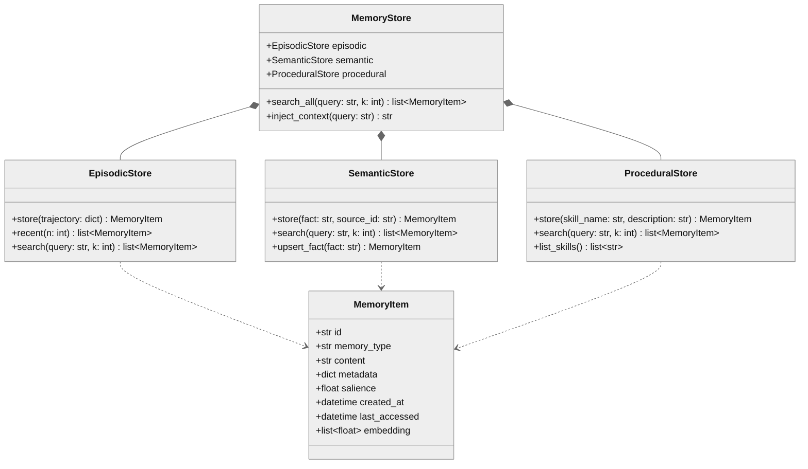
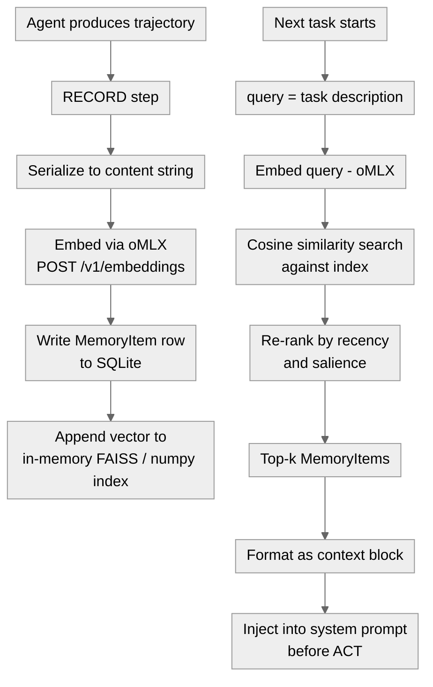

# 04 · Memory - Episodic, Semantic, Procedural

**What you'll learn:** Every time an agent acts, it generates raw experience - tool calls, reasoning traces, outcomes, failures. Without a memory layer, that experience evaporates and the agent restarts blind on every session. This module builds the "experience layer": how to classify what happened into three reusable memory types (episodic, semantic, procedural), store them in a lightweight SQLite + local-vector index, retrieve the right memories at query time using similarity and recency, and write them back as part of the RECORD step in the ACT - RECORD - REFLECT - LEARN loop. You will have a working `memory/store.py` by the end.

> [!info] Prerequisites
> - [[03 - The Minimal Agent Loop]] - you need a running agent loop before adding a memory layer
> - [[02 - Backends - oMLX and VibeProxy]] - embeddings always run locally through oMLX

---

## Learning Objectives

- [ ] Distinguish episodic, semantic, and procedural memory and give one concrete agent example of each
- [ ] Explain why embeddings must be local even when generation runs through VibeProxy
- [ ] Implement a `MemoryStore` that persists to SQLite and indexes vectors in-process
- [ ] Write a retrieval function that blends cosine similarity, recency decay, and salience
- [ ] Hook `store()` into the agent loop's RECORD step so experience accumulates automatically
- [ ] Describe what [MemEvolve](https://arxiv.org/pdf/2512.18746) and [Komi-learn](https://github.com/kurikomi-labs/komi-learn) do differently from a plain append log

---

## 1. The Three Memory Types

Cognitive science splits human memory into systems with different storage and retrieval characteristics. The same taxonomy maps cleanly onto agents.

| Type | What it stores | Agent example | Decay |
|---|---|---|---|
| **Episodic** | Past events, trajectories, outcomes | "I tried `pytest -k auth` and got 3 failures at 14:02" | High - specific events become stale |
| **Semantic** | Facts, knowledge, beliefs about the world | "The test suite uses `conftest.py` fixtures; `db` fixture is slow" | Low - facts stay relevant |
| **Procedural** | How-to skills, reusable action sequences | "To add a migration: `alembic revision --autogenerate` then `alembic upgrade head`" | Medium - skills may version |

Episodic memory is raw trajectory storage - what happened, in order, with metadata. Semantic memory is distilled facts extracted from episodes. Procedural memory is the pointer into the skill library (see [[06 - Skill Acquisition and Curation]]). All three feed the REFLECT step (see [[05 - Reflection and Self-Correction]]).

> [!note] The experience layer sits between ACT and REFLECT
> ACT produces a trajectory. RECORD embeds and stores it. REFLECT reads memory to critique. LEARN writes back new semantic or procedural entries. Memory is the substrate that makes improvement cumulative rather than ephemeral.

---

## 2. Architecture Overview

### 2.1 Class Diagram



*Three typed stores unified under `MemoryStore`; each `MemoryItem` carries its embedding for in-process similarity search.*

### 2.2 RECORD - Retrieve Flow



*Left branch: RECORD writes experience to persistent storage. Right branch: retrieval fetches relevant memories before the next ACT.*

---

## 3. What to Store vs. What to Skip

Not every token an agent produces deserves a memory slot. Indiscriminate storage fills the index with noise and degrades retrieval precision.

**Store:**
- Task outcomes (success / failure, with the key observation)
- Tool call results that revealed something non-obvious about the environment
- Corrected errors and the fix that worked
- Distilled facts the agent explicitly extracts during REFLECT
- Skill descriptions added to the procedural store

**Skip:**
- Pure scaffolding messages (system prompt boilerplate, filler tool preambles)
- Intermediate reasoning steps that were superseded in the same trajectory
- Duplicate facts that differ only in phrasing (use upsert for semantic entries)
- Any content containing secrets or credentials (see [[09 - Sandboxing and Safe Execution]])

> [!warning] Quality beats quantity
> [MemEvolve](https://arxiv.org/pdf/2512.18746) shows that naive append-only memory degrades agent performance as the index grows - retrieval precision falls below baseline at ~10k entries without quality filtering. Salience scoring and periodic consolidation matter.

---

## 4. Retrieval: Similarity + Recency + Salience

A plain cosine-similarity ranking has two failure modes:

1. **Recency blindness** - a highly similar but 6-month-old memory about a different codebase outranks a moderately similar memory from yesterday.
2. **Salience blindness** - an episode where the agent made and corrected a critical mistake scores the same as a boring success.

The retrieval score blends all three signals:

```
score(item) = α * cosine_sim(query_vec, item.embedding)
            + β * recency(item.created_at)
            + γ * item.salience
```

Where `recency` is an exponential decay: `exp(-λ * hours_since_creation)`. Default weights: α=0.6, β=0.2, γ=0.2. Adjust per use-case - code agents weight recency higher (APIs change); general-knowledge agents weight salience higher.

---

## 5. Hands-On Lab - Building `memory/store.py`

This lab fills in the scaffold file at `/Users/yuxinliu/self-improving-agent-lab/memory/store.py`.

### 5.1 Dependencies

Add to `requirements.txt`:
```
openai>=1.30
numpy>=1.26
sqlite-utils>=3.36
python-dateutil>=2.9
```

No FAISS required - numpy dot-product is fast enough for <100k entries on Apple Silicon.

### 5.2 The Store Module

```python
# memory/store.py
"""
MemoryStore: episodic, semantic, and procedural memory backed by SQLite + numpy vectors.
Embeddings always use oMLX at http://localhost:8000/v1 - never VibeProxy (chat-only).
"""

from __future__ import annotations

import json
import math
import uuid
from dataclasses import dataclass, field, asdict
from datetime import datetime, timezone
from pathlib import Path
from typing import Literal, Optional

import numpy as np
import sqlite_utils
from openai import OpenAI

# ---------------------------------------------------------------------------
# Embedding client - ALWAYS local oMLX regardless of generation backend
# ---------------------------------------------------------------------------
_EMB_CLIENT = OpenAI(base_url="http://localhost:8000/v1", api_key="not-needed")
EMBED_MODEL = "nomic-embed-text"  # swap to any oMLX-served embedding model
DB_PATH = Path(__file__).parent.parent / "memory" / "store.db"

MemoryType = Literal["episodic", "semantic", "procedural"]


def _embed(text: str) -> list[float]:
    """Embed a string using the local oMLX embeddings endpoint."""
    resp = _EMB_CLIENT.embeddings.create(model=EMBED_MODEL, input=text[:8192])
    return resp.data[0].embedding


def _cosine(a: list[float], b: list[float]) -> float:
    va, vb = np.array(a), np.array(b)
    denom = (np.linalg.norm(va) * np.linalg.norm(vb))
    return float(np.dot(va, vb) / denom) if denom > 0 else 0.0


def _recency(created_iso: str, decay_hours: float = 168.0) -> float:
    """Exponential decay - full score now, ~0.37 at decay_hours."""
    created = datetime.fromisoformat(created_iso).replace(tzinfo=timezone.utc)
    now = datetime.now(timezone.utc)
    hours = (now - created).total_seconds() / 3600
    return math.exp(-hours / decay_hours)


# ---------------------------------------------------------------------------
# Data model
# ---------------------------------------------------------------------------

@dataclass
class MemoryItem:
    id: str
    memory_type: MemoryType
    content: str
    metadata: dict
    salience: float           # 0.0 - 1.0; set by caller or auto-inferred
    created_at: str           # ISO-8601 UTC
    last_accessed: str        # ISO-8601 UTC
    embedding: list[float]

    def retrieval_score(
        self,
        query_vec: list[float],
        alpha: float = 0.6,
        beta: float = 0.2,
        gamma: float = 0.2,
    ) -> float:
        sim = _cosine(query_vec, self.embedding)
        rec = _recency(self.created_at)
        return alpha * sim + beta * rec + gamma * self.salience


# ---------------------------------------------------------------------------
# SQLite persistence helpers
# ---------------------------------------------------------------------------

def _get_db() -> sqlite_utils.Database:
    DB_PATH.parent.mkdir(parents=True, exist_ok=True)
    db = sqlite_utils.Database(DB_PATH)
    if "memories" not in db.table_names():
        db["memories"].create({
            "id": str,
            "memory_type": str,
            "content": str,
            "metadata": str,        # JSON
            "salience": float,
            "created_at": str,
            "last_accessed": str,
            "embedding": str,       # JSON list[float]
        }, pk="id")
        db["memories"].create_index(["memory_type"])
    return db


def _row_to_item(row: dict) -> MemoryItem:
    return MemoryItem(
        id=row["id"],
        memory_type=row["memory_type"],
        content=row["content"],
        metadata=json.loads(row["metadata"]),
        salience=row["salience"],
        created_at=row["created_at"],
        last_accessed=row["last_accessed"],
        embedding=json.loads(row["embedding"]),
    )


# ---------------------------------------------------------------------------
# Core store
# ---------------------------------------------------------------------------

class MemoryStore:
    """Unified store for all three memory types."""

    def __init__(self, db_path: Optional[Path] = None):
        global DB_PATH
        if db_path:
            DB_PATH = db_path
        self._db = _get_db()

    # -- Write ----------------------------------------------------------------

    def store(
        self,
        content: str,
        memory_type: MemoryType,
        metadata: Optional[dict] = None,
        salience: float = 0.5,
    ) -> MemoryItem:
        """Embed content and persist a new MemoryItem. Returns the stored item."""
        now = datetime.now(timezone.utc).isoformat()
        embedding = _embed(content)
        item = MemoryItem(
            id=str(uuid.uuid4()),
            memory_type=memory_type,
            content=content,
            metadata=metadata or {},
            salience=max(0.0, min(1.0, salience)),
            created_at=now,
            last_accessed=now,
            embedding=embedding,
        )
        self._db["memories"].insert({
            "id": item.id,
            "memory_type": item.memory_type,
            "content": item.content,
            "metadata": json.dumps(item.metadata),
            "salience": item.salience,
            "created_at": item.created_at,
            "last_accessed": item.last_accessed,
            "embedding": json.dumps(item.embedding),
        })
        return item

    def record_trajectory(self, trajectory: dict, salience: float = 0.5) -> MemoryItem:
        """Convenience: store a full agent trajectory dict as episodic memory."""
        content = json.dumps(trajectory, ensure_ascii=False)[:4096]
        return self.store(content, "episodic", metadata=trajectory.get("meta", {}), salience=salience)

    def record_fact(self, fact: str, source_id: Optional[str] = None) -> MemoryItem:
        """Store a distilled fact as semantic memory."""
        meta = {"source_id": source_id} if source_id else {}
        return self.store(fact, "semantic", metadata=meta, salience=0.7)

    def record_skill(self, skill_name: str, description: str) -> MemoryItem:
        """Store a skill pointer as procedural memory."""
        content = f"SKILL: {skill_name}\n{description}"
        return self.store(content, "procedural", metadata={"skill_name": skill_name}, salience=0.8)

    # -- Read -----------------------------------------------------------------

    def search(
        self,
        query: str,
        k: int = 5,
        memory_type: Optional[MemoryType] = None,
        alpha: float = 0.6,
        beta: float = 0.2,
        gamma: float = 0.2,
    ) -> list[MemoryItem]:
        """Retrieve top-k memories by blended score (similarity + recency + salience)."""
        query_vec = _embed(query)
        where_clause = f"memory_type = '{memory_type}'" if memory_type else None
        rows = list(self._db["memories"].rows_where(where_clause) if where_clause
                    else self._db["memories"].rows)
        if not rows:
            return []
        items = [_row_to_item(r) for r in rows]
        scored = sorted(
            items,
            key=lambda m: m.retrieval_score(query_vec, alpha, beta, gamma),
            reverse=True,
        )
        top = scored[:k]
        # Update last_accessed
        now = datetime.now(timezone.utc).isoformat()
        for item in top:
            self._db["memories"].update(item.id, {"last_accessed": now})
        return top

    def inject_context(self, query: str, k: int = 5) -> str:
        """
        Return a formatted memory context block ready to prepend to a system prompt.
        Searches across all memory types and renders a readable summary.
        """
        results = self.search(query, k=k)
        if not results:
            return ""
        lines = ["<memory_context>"]
        for item in results:
            tag = item.memory_type.upper()
            lines.append(f"[{tag}] {item.content[:300]}")
        lines.append("</memory_context>")
        return "\n".join(lines)

    def stats(self) -> dict:
        db = self._db["memories"]
        total = db.count
        by_type = {t: db.count_where(f"memory_type = '{t}'")
                   for t in ("episodic", "semantic", "procedural")}
        return {"total": total, **by_type}
```

### 5.3 Wiring RECORD into the Agent Loop

The RECORD step belongs at the end of each task iteration in `agent/loop.py`:

```python
# agent/loop.py  (excerpt - add after tool execution completes)
from memory.store import MemoryStore

_memory = MemoryStore()

def run_task(task: str, tools, client, model: str) -> dict:
    """Run one task cycle and record the trajectory to memory."""
    # ... existing ACT logic ...
    trajectory = {
        "task": task,
        "steps": steps,          # list of tool calls + results
        "final_answer": answer,
        "outcome": outcome,       # "success" | "failure" | "partial"
        "meta": {"model": model, "timestamp": datetime.utcnow().isoformat()},
    }
    # RECORD step - salience higher for failures (more to learn from)
    salience = 0.8 if outcome == "failure" else 0.5
    _memory.record_trajectory(trajectory, salience=salience)

    # Inject relevant memory into next task's context
    # (done at the TOP of the next run_task call, before constructing the prompt)
    return trajectory


def build_system_prompt(task: str) -> str:
    mem_ctx = _memory.inject_context(task, k=4)
    base = "You are a coding agent. Solve the task using the provided tools."
    return f"{mem_ctx}\n\n{base}" if mem_ctx else base
```

### 5.4 Running the Lab

```bash
# Start oMLX (pull an embedding model first in the menu-bar app)
# Then from the lab root:

cd /Users/yuxinliu/self-improving-agent-lab
python - <<'EOF'
from memory.store import MemoryStore

ms = MemoryStore()

# Store a few items across all three types
ms.record_trajectory({
    "task": "Fix failing test_auth_middleware",
    "outcome": "success",
    "steps": [{"tool": "run_tests", "result": "3 failures"}, {"tool": "patch_file", "result": "patched"}],
    "meta": {}
}, salience=0.6)

ms.record_fact("The auth middleware checks JWT expiry before role validation.", source_id="code_review_001")
ms.record_skill("run_migrations", "cd project && alembic upgrade head; verify with alembic current")

# Retrieve
results = ms.search("authentication middleware test failure", k=3)
for r in results:
    print(f"[{r.memory_type}] score≈... | {r.content[:80]}")

print(ms.stats())
EOF
```

> [!tip] Swap generation backend freely - embeddings stay local
> ```bash
> # Generation via VibeProxy (Claude MAX subscription)
> AGENT_BACKEND=vibeproxy python agent/loop.py
>
> # Generation via oMLX (fully local)
> AGENT_BACKEND=omlx python agent/loop.py
>
> # Either way, memory/store.py always calls http://localhost:8000/v1/embeddings
> # VibeProxy has NO embeddings endpoint - never route embeddings through it
> ```

---

## 6. Related Projects and Research

[Komi-learn](https://github.com/kurikomi-labs/komi-learn) implements a similar three-layer memory strategy for coding agents, with additional hooks for "continuous memory compaction" - periodically merging redundant semantic entries and promoting high-salience episodic events into semantic facts. It is a useful reference when your episodic index grows large.

[MemEvolve](https://arxiv.org/pdf/2512.18746) (EvolveLab) goes further: it treats the memory update policy itself as evolvable - the agent meta-evolves what gets written, how salience is scored, and when facts are retired. The finding most relevant here is that fixed-salience append-only stores plateau and then degrade. Even a simple salience heuristic (failures score higher) noticeably extends the useful lifespan of the index.

The broader [agent-memory direction](https://arxiv.org/pdf/2512.18746) in 2025-2026 research converges on: (1) typed storage rather than a monolithic "chat history", (2) quality-filtered writes rather than append-all, (3) periodic consolidation to prevent retrieval degradation. This note implements the minimal viable version of all three principles.

> [!example] How mem0 differs
> [mem0](https://github.com/mem0ai/mem0) is a hosted memory layer that provides a similar three-type API but adds user-scoped namespaces and cloud sync. For local-first use on Apple Silicon, `memory/store.py` gives you the same semantics without any external service dependency.

---

## 7. Pitfalls

> [!danger] Never route embeddings through VibeProxy
> VibeProxy exposes chat completion only - it has no `/v1/embeddings` endpoint. If you accidentally point the embedding client at `http://localhost:8317`, every `store()` call will raise a connection error. The embedding client is hardcoded to `http://localhost:8000/v1` intentionally. Keep it that way.

> [!warning] Storing secrets in memory
> If a trajectory includes API keys, tokens, or passwords surfaced by a tool call, those values will be embedded and persisted in SQLite. Always redact secrets from trajectory dicts before calling `record_trajectory`. See [[09 - Sandboxing and Safe Execution]] for the broader sanitization pattern.

> [!warning] Embedding model mismatch
> All vectors in `store.db` must come from the same model. If you switch from `nomic-embed-text` to a different model, the cosine similarities between old and new vectors are meaningless. Either clear the database or maintain separate indices per model version. Store the model name in the item's `metadata` for future detection.

> [!tip] Salience tuning heuristics
> - Failures: 0.8 - 0.9 (most to learn from)
> - Partial successes with a surprising observation: 0.7
> - Clean successes on routine tasks: 0.4 - 0.5
> - Distilled facts from REFLECT: 0.7 (semantic)
> - Skill entries: 0.8 (procedural, reused often)

> [!note] Rate limits, not token costs
> Because oMLX is local, embedding thousands of items costs nothing in dollars - the constraint is throughput (M2/M3 chip inference speed) and SQLite write rate. For batch imports, embed in parallel using `asyncio` + `httpx` against `http://localhost:8000/v1/embeddings`. For normal agent loops the synchronous client is fine.

---

## 8. Checkpoint

> [!question] Checkpoint
> 1. An agent just successfully fixed a bug by reading a stack trace and patching a file. Which memory type should the final trajectory be stored as, and what salience score would you assign?
> 2. Why does `memory/store.py` hardcode `http://localhost:8000/v1` for embeddings instead of reading `AGENT_BACKEND` from the environment?
> 3. You have 50,000 episodic items in `store.db` and retrieval quality has dropped. What does [MemEvolve](https://arxiv.org/pdf/2512.18746) suggest, and what is the simplest change you could make to `MemoryStore.store()` to slow the degradation?
> 4. A teammate switches the oMLX embedding model from `nomic-embed-text` to `mxbai-embed-large`. They run `memory/store.py` on new tasks without clearing the database. What will go wrong, and how would you detect it?
> 5. Describe the retrieval score formula and explain what would happen to older-but-highly-relevant memories if you set `beta = 0.0`.

---

## Navigation

- [[03 - The Minimal Agent Loop]] · [[00 - Curriculum Map]] (home) · [[05 - Reflection and Self-Correction]] -
