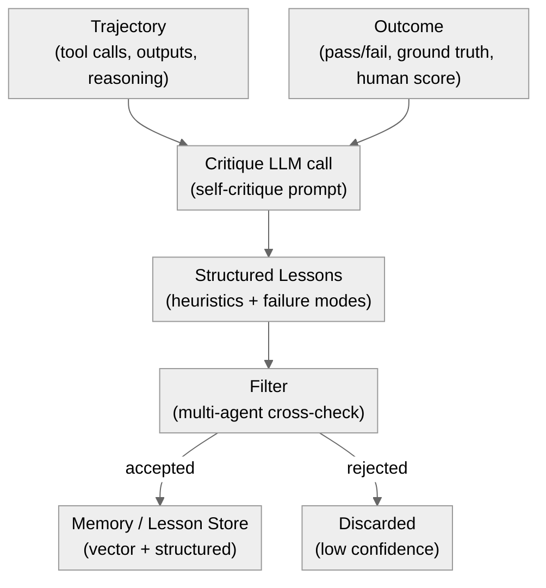
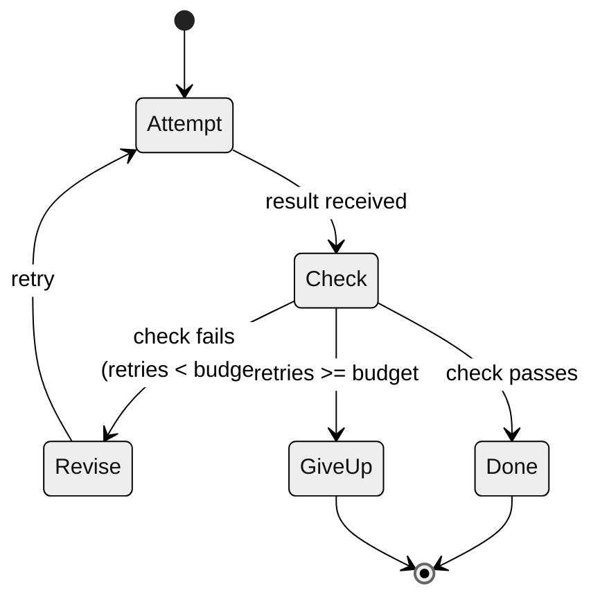

# 05 · Reflection and Self-Correction

**What you'll learn** - This module covers the REFLECT step of the ACT -> RECORD -> REFLECT -> LEARN loop. You will learn how to critique a recorded trajectory, extract reusable heuristics from that critique, distinguish between in-task self-correction (retry within a single run) and cross-task reflection (lessons that persist to future runs), and understand why reflection without external anchors causes recursive drift - a failure mode that makes agents progressively worse.

> [!info] Prerequisites
> - [[04 - Memory Systems]] - trajectory recording and memory primitives the REFLECT step reads from
> - Familiarity with the canonical loop vocabulary (ACT / RECORD / REFLECT / LEARN / VERIFY)

## Learning Objectives

- [ ] Explain what a "trajectory critique" is and write a self-critique prompt over a recorded trajectory
- [ ] Implement `reflection/reflect.py` to produce structured lessons from a (trajectory, outcome) pair
- [ ] Distinguish in-task self-correction from cross-task reflection and know when each applies
- [ ] Describe [Experiential Reflective Learning (ERL)](https://arxiv.org/pdf/2603.24639) and what "experiential" means relative to pure in-context critique
- [ ] State the recursive drift failure mode and name the two modules that provide the external anchors needed to prevent it
- [ ] Configure the multi-agent critique pattern to cross-validate lessons before they enter memory

---

## 1. What Is Reflection?

After every task run the agent has two artifacts: the **trajectory** (the full sequence of thoughts, tool calls, and outputs captured in Module 04) and the **outcome** (pass / fail / partial, plus any ground-truth signal). Reflection is the process of comparing those two artifacts and producing structured, reusable knowledge.

The word "reflection" is overloaded. In this curriculum it always means the REFLECT step of the canonical loop - a deliberate, LLM-driven critique pass that happens *after* the run ends, writes structured lessons to memory, and feeds into the LEARN step (Modules 06 and 08). It is not in-context chain-of-thought reasoning that occurs *during* a run (that is covered under in-task self-correction in Section 3).

[Experiential Reflective Learning (ERL)](https://arxiv.org/pdf/2603.24639) formalizes this distinction: "experiential" means the agent accumulates lessons *across* experiences rather than just reasoning within one context window. The key insight is that the lesson store outlives any single run - it is persistent memory, not just a longer prompt.

[SAMULE](https://arxiv.org/abs/2509.20562) (EMNLP 2025) refines *what* to reflect on by synthesising reflections at three complementary levels: micro (single-trajectory - analyse one failed run and generate a targeted fix), meso (intra-task - examine multiple trajectories of the same task to build an error taxonomy), and macro (inter-task - cluster similar errors across different tasks to derive transferable insight). The practical lesson for the REFLECT step below is that not all reflection is equal: a per-run lesson (micro) is cheap but narrow, while the transferable macro insight - the kind worth promoting into a reusable skill via [[06 - Skill Acquisition and Curation]] - only emerges once you reflect *across* tasks, not just across runs of one task. SAMULE reports that this failure-centric, multi-level synthesis significantly outperforms flat reflection baselines on TravelPlanner, NATURAL PLAN, and Tau-bench.

---

## 2. The REFLECT Pipeline



*The REFLECT pipeline: trajectory and outcome feed a critique call, which produces structured lessons, which are filtered by multi-agent cross-check before writing to memory.*

Key design choices visible in the diagram:

- **Two inputs are required.** Trajectory alone is insufficient - without the outcome you cannot know whether the reasoning was sound or merely fluent. This is why RECORD (Module 04) must capture outcome signals, not just the chain-of-thought.
- **Filter before write.** Raw LLM self-critique is noisy. The multi-agent cross-check (Section 5) reduces false positives in the lesson store.
- **Memory is the output.** Lessons that do not reach the store produce no durable improvement.

---

## 3. In-Task Self-Correction vs. Cross-Task Reflection

These two mechanisms are often conflated. They operate at different scopes and have different failure modes.

| Dimension | In-task self-correction | Cross-task reflection |
|---|---|---|
| Scope | Single run, current context window | Across runs, persistent memory |
| Trigger | Tool call fails, assertion fails, own check | Run ends with an outcome signal |
| Output | Revised action in the same run | Structured lesson written to store |
| Persistence | None - lost when context ends | Durable - available to future runs |
| Risk | Infinite retry loops without a budget | Recursive drift if unchecked |

### 3a. In-Task Self-Correction

The agent attempts an action, checks the result, and revises before moving on. This is useful and cheap - no memory write required. The danger is unconstrained retries.



*In-task self-correction state machine: Attempt -> Check -> Revise loops back until success, budget exhaustion, or a passing check.*

The budget is critical. Without it, a stubborn wrong assumption loops forever. In `agent/loop.py` this is the `max_retries` guard. When the budget is exhausted the run terminates with a failure outcome, which then feeds the cross-task reflection path.

### 3b. Cross-Task Reflection

This is the REFLECT step proper. It runs *after* the run terminates and produces lessons that survive into future runs. Because it writes to shared memory, it has a much higher impact - and a correspondingly higher risk if the lessons are wrong.

> [!warning] Recursive Drift
> Self-feedback alone - an agent critiquing its own trajectories without any external anchor - causes **recursive drift**: the agent's lessons increasingly reflect its own biases and blind spots rather than ground truth. Early lessons look plausible. Later lessons are confidently wrong. The agent becomes better at being wrong.
>
> Prevention requires external anchoring at every LEARN step:
> - **Module 07** [[07 - Verification Gates and Layered Control]] - deterministic test gates that reject code changes before they commit
> - **Module 10** [[10 - Evaluation Harness]] - benchmark suites that catch performance regression over time
>
> Never let a reflection run write to memory without at least one of these signals present.

> [!note] Principle-Level vs. Instance-Level Experience (June 2026)
> [Rethinking Continual Experience Internalization for Self-Evolving LLM Agents](https://arxiv.org/abs/2606.04703) (June 2026) finds that under multi-iteration experience learning, existing methods cause **progressive capability collapse** rather than compounding improvement. The root cause is the granularity of what gets stored: **principle-level experience** (generalised rules distilled from multiple episodes) is significantly more durable than **instance-level experience** (raw traces of specific runs). The paper further shows that **step-wise injection** - inserting the relevant lesson at the step where it applies - substantially outperforms global batch injection, where all lessons are prepended to the system prompt at once.
>
> This maps directly onto the curriculum recommendation: store distilled heuristics (principle-level) in the semantic memory store rather than raw trajectories (instance-level), and inject them at the relevant reasoning step rather than loading everything into the top of the system prompt.

> [!example] RHO - reflecting over your own unlabeled past trajectories
> [Retrospective Harness Optimization (RHO)](https://arxiv.org/abs/2606.05922) (June 2026, CityU HK + MSR Asia; code at [wbopan/retro-harness](https://github.com/wbopan/retro-harness)) runs the REFLECT step over the trajectory log with **no ground-truth labels and no validation set**. It selects a diverse coreset of hard past tasks, re-solves them in parallel, scores the rollouts by self-validation and self-consistency, proposes candidate harness updates, and picks the best by **pairwise self-preference**. A single retrospective pass lifts SWE-Bench Pro from 59% to 78%. The lesson for this module: the RECORD log from [[04 - Memory Systems]] is already enough raw material to improve from - reflection does not require labeled outcomes, only honest self-comparison across past runs. But self-preference is an *internal* signal, so pair it with the external VERIFY gate of [[07 - Verification Gates and Layered Control]] before trusting a proposed change - exactly the recursive-drift caution this module opened with.

---

## 4. The Self-Critique Prompt

The critique prompt is the core of the REFLECT step. It takes the trajectory and outcome as context and asks the LLM to reason about what went wrong, what went right, and what rule would have produced a better result.

A good critique prompt has three parts:

1. **Grounding** - present the trajectory and outcome verbatim so the model does not hallucinate what happened
2. **Structured output** - request JSON with explicit fields for heuristics and failure modes, not free prose
3. **Confidence gate** - ask the model to score its own confidence; lessons below a threshold are discarded before the filter step

Example prompt template (used in `reflection/reflect.py`):

```
You are a trajectory analyst. You will receive a complete agent trajectory and its outcome.
Produce a JSON object with these fields:
  - summary: one sentence describing what the agent tried to do
  - failure_mode: null if success, otherwise a specific description of what went wrong
  - heuristics: list of up to 3 short rules the agent should follow in future similar tasks
  - anti_patterns: list of up to 2 things the agent did that made the outcome worse
  - confidence: float 0-1, your confidence that these lessons generalize beyond this single run

Trajectory:
{trajectory}

Outcome:
{outcome}
```

The `confidence` field is the self-filter. Lessons with confidence below 0.6 are discarded. This is not sufficient on its own (see Section 5) but it reduces noise.

---

## 5. Multi-Agent Critique

Single-agent self-critique has a systematic bias: the same model that made the mistakes is judging them. [The metacognitive position paper](https://openreview.net/forum?id=4KhDd0Ozqe) argues that genuine self-improvement requires decoupling the actor from the evaluator.

A practical production pattern is to run the critique with a *second* model invocation (or a second agent role) and require agreement before writing to memory. HN discussion of production multi-agent critique systems describes the dynamic informally: "agents bully each other to prevent context drift" - meaning when two independent critiques disagree, neither is written, forcing a conservative default.

Implementation options in order of cost:

1. **Same model, different system prompt** - least expensive, moderate independence
2. **Different model via router** - e.g., oMLX small model for first pass, VibeProxy Claude for second pass
3. **Separate agent process** - highest independence, highest overhead

For the lab in this module, option 1 is used. Option 2 is the production recommendation and is shown in `backends/router.py`.

---

## 6. Hands-On Lab - `reflection/reflect.py`

**Goal** - Given a trajectory dict and an outcome string, produce structured lessons and write them to the memory store.

**Scaffold file** - `reflection/reflect.py`

The lab builds on `memory/store.py` (Module 04) and `backends/adapter.py`.

> [!info] In the lab: this is `agentkit.evolve`
> The scaffold delegates the reflect->learn link to **`agentkit.evolve`** (available at [github.com/shaneliuyx/agentkit](https://github.com/shaneliuyx/agentkit)):
> - **Group-relative lesson extraction** (`distill_group`) scores N rollouts with a verifier, keeps natural-language lessons only from rollouts that strictly beat the group mean, and demotes below-mean rollouts to counter-lessons. This is the REFLECT->LEARN bridge.
> - **Weakness-targeted prompt evolution** (`evolve_prompt`) proposes mutations that focus on the current prompt's failure modes — reflection feeds the optimizer directly.
> - The keep/discard control is **deterministic and model-free**; the injected LLM is only the mutation proposer. Every candidate is admitted solely through the LEARN `Gate` ([[07 - Verification Gates and Layered Control]]).
> - The whole agent is `agentkit.SelfImprovingAgent` wired in `scaffold/lab_agent.py`.

### Step 1 - Set up your environment

```bash
cd /Users/yuxinliu/self-improving-agent-lab
source .venv/bin/activate
cp .env.example .env
# Set AGENT_BACKEND=omlx or AGENT_BACKEND=vibeproxy in .env
pip install "git+https://github.com/shaneliuyx/agentkit"  # provides agentkit.evolve
```

### Step 2 - Implement `reflection/reflect.py`

```python
# reflection/reflect.py
"""
REFLECT step: critique a group of trajectories, extract group-relative lessons,
and (optionally) run weakness-targeted prompt evolution.

Delegates to agentkit.evolve:
  - distill_group()  -> group-relative lesson extraction (the reflect->learn link)
  - evolve_prompt()  -> weakness-targeted prompt evolution feeding the LEARN step

Works on both backends:
  AGENT_BACKEND=omlx       -> http://localhost:8000/v1
  AGENT_BACKEND=vibeproxy  -> http://localhost:8317/v1

Note: embeddings for the lesson store always use oMLX regardless of AGENT_BACKEND,
because VibeProxy (Claude subscription) does not expose an embeddings endpoint.
"""

from __future__ import annotations

import json
import os
from typing import Optional

from openai import OpenAI

from agentkit.evolve import (
    distill_group,
    evolve_prompt,
    make_llm_proposer,
    GroupDistillation,
    OptimizeResult,
    Rollout,
    Verifier,
)

# --- unified adapter (see backends/adapter.py) ---
BACKENDS = {
    "omlx":      {"base_url": "http://localhost:8000/v1",  "model": os.getenv("OMLX_MODEL", "qwen2.5-coder-7b")},
    "vibeproxy": {"base_url": "http://localhost:8317/v1",  "model": os.getenv("VIBE_MODEL", "claude-sonnet-4-5-20250929")},
}

def make_client(backend: Optional[str] = None) -> tuple[OpenAI, str]:
    b = BACKENDS[backend or os.getenv("AGENT_BACKEND", "omlx")]
    return OpenAI(base_url=b["base_url"], api_key=os.getenv("LLM_API_KEY", "not-needed")), b["model"]

# --- embeddings always local via oMLX ---
def _embed(text: str) -> list[float]:
    emb = OpenAI(base_url="http://localhost:8000/v1", api_key="not-needed")
    return emb.embeddings.create(model="nomic-embed-text", input=text).data[0].embedding


def reflect_group(
    rollouts: list[Rollout],
    verifier: Verifier,
    store_path: str = "memory/lessons.jsonl",
) -> GroupDistillation:
    """
    Group-relative REFLECT step (the reflect->learn link).

    distill_group() scores all rollouts with the verifier, keeps natural-language
    lessons only from rollouts that strictly beat the group mean, and demotes
    below-mean rollouts to counter-lessons ("what NOT to do").

    The keep/discard decision is deterministic and model-free — the LLM is not
    involved in the gate; it only produces candidate lesson text.
    Accepted lessons are written to the flat JSONL lesson store.
    """
    distillation: GroupDistillation = distill_group(rollouts, verifier=verifier)

    os.makedirs(os.path.dirname(store_path) or ".", exist_ok=True)
    for lesson in distillation.lessons:
        record = {
            "text": lesson,
            "embedding": _embed(lesson),
            "source": "distill_group",
        }
        with open(store_path, "a") as f:
            f.write(json.dumps(record) + "\n")
        print(f"[reflect] Lesson written: {lesson[:80]}...")

    for counter in distillation.counter_lessons:
        print(f"[reflect] Counter-lesson (what NOT to do): {counter[:80]}...")

    return distillation


def reflect_and_evolve(
    baseline_prompt: str,
    rollouts: list[Rollout],
    verifier: Verifier,
    gate,
    baseline_score: float,
    epochs: int = 5,
    cwd: str = ".",
) -> OptimizeResult:
    """
    Full reflect->learn pipeline: group-relative lesson extraction feeding
    weakness-targeted prompt evolution.

    evolve_prompt() focuses mutation proposals on the failure modes where the
    current best prompt is weakest — reflection steers the optimizer.
    The gate (from agentkit, see [[07 - Verification Gates and Layered Control]])
    is the only admittance criterion; it is deterministic and model-free.
    """
    client, model = make_client()
    propose = make_llm_proposer(client=client, model=model)

    result: OptimizeResult = evolve_prompt(
        baseline_prompt,
        propose=propose,
        evaluate=verifier,
        gate=gate,
        baseline_score=baseline_score,
        epochs=epochs,
        cwd=cwd,
    )

    print(f"[reflect] evolve_prompt complete: delta={result.delta:+.3f}")
    print(f"[reflect] Best prompt (first 120 chars): {result.best[:120]}...")
    return result
```

### Step 3 - Run the lab

```python
# Run from the repo root as a scratch script.

from agentkit.evolve import Rollout, Verifier

# Build example rollouts: each is a (trajectory, outcome) pair
rollouts = [
    Rollout(
        trajectory={
            "task": "Write a Python function to parse ISO 8601 dates",
            "steps": [
                {"tool": "write_code", "input": "def parse_date(s): return datetime.fromisoformat(s)"},
                {"tool": "run_tests",  "output": "FAILED: timezone-aware strings not handled"},
                {"tool": "write_code", "input": "def parse_date(s): return datetime.fromisoformat(s.replace('Z', '+00:00'))"},
                {"tool": "run_tests",  "output": "PASSED"},
            ],
        },
        outcome="PASS - all 8 test cases green after 2 attempts",
    ),
    Rollout(
        trajectory={
            "task": "Write a Python function to parse ISO 8601 dates",
            "steps": [
                {"tool": "write_code", "input": "def parse_date(s): return s"},
                {"tool": "run_tests",  "output": "FAILED: returned string, not datetime"},
            ],
        },
        outcome="FAIL - type mismatch",
    ),
]

# Verifier scores each rollout (deterministic, model-free)
def outcome_verifier(rollout: Rollout) -> float:
    return 1.0 if rollout.outcome.startswith("PASS") else 0.0

from reflection.reflect import reflect_group

distillation = reflect_group(
    rollouts=rollouts,
    verifier=outcome_verifier,
)

print("Lessons (above-group-mean rollouts):")
for lesson in distillation.lessons:
    print(f"  + {lesson}")

print("Counter-lessons (below-group-mean):")
for counter in distillation.counter_lessons:
    print(f"  - {counter}")
```

**Expected output** (model-dependent, illustrative):

```
[reflect] Lesson written: Always handle timezone suffix variants before calling fromisoformat...
[reflect] Counter-lesson (what NOT to do): Returning the raw string instead of a parsed datetime...
Lessons (above-group-mean rollouts):
  + Always handle timezone suffix variants before calling fromisoformat
Counter-lessons (below-group-mean):
  - Returning the raw string instead of a parsed datetime causes type mismatch failures
```

Note: `distill_group` keeps lessons only from rollouts that **strictly beat the group mean score**. In this two-rollout example the PASS rollout (score 1.0) beats the mean (0.5), so its lesson is kept; the FAIL rollout (score 0.0) becomes a counter-lesson. With larger groups the threshold is more meaningful — this is the reflect->learn link described in Section 1.

### Step 4 - Switch backends

```bash
# Run against VibeProxy (Claude subscription via local proxy)
# Note: ToS caveat - using a subscription via proxy may violate your provider's ToS.
AGENT_BACKEND=vibeproxy python -c "
from reflection.reflect import reflect_group
# ... same call as above
"

# Run against oMLX local model (no ToS concerns)
AGENT_BACKEND=omlx python -c "
from reflection.reflect import reflect_group
# ...
"
```

> [!note] Rate limits, not token costs
> On both backends you are rate-limited, not per-token-metered. Reflection loops that make many LLM calls (critique, cross-critique, re-rank) are effectively free in dollar terms. Design around throughput and local GPU/ANE capacity, not cost per call. This is a meaningful difference from the paid-API mental model where each reflective call has a direct dollar cost.

---

## 7. Extracting Reusable Heuristics and Failure Modes

The output of the critique step is only as useful as its downstream integration. Two categories of output have different memory destinations:

**Heuristics** - positive rules, stored as retrievable lessons in the vector store. Future runs with semantically similar tasks will retrieve these via embedding search (Module 04) and inject them into the system prompt.

**Failure modes** - negative rules, stored as anti-pattern entries. These are used in the VERIFY step (Module 07) to construct deterministic rejection rules: if the agent's proposed action matches a known failure mode, block it without an LLM call.

[ERL](https://arxiv.org/pdf/2603.24639) proposes keeping heuristics experience-linked - each lesson points back to the trajectory that generated it. This matters when a heuristic turns out to be wrong: you can retrace to the source trajectory, identify the bad outcome signal that caused the error, and prune the lesson rather than accumulating contradictory rules.

The [metacognitive position paper](https://openreview.net/forum?id=4KhDd0Ozqe) extends this argument: truly self-improving agents need meta-level awareness of which parts of their lesson store are reliable vs. tentative. A flat list of heuristics without provenance degrades over time.

---

## 8. Pitfalls

> [!danger] Recursive Drift
> As described in Section 3b: self-critique without external anchors produces confidently wrong lessons. **Every reflection run must have a ground-truth outcome signal** - test results, a benchmark score, a human annotation - before it writes to memory. Plausible-sounding LLM output is not ground truth. Forward reference: Module 07 and Module 10 provide the external anchoring mechanisms.

> [!warning] Lesson Accumulation Without Pruning
> A lesson store that only grows becomes a contradiction mine. Heuristics conflict. Retrieval returns stale advice. Build a TTL or confidence-decay mechanism from the start - easier than retrofitting it on 10,000 entries later.

> [!warning] In-Task Loops Without a Retry Budget
> Self-correction that retries without a max budget loops indefinitely on stuck states. Every retry path in `agent/loop.py` must have an explicit `max_retries` guard. When the budget runs out, fail fast and let the cross-task reflection path learn from the failure.

> [!tip] Cheap Calls Are Not Free Time
> Rate limits and local throughput are still finite. A critique call that takes 4 seconds on oMLX blocks the next run for 4 seconds. Design the REFLECT step to run asynchronously or in a post-run batch, not inline in the hot path.

> [!warning] Same-Model Bias in Self-Critique
> Asking the same model that acted to critique its own output produces systematically biased lessons - it cannot see its own blind spots. The cross-critique pattern in Section 5 mitigates this. For high-stakes lesson writes, use the VibeProxy (Claude) backend for critique even if oMLX handled the action step, or vice versa.

> [!example] ERL vs. In-Context Reflection
> A common mistake: adding "reflect on what went wrong" as a step inside the agent's system prompt and calling that ERL. It is not - that is in-context reflection, which is lost when the context window clears. ERL requires writing structured lessons to durable memory that outlives the context.

---

> [!question] Checkpoint
> Test your understanding before moving on.
>
> 1. A trajectory shows the agent correctly calling a tool but with the wrong argument format on the first attempt, then self-correcting on the second attempt and succeeding. The outcome is PASS. Should the cross-task REFLECT step produce a lesson? If yes, what kind?
>
> 2. You deploy the reflection system and notice that after 50 runs the agent has accumulated 47 heuristics, but its task success rate has dropped from 72% to 61%. What failure mode does this most likely indicate, and what is the correct remediation?
>
> 3. Why is the `confidence` field in the critique output insufficient as a sole quality gate? What does the multi-agent cross-critique add that single-pass self-scoring cannot provide?
>
> 4. Your oMLX model is running on a MacBook Air M2 with 16 GB RAM. Each critique call takes 6 seconds. You have a batch of 30 trajectories to reflect on. How should you structure the reflect pipeline to avoid blocking the next agent run?
>
> 5. A colleague proposes skipping the external outcome signal and using the agent's final self-assessment ("I believe this solution is correct") as the outcome for the REFLECT step. Name the failure mode this introduces and cite the two modules that provide the correct alternative.

---

## Navigation

← [[04 - Memory Systems]] · [[00 - Curriculum Map]] (home) · [[06 - Skill Acquisition and Curation]] →
