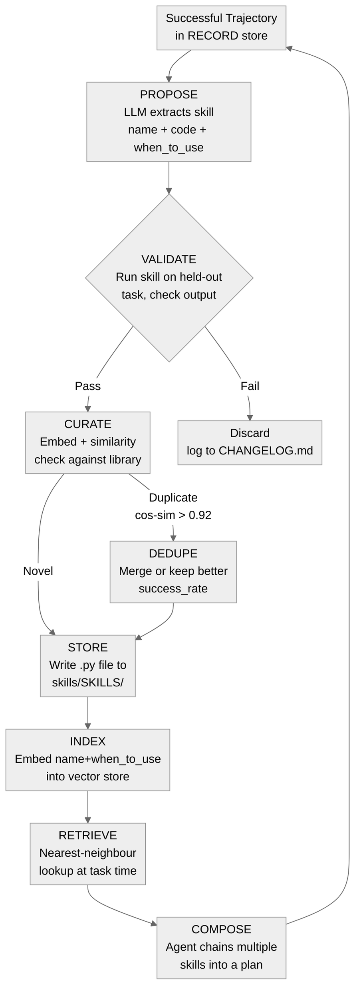
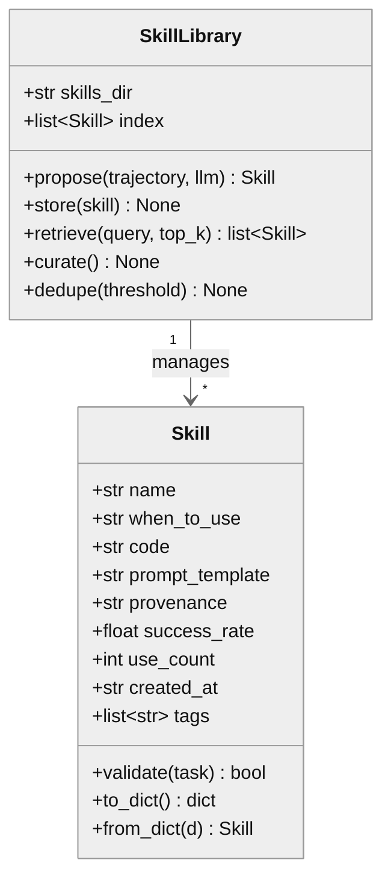

# 06 · Skill Acquisition and Curation

**What you'll learn** - Reflection alone does not persist knowledge; agents that improve over time must write reusable skills and curate a growing library of them. This module covers the full skill lifecycle: from spotting a successful trajectory worth generalising, to proposing, validating, deduplicating, storing, retrieving, and composing skills. You will see how projects like [SkillOS](https://arxiv.org/abs/2605.06614), [Muse-Autoskill](https://arxiv.org/abs/2605.27366), and [agent-seed](https://github.com/B67687/agentic-workflows/pull/82) structure this, how [Strands](https://aws.amazon.com/blogs/devops/building-self-extending-cli-tools-with-aws-strands/) applies it to self-extending CLI tooling, and how to implement a working skill store in the scaffold at `skills/library.py` and `skills/SKILLS/`.

> [!info] Prerequisites
> This module builds directly on [[05 - Reflection and Self-Correction]]. You should also be comfortable with [[04 - Memory Systems]] because the skill library is a form of long-term structured memory.

---

## Learning Objectives

- [ ] Explain the Voyager-style skill library pattern and why reusable skills outperform per-run reflection alone
- [ ] Describe each file in the agent-seed minimal scaffold (GOAL.md, AGENTS.md, scripts/go, CHANGELOG.md) and its role
- [ ] Trace a skill through all lifecycle stages: propose - test - curate/dedupe - store - retrieve - compose
- [ ] Implement skill proposal from a successful trajectory in Python using the unified adapter
- [ ] Apply curation rules to prevent skill bloat and duplication in a growing library
- [ ] Connect skill acquisition to the broader LEARN step in the ACT -> RECORD -> REFLECT -> LEARN -> VERIFY loop

---

## 1. Why Skills, Not Just Memories

Reflection (Module 05) produces heuristics - prose lessons like "always validate JSON before parsing". Memory (Module 04) stores those lessons as retrievable text. But prose memories degrade with scale: after 200 lessons, retrieval becomes noisy and applying a lesson still requires the agent to re-derive the implementation each time.

Skills solve this by storing the *implementation* alongside the *intent*:

- A skill is a named, tested, reusable unit of behaviour - a Python function, a prompt template, or a multi-step procedure.
- When the agent encounters a future task that matches the skill's `when_to_use` description, it retrieves the skill and calls it directly rather than re-solving from scratch.
- [Muse-Autoskill](https://arxiv.org/abs/2605.27366) shows that agents with a growing skill library solve harder tasks faster over time - the library is a compounding asset.

> [!note] The LEARN step in the canonical loop
> In the curriculum's vocabulary: ACT -> RECORD -> REFLECT -> **LEARN** -> VERIFY.
> Writing a skill *is* the LEARN step made concrete and durable. A skill that passes verification becomes a reusable tool; one that fails is discarded or quarantined before it can corrupt future runs.

---

## 2. The agent-seed Scaffold - Four Files, One Contract

The [agent-seed](https://github.com/B67687/agentic-workflows/pull/82) pattern is the minimal viable harness. It uses exactly four artefacts:

| File | Role |
|------|------|
| `GOAL.md` | The immutable "motto" - one sentence stating what this agent exists to do. The agent reads it at boot; it anchors every skill proposal against a fixed intent. |
| `AGENTS.md` | The operating contract - what the agent may and may not do, which tools are available, escalation rules. Skills inherit these constraints. |
| `scripts/go` | The iteration protocol - a shell script that runs one full loop (act, record, reflect, optionally propose a skill). Keeps the loop deterministic and machine-invokable (L2 in the rule priority hierarchy). |
| `CHANGELOG.md` | The audit trail - every skill addition, deletion, or modification is appended here with a timestamp and reason. Enables rollback and post-hoc analysis. |

> [!tip] Why a shell script for the loop?
> The [NousResearch production finding](https://github.com/NousResearch/hermes-agent/issues/29652) showed that "Layer 1 (Prompt) alone failed" - agents skipped instructions embedded only in prompts. Moving the iteration protocol to a deterministic shell script (L2) removes the agent's ability to skip steps. `scripts/go` is not optional infrastructure; it is the enforcement layer.

In the scaffold, `scripts/go` calls `agent/loop.py`, which calls `reflection/reflect.py`, which may call `skills/library.py` to propose and store a new skill. The loop is composable at the shell level.

---

## 3. The Skill Lifecycle

[SkillOS](https://arxiv.org/abs/2605.06614) formalises skill management as a pipeline with distinct stages. The diagram below maps those stages to the scaffold.



*Skill lifecycle - from raw trajectory to reusable composable unit. Each LEARN step either grows the library or proves a skill already exists.*

> [!warning] Validate before storing
> An unvalidated skill that gets stored is a latent bug. Every future task that retrieves it will inherit the defect. The VALIDATE stage is not optional - it is the minimum VERIFY gate for the LEARN step.

---

## 4. The Skill Object

A skill is more than a function. [Muse-Autoskill](https://arxiv.org/abs/2605.27366) and [SkillOS](https://arxiv.org/abs/2605.06614) both track provenance and success rates to support curation decisions. The class diagram below reflects the structure used in `skills/library.py`.



*Skill object and library manager. `provenance` records which trajectory spawned the skill; `success_rate` drives curation decisions.*

Key fields:
- `when_to_use` - a natural-language description used for embedding-based retrieval. Write it as a search query, not a title.
- `provenance` - the trajectory ID that produced this skill. Enables tracing a bad skill back to the run that generated it.
- `success_rate` - updated on every use. Skills below 0.4 after 10+ uses are candidates for removal.
- `code` vs `prompt_template` - skills can be procedural (Python code) or declarative (a prompt template). Store both types uniformly.

---

## 5. Curation - Keeping the Library Healthy

A library that only grows becomes a retrieval problem. [SkillOS](https://arxiv.org/abs/2605.06614) identifies three failure modes:

1. **Skill bloat** - hundreds of near-identical skills for "parse JSON", "call HTTP endpoint", etc. Retrieval returns the wrong variant; the agent wastes tokens deciding between them.
2. **Stale skills** - skills written for an old API or model that now fail silently.
3. **Overspecialised skills** - skills that encode a one-off task detail, not a reusable pattern.

Curation rules (run after every 10 new skill proposals):

```python
# skills/library.py excerpt - curation pass
def curate(self, sim_threshold: float = 0.92, min_uses: int = 10, min_success: float = 0.4):
    # 1. Remove skills that consistently fail
    for skill in list(self.index):
        if skill.use_count >= min_uses and skill.success_rate < min_success:
            self._remove(skill, reason="low_success_rate")

    # 2. Merge near-duplicate skills (keep higher success_rate)
    embeddings = self._embed_all()
    for i, s1 in enumerate(self.index):
        for j, s2 in enumerate(self.index):
            if j <= i:
                continue
            cos = self._cosine(embeddings[i], embeddings[j])
            if cos > sim_threshold:
                loser = s1 if s1.success_rate <= s2.success_rate else s2
                self._remove(loser, reason=f"duplicate_of_{s1.name if loser is s2 else s2.name}")
```

> [!tip] Curation is cheaper than you think
> On oMLX or VibeProxy, embedding 200 skill descriptions costs milliseconds and zero dollars (embeddings always run locally via oMLX). Run curation after every batch of new proposals, not just periodically.

---

## 6. Self-Extending CLI Tools with Strands

[Strands](https://aws.amazon.com/blogs/devops/building-self-extending-cli-tools-with-aws-strands/) demonstrates the same pattern at the CLI layer: a tool discovers it lacks a capability, generates a new sub-command, validates it, and registers it in its own command registry. The skill library is the AI equivalent: the agent extends its own API surface at runtime.

The key insight from Strands is that self-extension requires three things your scaffold already has:
1. A stable interface contract (AGENTS.md / the skill's `when_to_use` + `code` fields)
2. A safe write path (skills/SKILLS/ directory, not the agent's core loop)
3. A rollback mechanism (CHANGELOG.md + the `_remove` path in `curate()`)

Without all three, self-extension becomes self-corruption.

---

## 7. Hands-On Lab - Propose, Validate, Store, Retrieve

This lab implements the full propose-validate-store-retrieve cycle against the scaffold at `/Users/yuxinliu/self-improving-agent-lab/skills/library.py`.

### Setup

```bash
cd /Users/yuxinliu/self-improving-agent-lab
pip install openai numpy
# Start oMLX with an embedding model (e.g. nomic-embed-text) loaded
# Optionally set AGENT_BACKEND=vibeproxy for the generation step
```

### Step 1 - Implement the Skill class and SkillLibrary

```python
# skills/library.py
from __future__ import annotations
import json, os, time, math
from dataclasses import dataclass, field, asdict
from pathlib import Path
from typing import Optional
from openai import OpenAI

SKILLS_DIR = Path(__file__).parent / "SKILLS"
SKILLS_DIR.mkdir(exist_ok=True)

# Embeddings always use oMLX locally - see spec
_emb_client = OpenAI(base_url="http://localhost:8000/v1", api_key="not-needed")

def _embed(text: str) -> list[float]:
    return _emb_client.embeddings.create(
        model=os.getenv("EMBED_MODEL", "nomic-embed-text"),
        input=text,
    ).data[0].embedding

def _cosine(a: list[float], b: list[float]) -> float:
    dot = sum(x * y for x, y in zip(a, b))
    na = math.sqrt(sum(x**2 for x in a))
    nb = math.sqrt(sum(x**2 for x in b))
    return dot / (na * nb + 1e-9)


@dataclass
class Skill:
    name: str
    when_to_use: str
    code: str
    provenance: str = ""           # trajectory ID that generated this skill
    success_rate: float = 1.0
    use_count: int = 0
    created_at: str = field(default_factory=lambda: time.strftime("%Y-%m-%dT%H:%M:%S"))
    tags: list[str] = field(default_factory=list)
    prompt_template: str = ""

    def to_dict(self) -> dict:
        return asdict(self)

    @classmethod
    def from_dict(cls, d: dict) -> "Skill":
        return cls(**{k: v for k, v in d.items() if k in cls.__dataclass_fields__})


class SkillLibrary:
    def __init__(self, skills_dir: Path = SKILLS_DIR):
        self.skills_dir = skills_dir
        self.index: list[Skill] = self._load_all()

    # ------------------------------------------------------------------ I/O

    def _load_all(self) -> list[Skill]:
        skills = []
        for p in self.skills_dir.glob("*.json"):
            try:
                skills.append(Skill.from_dict(json.loads(p.read_text())))
            except Exception:
                pass
        return skills

    def store(self, skill: Skill) -> None:
        path = self.skills_dir / f"{skill.name}.json"
        path.write_text(json.dumps(skill.to_dict(), indent=2))
        self.index.append(skill)
        self._changelog(f"ADD {skill.name} provenance={skill.provenance}")

    def _remove(self, skill: Skill, reason: str = "") -> None:
        path = self.skills_dir / f"{skill.name}.json"
        if path.exists():
            path.unlink()
        self.index = [s for s in self.index if s.name != skill.name]
        self._changelog(f"REMOVE {skill.name} reason={reason}")

    def _changelog(self, msg: str) -> None:
        cl = Path(__file__).parent.parent / "CHANGELOG.md"
        entry = f"\n- {time.strftime('%Y-%m-%dT%H:%M:%S')} skills: {msg}"
        with cl.open("a") as f:
            f.write(entry)

    # ------------------------------------------------------------------ propose

    def propose(self, trajectory: str, llm_client, model: str) -> Optional[Skill]:
        """Ask the LLM to extract a reusable skill from a successful trajectory."""
        system = (
            "You are a skill extractor. Given a successful agent trajectory, "
            "extract ONE reusable skill as JSON with keys: "
            "name (snake_case), when_to_use (one sentence, written as a search query), "
            "code (a self-contained Python function), tags (list of strings). "
            "Return ONLY valid JSON, no markdown fences."
        )
        resp = llm_client.chat.completions.create(
            model=model,
            messages=[
                {"role": "system", "content": system},
                {"role": "user", "content": f"Trajectory:\n{trajectory}"},
            ],
            temperature=0.2,
        )
        raw = resp.choices[0].message.content.strip()
        try:
            data = json.loads(raw)
            return Skill(
                name=data["name"],
                when_to_use=data["when_to_use"],
                code=data["code"],
                tags=data.get("tags", []),
                provenance=trajectory[:80],
            )
        except Exception as e:
            print(f"[propose] parse error: {e}\nraw={raw[:200]}")
            return None

    # ------------------------------------------------------------------ retrieve

    def retrieve(self, query: str, top_k: int = 3) -> list[Skill]:
        if not self.index:
            return []
        q_vec = _embed(query)
        scored = sorted(
            self.index,
            key=lambda s: _cosine(q_vec, _embed(s.when_to_use)),
            reverse=True,
        )
        return scored[:top_k]

    # ------------------------------------------------------------------ curate

    def curate(self, sim_threshold: float = 0.92, min_uses: int = 10,
               min_success: float = 0.4) -> None:
        # Remove consistently failing skills
        for skill in list(self.index):
            if skill.use_count >= min_uses and skill.success_rate < min_success:
                self._remove(skill, reason="low_success_rate")

        # Deduplicate near-identical skills
        vecs = {s.name: _embed(s.when_to_use) for s in self.index}
        to_remove: set[str] = set()
        idx = list(self.index)
        for i in range(len(idx)):
            for j in range(i + 1, len(idx)):
                s1, s2 = idx[i], idx[j]
                if s1.name in to_remove or s2.name in to_remove:
                    continue
                if _cosine(vecs[s1.name], vecs[s2.name]) > sim_threshold:
                    loser = s1 if s1.success_rate <= s2.success_rate else s2
                    to_remove.add(loser.name)
                    winner = s2 if loser is s1 else s1
                    self._remove(loser, reason=f"duplicate_of_{winner.name}")
```

### Step 2 - Propose and validate a skill from a trajectory

```python
# Run as: AGENT_BACKEND=omlx python -c "import skills.lab_demo; skills.lab_demo.run()"
# or:     AGENT_BACKEND=vibeproxy python -c "..."
# Note: VibeProxy routes generation; embeddings always use oMLX regardless.

import sys
sys.path.insert(0, "/Users/yuxinliu/self-improving-agent-lab")

from backends.adapter import make_client
from skills.library import SkillLibrary, Skill

# A minimal successful trajectory to propose a skill from
EXAMPLE_TRAJECTORY = """
TASK: Count word frequencies in a text string.
SOLUTION:
  def word_freq(text):
      from collections import Counter
      return dict(Counter(text.lower().split()))
TEST: word_freq("the cat sat on the mat")
RESULT: {"the": 2, "cat": 1, "sat": 1, "on": 1, "mat": 1}
STATUS: SUCCESS
"""

def validate_skill(skill: Skill) -> bool:
    """Execute the skill's code and check it runs without error."""
    try:
        ns: dict = {}
        exec(skill.code, ns)                          # define the function
        fn_name = [k for k in ns if not k.startswith("_")][0]
        fn = ns[fn_name]
        result = fn("hello world hello")              # minimal smoke test
        print(f"[validate] {skill.name} result sample: {result}")
        return isinstance(result, dict)
    except Exception as e:
        print(f"[validate] {skill.name} FAILED: {e}")
        return False

def run():
    client, model = make_client()                     # respects AGENT_BACKEND
    lib = SkillLibrary()

    print(f"[lab] using model={model}")
    skill = lib.propose(EXAMPLE_TRAJECTORY, client, model)
    if skill is None:
        print("[lab] proposal failed"); return

    print(f"[lab] proposed: {skill.name} | {skill.when_to_use}")

    if validate_skill(skill):
        # Check for duplicates before storing
        similar = lib.retrieve(skill.when_to_use, top_k=1)
        if similar:
            from skills.library import _cosine, _embed
            sim = _cosine(_embed(skill.when_to_use), _embed(similar[0].when_to_use))
            if sim > 0.92:
                print(f"[lab] skill too similar to '{similar[0].name}' (cos={sim:.3f}), skipping")
                return
        lib.store(skill)
        print(f"[lab] stored skill: {skill.name}")
    else:
        print("[lab] validation failed - skill discarded")

    # Retrieve test
    results = lib.retrieve("count how often each word appears in a string", top_k=2)
    print(f"[lab] retrieved: {[s.name for s in results]}")

if __name__ == "__main__":
    run()
```

### Step 3 - Run the iteration

```bash
# With oMLX (local inference):
AGENT_BACKEND=omlx python skills/lab_demo.py

# With VibeProxy (Claude subscription, embeddings still local):
# Note: using a subscription via a local proxy may violate provider ToS.
AGENT_BACKEND=vibeproxy VIBE_MODEL=claude-sonnet-4-5 python skills/lab_demo.py
```

Expected output:

```
[lab] using model=qwen2.5-coder-7b
[lab] proposed: word_freq | count word frequencies in a text string
[validate] word_freq result sample: {'hello': 2, 'world': 1}
[lab] stored skill: word_freq
[lab] retrieved: ['word_freq']
```

> [!example] Composing two skills
> Once the library has multiple skills, retrieval returns a ranked list. The agent can chain them:
> ```python
> skills = lib.retrieve("parse JSON then count field values", top_k=2)
> plan = "\n".join(f"Step {i+1}: use skill '{s.name}'" for i, s in enumerate(skills))
> ```
> This is the COMPOSE stage in the lifecycle diagram - skills become building blocks for multi-step plans, matching the Voyager-style library design.

---

## 8. Common Pitfalls

> [!danger] Storing unvalidated skills
> Skipping the VALIDATE stage is the single most common failure mode in skill libraries. A skill that fails silently (returns wrong output without raising an exception) will corrupt downstream tasks for every future invocation. Always execute the proposed code against at least one smoke-test input before storing.

> [!warning] Embedding `when_to_use` as a title, not a query
> Embedding "Word frequency counter" retrieves poorly against query "how do I count words in a string?". Write `when_to_use` as the query a future agent would actually use: "count how often each word appears in a text string".

> [!warning] Growing the library without a curation pass
> After 50+ skills, cosine retrieval starts returning mediocre matches because the top-3 neighbours are all marginally relevant. Schedule `lib.curate()` after every 10 new proposals. The CHANGELOG.md ensures you can audit what was removed and why.

> [!tip] Skills vs memories
> Use skills when you have a tested, reusable implementation. Use memories (Module 04) for prose heuristics, observed patterns, and context that does not reduce to a callable function. Both belong in a well-engineered agent; they are complementary, not competing.

> [!note] Rate limits, not token cost
> On oMLX and VibeProxy, skill proposals and validations are effectively free in dollar terms - you are bounded by local inference throughput and rate limits, not per-call billing. This means you can afford to propose a skill from every successful trajectory, then rely on the dedupe step to keep the library clean. Contrast with a paid-API setup where every extra LLM call has direct cost.

---

## 9. Connecting to the Broader Curriculum

Skill acquisition is the LEARN step, but it does not operate in isolation:

- Skills are generated from trajectories recorded by [[04 - Memory Systems]].
- The trajectory that warrants skill extraction is identified by the REFLECT step in [[05 - Reflection and Self-Correction]].
- Every stored skill must pass through the VERIFY gates described in [[07 - Verification Gates and Layered Control]] before being considered stable.
- If a skill encodes a structural change to the agent itself (not just a utility function), that escalates to [[08 - Self-Modification - The DGM Pattern]], which applies stronger sandboxing and rollback requirements.

The [Muse-Autoskill](https://arxiv.org/abs/2605.27366) paper shows that the compounding benefit of a skill library only materialises when retrieval quality is high and the library remains curated. A bloated, uncurated library degrades performance below the no-skill baseline after a few hundred entries. Curation is not optional maintenance - it is load-bearing.

---

> [!question] Checkpoint
> 1. What is the difference between storing a heuristic in the memory store (Module 04) and storing a skill in `skills/SKILLS/`? When would you choose each?
> 2. In the agent-seed scaffold, what is the purpose of `AGENTS.md` and why does a skill need to inherit its constraints?
> 3. The VALIDATE step runs the proposed skill's code. What class of failures does this catch, and what class does it miss?
> 4. Two skills have cosine similarity 0.95 on their `when_to_use` embeddings. Skill A has `success_rate=0.85, use_count=3`; Skill B has `success_rate=0.72, use_count=47`. Which would you keep and why?
> 5. A user running VibeProxy proposes a skill that requires calling the `/v1/embeddings` endpoint. What problem will they hit, and how does the scaffold's architecture address it?

---

## Navigation

← [[05 - Reflection and Self-Correction]] · [[00 - Curriculum Map]] (home) · [[07 - Verification Gates and Layered Control]] →
