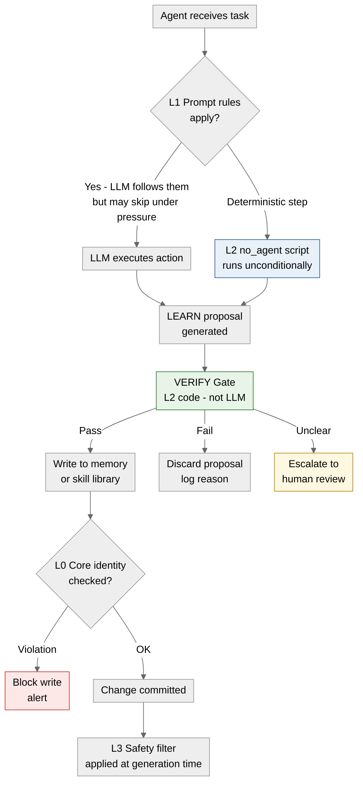
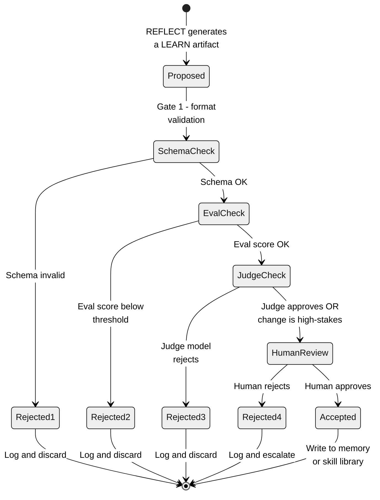

# 07 · Verification Gates and the Layered Control Model

**What you'll learn** - VERIFY is the spine of the self-improvement loop. Without an external gate between REFLECT and LEARN, every accepted change is an unvalidated trust decision, and compounding errors produce "recursive drift" - the agent's behavior silently degrades while its internal confidence stays high. This module establishes what a verification gate is, catalogues the evaluation sources that power it (tests, ground-truth tasks, schema checks, stronger-model judges, humans), explains the NousResearch L0-L3 rule-priority hierarchy and the production lesson that "Layer 1 alone failed," shows how plan-based orchestrators like Ivy Tendril wire gates into a lifecycle, and delivers a runnable `verification/gates.py` you can drop into the scaffold.

> [!info] Prerequisites
> - [[06 - Skill Acquisition and Curation]] - you must understand what a proposed LEARN artifact looks like before you can gate it
> - [[05 - Reflection and Self-Correction]] - reflection produces the proposals that VERIFY must accept or reject

---

## Learning Objectives

- [ ] Explain what "recursive drift" is and why VERIFY must sit between REFLECT and LEARN
- [ ] List at least four classes of external evaluation source and when to use each
- [ ] Draw the L0/L1/L2/L3 rule-priority hierarchy and identify where a deterministic script lives
- [ ] Articulate the production finding that motivated moving steps out of L1 prompt into L2 scripts
- [ ] Describe the three outcomes of a verification gate: keep / discard / escalate-to-human
- [ ] Implement a working gate that accepts or rejects a proposed memory or skill change based on eval results
- [ ] Integrate the gate into the ACT -> RECORD -> REFLECT -> LEARN -> VERIFY cycle

---

## 1 - Why Verification Gates Exist

The self-improvement loop sounds virtuous: the agent reflects on its failures, extracts a lesson, and updates itself. The failure mode is subtle - if every reflection is accepted, bad lessons accumulate alongside good ones. A single noisy trajectory ("the agent got lucky") can write an incorrect heuristic that corrupts a dozen future tasks. Each corrupted task then generates more training signal, amplifying the original error. This compounding is recursive drift.

The fix is structural: VERIFY is an independent evaluation step that treats every proposed LEARN artifact - a new memory entry, a skill function, a rewritten system prompt, a code patch - as untrusted until an external signal approves it.

> [!note] The key word is "external"
> Self-assessment by the same model that produced the proposal is insufficient. The model cannot reliably know its own error rate on the dimensions that matter. You need a signal that is outside the agent's own reasoning path.

The [Continual Harness paper](https://arxiv.org/abs/2605.09998) frames VERIFY as the "gating oracle" that controls what enters the long-term knowledge store. The [SkillOS paper](https://arxiv.org/abs/2605.06614) shows that skill curation quality - meaning what VERIFY accepts - dominates final agent performance more than the skill-generation model used.

---

## 2 - Evaluation Source Taxonomy

A gate is only as good as its signal. Here are the main classes, from cheapest to most expensive:

### 2.1 - Unit Tests and Regression Suites

If the proposed change is code (a skill function, a patch), run your test suite. This is deterministic, fast, and cheap. The [agent-seed harness](https://github.com/B67687/agentic-workflows/pull/82) makes `scripts/commit` refuse to land changes that fail tests - the gate is enforced at the filesystem layer, not by the LLM.

The TDD Hardening pattern ([referenced in agent-seed's PR](https://github.com/B67687/agentic-workflows/pull/82)) goes further: before a proposed skill is allowed into `skills/SKILLS/`, a test for that skill's contract must exist and pass. Write-test-first applies to agent-generated code as much as human-generated code.

### 2.2 - Ground-Truth Task Replay

For memory and heuristic changes (not code), run a held-out set of tasks whose correct answers you know. If the proposed change improves pass rate on that set, accept; if it regresses, discard. This is the eval harness pattern from [[10 - Evaluation Harness]] - use it here as a gate signal.

### 2.3 - Schema and Format Checks

The cheapest structural guard: validate that a proposed memory entry or skill metadata conforms to the expected JSON schema. A malformed entry that passes this check can still be semantically wrong, so this is a floor, not a ceiling.

### 2.4 - Stronger Model as Judge

When you cannot construct a deterministic test, use a larger or more capable model to evaluate the proposal. The judge is given the original task, the proposed change, and a rubric; it scores quality or explicitly approves/rejects. This works well for prose heuristics and natural-language memory entries.

On your local stack: use `AGENT_BACKEND=vibeproxy` with a large Claude model as the judge, while the generating agent runs on a smaller `AGENT_BACKEND=omlx` model. The asymmetry in capability creates a meaningful signal. Because both backends are rate-limited rather than per-token-metered, this multi-call pattern is economically viable - something that would add non-trivial cost on a pay-per-token API.

### 2.5 - Human-in-the-Loop on Final Execution

[Reddit's r/AI_Agents community](https://www.reddit.com/r/AI_Agents/comments/1taei9m/stop_building_ai_agents/) - 1,447 upvotes on "Stop building AI agents" - includes the finding that human approval on the final execution step "saves 90% of the headache." For irreversible or high-stakes changes (writing to the skill library, committing a code patch, modifying the agent's own system prompt), requiring a human acknowledgement before the LEARN step executes is the right call. The Artemis "human-governed self-improvement loop" formalizes this: every proposed self-modification that touches the agent's core behavior requires a human to sign off before landing.

> [!warning] Automation vs. agency boundary
> The [Reddit thread](https://www.reddit.com/r/AI_Agents/comments/1taei9m/stop_building_ai_agents/) notes: "compliance will review it -> automation, full stop." If your modified agent will be used in a regulated context, the VERIFY gate should default to human-in-the-loop, not just stronger-model-as-judge.

---

## 3 - The L0/L1/L2/L3 Rule-Priority Hierarchy

The [NousResearch hermes-agent issue #29652](https://github.com/NousResearch/hermes-agent/issues/29652) documents a rule-priority hierarchy that emerged from production use. It defines four layers of control, ordered by authority:

| Layer | Name | Mechanism | Override? |
|---|---|---|---|
| L0 | Core identity | Baked into model weights / system prompt header | Non-overridable |
| L1 | Prompt rules | Instructions in the system or user prompt | Overridable by L0 |
| L2 | Deterministic scripts | `no_agent` scripts outside the LLM path | Not subject to LLM interpretation |
| L3 | Global safety | Provider-level safety filters | Applied last, always active |

The critical production finding: **"Layer 1 (Prompt) alone failed."** Agents skipped explicit prompt instructions under certain conditions - not through jailbreak, but through normal task-pressure reasoning ("this step seems unnecessary for the goal"). Teams responded by moving deterministic steps to L2: shell scripts, CI checks, and commit hooks that run regardless of what the LLM decides. The VERIFY gate, for exactly this reason, should be implemented as L2 code rather than as a prompt instruction.



*The L0-L3 layered control model. VERIFY lives at L2 - deterministic code that the LLM cannot reason around. L0 protects core identity; L3 is the provider safety layer applied at generation time.*

> [!tip] Why L2 for VERIFY?
> If you implement the gate as a prompt ("only accept this change if the tests pass"), the LLM can rationalize past it. If you implement it as a Python function that checks test output and returns `True/False`, the result is deterministic. Move your invariants to L2.

---

## 4 - Plan-Based Lifecycle with Verification Gates

[Ivy Tendril](https://github.com/yeaight7/awesome-ai-devtools/pull/3) is an orchestrator that manages Claude Code, Codex, and Copilot in a plan-based lifecycle with explicit verification gates. Each phase of a plan has an entry condition and an exit condition; the exit condition is the gate. An agent cannot advance from "skill proposed" to "skill landed" without passing the exit gate for that phase.

This is the right mental model for your scaffold: treat VERIFY not as a single checkpoint but as a series of phase gates that the proposal must clear in sequence.



*A LEARN proposal passing through sequential verification gates. Each gate is a separate L2 check. Rejection at any stage discards the proposal and logs the reason for future meta-learning.*

---

## 5 - TDD Hardening for Agent-Generated Code

The TDD Hardening approach (documented in [agent-seed's PR #82](https://github.com/B67687/agentic-workflows/pull/82)) applies test-driven discipline to agent-generated artifacts:

1. Before the agent generates a skill function, specify a test contract: what inputs produce what outputs.
2. The agent writes the skill implementation.
3. The VERIFY gate runs `pytest` on the contract tests.
4. Only if tests pass does the skill get written to `skills/SKILLS/`.

This is distinct from using tests as evaluation signal (section 2.1): here, the test is written before the skill, making the gate specification explicit rather than implicit.

> [!example] TDD hardening in the scaffold
> In `verification/gates.py`, the scaffold calls `run_gate(proposal, baseline_score=..., sandbox=SubprocessSandbox(), evaluator=...)` from `agentkit.gates`. The `execute` stage runs the proposed skill code inside `SubprocessSandbox` (cwd-jailed, timed, output-capped); a crash or test failure at that stage returns `Outcome.REJECT` with `verdict.stage == "execute"`. The skill is never written to `skills/SKILLS/` directly by the agent — only when `verdict.status == Outcome.ACCEPT`.

---

## 6 - Hands-On Lab - Building `verification/gates.py`

This lab builds the gate module referenced throughout the curriculum. The file lives at `verification/gates.py` in the scaffold at `/Users/yuxinliu/self-improving-agent-lab`.

### 6.1 - Setup

```bash
cd /Users/yuxinliu/self-improving-agent-lab
# Install deps if not already present
pip install openai jsonschema pytest
```

### 6.2 - The Gate Implementation

> [!info] In the lab: agentkit.gates
> `verification/gates.py` in the scaffold **delegates** to `agentkit.gates`. The public API is `run_gate` / `Gate` / `Outcome` from `agentkit.gates`, and `SubprocessSandbox` from `agentkit.sandbox`. Every self-modification admitted by `agentkit.SelfImprovingAgent` — skills, prompts, tool registrations — passes through this gate (see `scaffold/lab_agent.py`, `agent.improve`). You do not need to build the gate from scratch; you configure and call it.

The LEARN admission gate in `agentkit` runs six deterministic stages in order — **syntax → containment → execute → regression → safety → delta** — and returns one of three outcomes: `ACCEPT`, `REJECT`, or `ESCALATE`.

The invariant to hold in your head: **the LLM is a veto, not a vote.** The deterministic stages (syntax through delta) decide first. The injected safety LLM (`evaluator`) can only add a veto — `ESCALATE` or `REJECT` — after the deterministic stages pass. It can never flip a deterministic `REJECT` to `ACCEPT`.

```python
# verification/gates.py  (scaffold file — delegates to agentkit)
"""
Verification gate for LEARN proposals.
Delegates to agentkit.gates.  Three outcomes: ACCEPT, REJECT, ESCALATE.

Stage order (deterministic first, LLM veto last):
  syntax -> containment -> execute -> regression -> safety -> delta

The LLM evaluator is a veto, not a vote: it can only REJECT/ESCALATE
after deterministic stages pass; it cannot override a deterministic REJECT.
"""

from agentkit.gates import run_gate, Gate, Outcome
from agentkit.sandbox import SubprocessSandbox

# ---------------------------------------------------------------------------
# Functional form — one call, one Verdict
# ---------------------------------------------------------------------------

def admit_proposal(proposal: dict, baseline_score: float, evaluator) -> tuple[Outcome, str]:
    """
    Run the LEARN admission gate on a proposed self-modification.

    proposal:       e.g. {"type": "skill", "code": "def foo(): ..."}
    baseline_score: current agent score on the held-out eval set (0.0–1.0)
    evaluator:      callable(proposal) -> float  (new score if proposal were applied)

    Returns (Outcome, stage_that_decided).
    """
    verdict = run_gate(
        proposal,
        baseline_score=baseline_score,
        sandbox=SubprocessSandbox(),
        evaluator=evaluator,
    )
    return verdict.status, verdict.stage


# ---------------------------------------------------------------------------
# Class form — reuse sandbox and evaluator across many proposals
# ---------------------------------------------------------------------------

def make_gate(evaluator) -> Gate:
    """Return a Gate instance bound to SubprocessSandbox and the given evaluator."""
    return Gate(sandbox=SubprocessSandbox(), evaluator=evaluator)
```

Key points about the stage ordering:

- **syntax** — rejects immediately if the proposal code does not parse. No sandbox, no LLM.
- **containment** — ESCALATEs proposals whose code calls filesystem, subprocess, network, or `exec`/`eval`. Side-effecting proposals are flagged before execution, not after.
- **execute** — runs the code in `SubprocessSandbox` (argv-not-shell, cwd-jailed, timed, output-capped). A crash here REJECTs at the `execute` stage.
- **regression** — calls `evaluator(proposal)` and checks the new score against `baseline_score`. A drop REJECTs.
- **safety** — the injected LLM veto. Can ESCALATE or REJECT; cannot flip a prior deterministic decision.
- **delta** — final magnitude check; rejects implausibly large jumps (positive or negative).

### 6.3 - Trying the Gate

```python
# verification/try_gate.py  (run from scaffold root)

from agentkit.gates import run_gate, Outcome
from agentkit.sandbox import SubprocessSandbox

# A clean skill proposal — should reach ACCEPT
good_proposal = {
    "type": "skill",
    "code": "def summarise(text: str) -> str:\n    return text[:200]",
}

# A proposal with a syntax error — REJECTs at the syntax stage
bad_syntax = {
    "type": "skill",
    "code": "def broken(:\n    pass",
}

# A proposal that touches the filesystem — ESCALATEs at containment
side_effecting = {
    "type": "skill",
    "code": "import os\ndef rm_logs():\n    os.remove('/tmp/log.txt')",
}

# Dummy evaluator: always returns a score slightly above baseline
evaluator = lambda proposal: 0.75

sandbox = SubprocessSandbox()

for label, proposal in [
    ("good_proposal", good_proposal),
    ("bad_syntax", bad_syntax),
    ("side_effecting", side_effecting),
]:
    verdict = run_gate(proposal, baseline_score=0.5, sandbox=sandbox, evaluator=evaluator)
    print(f"[{label}] status={verdict.status}  decided_at_stage={verdict.stage}")

# Expected output:
# [good_proposal]    status=accept    decided_at_stage=delta
# [bad_syntax]       status=reject    decided_at_stage=syntax
# [side_effecting]   status=escalate  decided_at_stage=containment
```

Checking outcomes with the `Outcome` enum:

```python
from agentkit.gates import Outcome

if verdict.status == Outcome.ACCEPT:
    store.write(proposal)
elif verdict.status == Outcome.ESCALATE:
    queue_for_human_review(proposal, stage=verdict.stage)
else:  # Outcome.REJECT
    log_rejected(proposal, stage=verdict.stage)

# Outcome values are plain strings — Outcome.ACCEPT == "accept", etc.
assert Outcome.ACCEPT == "accept"
assert Outcome.REJECT == "reject"
assert Outcome.ESCALATE == "escalate"
```

Run from the scaffold root (no special backend needed — the gate is local):

```bash
python verification/try_gate.py
```

> [!tip] Rate limits vs. token cost
> The safety LLM veto inside `agentkit.gates` is invoked only after all deterministic stages pass. On your local stack with `AGENT_BACKEND=vibeproxy`, this means the LLM call is made at most once per proposal that survives syntax, containment, execute, and regression checks — cheap deterministic stages filter the expensive call. Because VibeProxy routes a Claude MAX subscription (not a pay-per-token API), this veto call costs you nothing in dollars, only rate-limit headroom.

---

## 7 - Wiring the Gate into the Full Loop

With `agentkit.gates` in place, the LEARN step in `evolve/loop.py` becomes:

```python
# evolve/loop.py (relevant excerpt)
import json, datetime
from pathlib import Path

from agentkit.gates import run_gate, Outcome
from agentkit.sandbox import SubprocessSandbox
from memory.store import MemoryStore
from reflection.reflect import reflect_on_trajectory


def improve_from_trajectory(trajectory: dict, store: MemoryStore, evaluator, baseline_score: float) -> None:
    """Run one REFLECT -> VERIFY -> LEARN cycle."""

    # REFLECT - generate a proposed self-modification
    proposal = reflect_on_trajectory(trajectory)
    if proposal is None:
        print("[IMPROVE] No proposal generated - nothing to verify.")
        return

    # VERIFY - run the admission gate (deterministic stages first, LLM veto last)
    verdict = run_gate(
        proposal,
        baseline_score=baseline_score,
        sandbox=SubprocessSandbox(),
        evaluator=evaluator,
    )

    if verdict.status == Outcome.ACCEPT:
        store.write(proposal)
        print(f"[IMPROVE] Accepted at stage={verdict.stage}: {str(proposal)[:60]}...")
    elif verdict.status == Outcome.ESCALATE:
        print(f"[IMPROVE] Escalated at stage={verdict.stage} - queued for human review")
        _log_rejected(proposal, verdict)
    else:  # Outcome.REJECT
        print(f"[IMPROVE] Rejected at stage={verdict.stage}")
        _log_rejected(proposal, verdict)


def _log_rejected(proposal: dict, verdict) -> None:
    archive = Path("evolve/archive")
    archive.mkdir(exist_ok=True)
    ts = datetime.datetime.utcnow().strftime("%Y%m%dT%H%M%SZ")
    (archive / f"rejected_{ts}.json").write_text(
        json.dumps({"proposal": proposal, "status": verdict.status, "stage": verdict.stage}, indent=2)
    )
```

The `stage` field on the verdict tells you *which* deterministic check triggered — useful for debugging why a proposal was rejected without having to re-run the full gate.

---

## 8 - Pitfalls

> [!danger] The self-approving trap
> Do not use the same model instance that generated the proposal to also judge it. You will get near-100% approval rates. The judge must be a separate call, ideally a different model or at minimum a different temperature/system prompt.

> [!warning] Silent discard is a failure mode
> If you discard proposals without logging them, you lose the signal about what your agent is getting wrong at the reflection stage. Write every rejection to `evolve/archive/` with the reason. This log is the raw material for [[08 - Self-Modification - The DGM Pattern]] meta-improvements.

> [!warning] Threshold calibration is a project-specific task
> The `baseline_score` you pass to `run_gate` sets the floor for the regression stage. The gate rejects proposals whose `evaluator` score falls below that floor. Start conservative (baseline near your current best score) and relax only if you observe excessive rejection of genuinely good proposals. Track your accept/reject ratio in `CHANGELOG.md`.

> [!danger] L1 prompt rules are not a gate
> It is tempting to add a rule like "only write memory if the eval passes" to your system prompt. Based on the [NousResearch production finding](https://github.com/NousResearch/hermes-agent/issues/29652), this will fail under task pressure. The gate must be L2 code — the `if verdict.status == Outcome.ACCEPT` check in Python, not an instruction to the LLM.

> [!tip] Sandboxing and VERIFY are complementary
> VERIFY decides whether to accept a change. [[09 - Sandboxing and Safe Execution]] decides whether to run it safely. Use both: sandbox the eval run so a malicious skill cannot escape, then gate the result.

---

> [!question] Checkpoint
> 1. What is "recursive drift" and which step in the ACT -> RECORD -> REFLECT -> LEARN loop prevents it?
> 2. The NousResearch production finding says "Layer 1 alone failed." What does that mean in practice, and what is the recommended fix?
> 3. A proposal passes syntax and containment checks, but its `evaluator` score (0.45) is below the `baseline_score` (0.5). The safety LLM would have returned ACCEPT. What does `run_gate` return, and at which stage?
> 4. Why should the safety LLM veto be injected after the deterministic stages rather than before?
> 5. A proposal ESCALATEs at the `containment` stage. What does that tell you about the proposal's code, and what should the scaffold do next?

---

## Navigation

← [[06 - Skill Acquisition and Curation]] · [[00 - Curriculum Map]] (home) · [[08 - Self-Modification - The DGM Pattern]] →

**Cross-references** - [[01 - What Self-Improving Means]] · [[05 - Reflection and Self-Correction]] · [[09 - Sandboxing and Safe Execution]] · [[10 - Evaluation Harness]]
