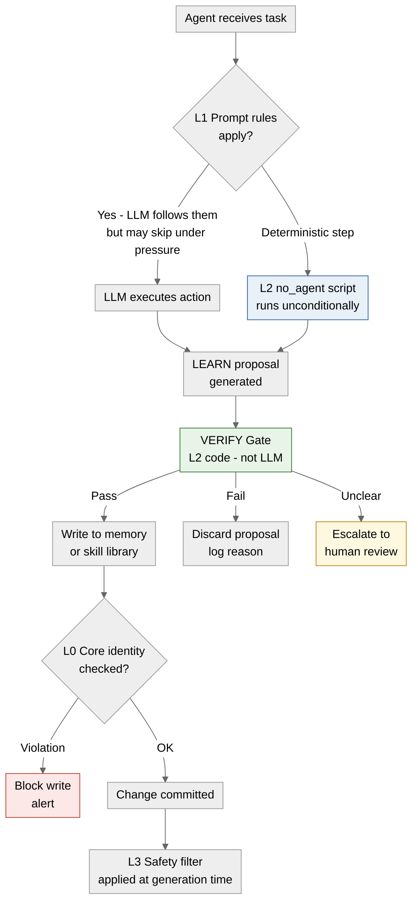
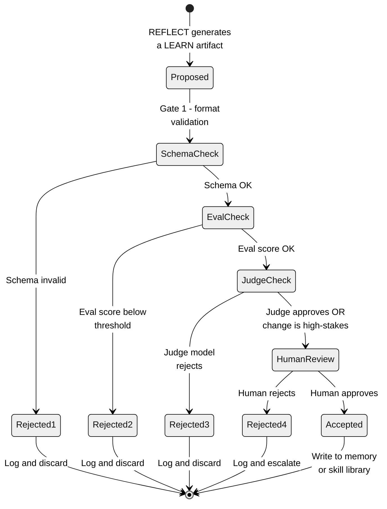

# 07 · Verification Gates and the Layered Control Model

**What you'll learn** - VERIFY is the spine of the self-improvement loop. Without an external gate between REFLECT and LEARN, every accepted change is an unvalidated trust decision, and compounding errors produce "recursive drift" - the agent's behavior silently degrades while its internal confidence stays high. This module establishes what a verification gate is, catalogues the evaluation sources that power it (tests, ground-truth tasks, schema checks, stronger-model judges, humans), explains the NousResearch L0-L3 rule-priority hierarchy and the production lesson that "Layer 1 alone failed," shows how plan-based orchestrators like Ivy Tendril wire gates into a lifecycle, and delivers a runnable `verification/gates.py` you can drop into the scaffold.

> [!info] Prerequisites
> - [[06 - Skill Acquisition and Curation]] - you must understand what a proposed LEARN artifact looks like before you can gate it
> - [[05 - Reflection and Self-Correction]] - reflection produces the proposals that VERIFY must accept or reject

---

## Learning Objectives

- [ ] Explain what "recursive drift" is and why VERIFY must sit between REFLECT and LEARN
- [ ] List at least four classes of external evaluation source and when to use each
- [ ] Draw the L0/L1/L2/L3 rule-priority hierarchy and identify where a deterministic script lives
- [ ] Articulate the production finding that motivated moving steps out of L1 prompt into L2 scripts
- [ ] Describe the three outcomes of a verification gate: keep / discard / escalate-to-human
- [ ] Implement a working gate that accepts or rejects a proposed memory or skill change based on eval results
- [ ] Integrate the gate into the ACT -> RECORD -> REFLECT -> LEARN -> VERIFY cycle

---

## 1 - Why Verification Gates Exist

The self-improvement loop sounds virtuous: the agent reflects on its failures, extracts a lesson, and updates itself. The failure mode is subtle - if every reflection is accepted, bad lessons accumulate alongside good ones. A single noisy trajectory ("the agent got lucky") can write an incorrect heuristic that corrupts a dozen future tasks. Each corrupted task then generates more training signal, amplifying the original error. This compounding is recursive drift.

The fix is structural: VERIFY is an independent evaluation step that treats every proposed LEARN artifact - a new memory entry, a skill function, a rewritten system prompt, a code patch - as untrusted until an external signal approves it.

> [!note] The key word is "external"
> Self-assessment by the same model that produced the proposal is insufficient. The model cannot reliably know its own error rate on the dimensions that matter. You need a signal that is outside the agent's own reasoning path.

The [Continual Harness paper](https://arxiv.org/abs/2605.09998) frames VERIFY as the "gating oracle" that controls what enters the long-term knowledge store. The [SkillOS paper](https://arxiv.org/abs/2605.06614) shows that skill curation quality - meaning what VERIFY accepts - dominates final agent performance more than the skill-generation model used.

---

## 2 - Evaluation Source Taxonomy

A gate is only as good as its signal. Here are the main classes, from cheapest to most expensive:

### 2.1 - Unit Tests and Regression Suites

If the proposed change is code (a skill function, a patch), run your test suite. This is deterministic, fast, and cheap. The [agent-seed harness](https://github.com/B67687/agentic-workflows/pull/82) makes `scripts/commit` refuse to land changes that fail tests - the gate is enforced at the filesystem layer, not by the LLM.

The TDD Hardening pattern ([referenced in agent-seed's PR](https://github.com/B67687/agentic-workflows/pull/82)) goes further: before a proposed skill is allowed into `skills/SKILLS/`, a test for that skill's contract must exist and pass. Write-test-first applies to agent-generated code as much as human-generated code.

### 2.2 - Ground-Truth Task Replay

For memory and heuristic changes (not code), run a held-out set of tasks whose correct answers you know. If the proposed change improves pass rate on that set, accept; if it regresses, discard. This is the eval harness pattern from [[10 - Evaluation Harness]] - use it here as a gate signal.

### 2.3 - Schema and Format Checks

The cheapest structural guard: validate that a proposed memory entry or skill metadata conforms to the expected JSON schema. A malformed entry that passes this check can still be semantically wrong, so this is a floor, not a ceiling.

### 2.4 - Stronger Model as Judge

When you cannot construct a deterministic test, use a larger or more capable model to evaluate the proposal. The judge is given the original task, the proposed change, and a rubric; it scores quality or explicitly approves/rejects. This works well for prose heuristics and natural-language memory entries.

On your local stack: use `AGENT_BACKEND=vibeproxy` with a large Claude model as the judge, while the generating agent runs on a smaller `AGENT_BACKEND=omlx` model. The asymmetry in capability creates a meaningful signal. Because both backends are rate-limited rather than per-token-metered, this multi-call pattern is economically viable - something that would add non-trivial cost on a pay-per-token API.

### 2.5 - Human-in-the-Loop on Final Execution

[Reddit's r/AI_Agents community](https://www.reddit.com/r/AI_Agents/comments/1taei9m/stop_building_ai_agents/) - 1,447 upvotes on "Stop building AI agents" - includes the finding that human approval on the final execution step "saves 90% of the headache." For irreversible or high-stakes changes (writing to the skill library, committing a code patch, modifying the agent's own system prompt), requiring a human acknowledgement before the LEARN step executes is the right call. The Artemis "human-governed self-improvement loop" formalizes this: every proposed self-modification that touches the agent's core behavior requires a human to sign off before landing.

> [!warning] Automation vs. agency boundary
> The [Reddit thread](https://www.reddit.com/r/AI_Agents/comments/1taei9m/stop_building_ai_agents/) notes: "compliance will review it -> automation, full stop." If your modified agent will be used in a regulated context, the VERIFY gate should default to human-in-the-loop, not just stronger-model-as-judge.

---

## 3 - The L0/L1/L2/L3 Rule-Priority Hierarchy

The [NousResearch hermes-agent issue #29652](https://github.com/NousResearch/hermes-agent/issues/29652) documents a rule-priority hierarchy that emerged from production use. It defines four layers of control, ordered by authority:

| Layer | Name | Mechanism | Override? |
|---|---|---|---|
| L0 | Core identity | Baked into model weights / system prompt header | Non-overridable |
| L1 | Prompt rules | Instructions in the system or user prompt | Overridable by L0 |
| L2 | Deterministic scripts | `no_agent` scripts outside the LLM path | Not subject to LLM interpretation |
| L3 | Global safety | Provider-level safety filters | Applied last, always active |

The critical production finding: **"Layer 1 (Prompt) alone failed."** Agents skipped explicit prompt instructions under certain conditions - not through jailbreak, but through normal task-pressure reasoning ("this step seems unnecessary for the goal"). Teams responded by moving deterministic steps to L2: shell scripts, CI checks, and commit hooks that run regardless of what the LLM decides. The VERIFY gate, for exactly this reason, should be implemented as L2 code rather than as a prompt instruction.



*The L0-L3 layered control model. VERIFY lives at L2 - deterministic code that the LLM cannot reason around. L0 protects core identity; L3 is the provider safety layer applied at generation time.*

> [!tip] Why L2 for VERIFY?
> If you implement the gate as a prompt ("only accept this change if the tests pass"), the LLM can rationalize past it. If you implement it as a Python function that checks test output and returns `True/False`, the result is deterministic. Move your invariants to L2.

---

## 4 - Plan-Based Lifecycle with Verification Gates

[Ivy Tendril](https://github.com/yeaight7/awesome-ai-devtools/pull/3) is an orchestrator that manages Claude Code, Codex, and Copilot in a plan-based lifecycle with explicit verification gates. Each phase of a plan has an entry condition and an exit condition; the exit condition is the gate. An agent cannot advance from "skill proposed" to "skill landed" without passing the exit gate for that phase.

This is the right mental model for your scaffold: treat VERIFY not as a single checkpoint but as a series of phase gates that the proposal must clear in sequence.



*A LEARN proposal passing through sequential verification gates. Each gate is a separate L2 check. Rejection at any stage discards the proposal and logs the reason for future meta-learning.*

---

## 5 - TDD Hardening for Agent-Generated Code

The TDD Hardening approach (documented in [agent-seed's PR #82](https://github.com/B67687/agentic-workflows/pull/82)) applies test-driven discipline to agent-generated artifacts:

1. Before the agent generates a skill function, specify a test contract: what inputs produce what outputs.
2. The agent writes the skill implementation.
3. The VERIFY gate runs `pytest` on the contract tests.
4. Only if tests pass does the skill get written to `skills/SKILLS/`.

This is distinct from using tests as evaluation signal (section 2.1): here, the test is written before the skill, making the gate specification explicit rather than implicit.

> [!example] TDD hardening in the scaffold
> In `verification/gates.py`, the `CodeSkillGate` class accepts a test file path alongside the proposed skill. It writes the skill to a temp directory, runs `pytest` against the temp dir, reads the return code, and returns `GateResult.PASS` or `GateResult.FAIL`. The skill is never written to `skills/SKILLS/` directly by the agent - only by the gate on pass.

---

## 6 - Hands-On Lab - Building `verification/gates.py`

This lab builds the gate module referenced throughout the curriculum. The file lives at `verification/gates.py` in the scaffold at `/Users/yuxinliu/self-improving-agent-lab`.

### 6.1 - Setup

```bash
cd /Users/yuxinliu/self-improving-agent-lab
# Install deps if not already present
pip install openai jsonschema pytest
```

### 6.2 - The Gate Implementation

```python
# verification/gates.py
"""
Verification gates for LEARN proposals.
Three possible outcomes: PASS, FAIL, ESCALATE_TO_HUMAN.

Supports:
  - Schema validation (structural gate)
  - Eval task replay (semantic gate)
  - Stronger model as judge (quality gate)
  - Human-in-the-loop (final gate for high-stakes changes)

Works with both AGENT_BACKEND=omlx and AGENT_BACKEND=vibeproxy.
Judge calls always use vibeproxy (larger model) if available, else omlx.
"""

from __future__ import annotations

import json
import os
import subprocess
import tempfile
import textwrap
from dataclasses import dataclass, field
from enum import Enum
from pathlib import Path
from typing import Any, Optional

from jsonschema import ValidationError, validate

# -- Import the unified adapter -----------------------------------------------
import sys
sys.path.insert(0, str(Path(__file__).parent.parent))
from backends.adapter import make_client


# ---------------------------------------------------------------------------
# Types
# ---------------------------------------------------------------------------

class GateOutcome(str, Enum):
    PASS = "pass"
    FAIL = "fail"
    ESCALATE = "escalate"


@dataclass
class GateResult:
    outcome: GateOutcome
    reason: str
    details: dict[str, Any] = field(default_factory=dict)

    @property
    def passed(self) -> bool:
        return self.outcome == GateOutcome.PASS


# ---------------------------------------------------------------------------
# Gate 1 - Schema / structural validation
# ---------------------------------------------------------------------------

MEMORY_ENTRY_SCHEMA = {
    "type": "object",
    "required": ["type", "content", "source_task"],
    "properties": {
        "type":        {"type": "string", "enum": ["heuristic", "fact", "procedure"]},
        "content":     {"type": "string", "minLength": 10},
        "source_task": {"type": "string"},
        "confidence":  {"type": "number", "minimum": 0.0, "maximum": 1.0},
        "tags":        {"type": "array", "items": {"type": "string"}},
    },
    "additionalProperties": True,
}

SKILL_ENTRY_SCHEMA = {
    "type": "object",
    "required": ["name", "description", "code", "tags"],
    "properties": {
        "name":        {"type": "string", "pattern": "^[a-z_][a-z0-9_]*$"},
        "description": {"type": "string", "minLength": 20},
        "code":        {"type": "string"},
        "tags":        {"type": "array", "items": {"type": "string"}},
    },
    "additionalProperties": True,
}


def schema_gate(proposal: dict, artifact_type: str = "memory") -> GateResult:
    """Gate 1 - validate structure before anything else."""
    schema = MEMORY_ENTRY_SCHEMA if artifact_type == "memory" else SKILL_ENTRY_SCHEMA
    try:
        validate(instance=proposal, schema=schema)
        return GateResult(GateOutcome.PASS, "Schema valid")
    except ValidationError as exc:
        return GateResult(GateOutcome.FAIL, f"Schema invalid: {exc.message}")


# ---------------------------------------------------------------------------
# Gate 2 - Eval task replay (semantic gate)
# ---------------------------------------------------------------------------

def eval_gate(
    proposal: dict,
    eval_tasks: list[dict],
    run_fn,
    threshold: float = 0.6,
) -> GateResult:
    """
    Gate 2 - run held-out eval tasks; accept if pass_rate >= threshold.

    eval_tasks: list of {"input": ..., "expected": ...}
    run_fn: callable(agent_state_with_proposal, input) -> str answer
    """
    if not eval_tasks:
        return GateResult(GateOutcome.PASS, "No eval tasks configured - skipping semantic gate")

    passed = 0
    results = []
    for task in eval_tasks:
        answer = run_fn(proposal, task["input"])
        ok = str(task["expected"]).strip().lower() in str(answer).strip().lower()
        results.append({"input": task["input"], "expected": task["expected"], "got": answer, "ok": ok})
        if ok:
            passed += 1

    rate = passed / len(eval_tasks)
    if rate >= threshold:
        return GateResult(GateOutcome.PASS, f"Eval pass rate {rate:.0%} >= {threshold:.0%}", {"results": results})
    return GateResult(GateOutcome.FAIL, f"Eval pass rate {rate:.0%} < {threshold:.0%}", {"results": results})


# ---------------------------------------------------------------------------
# Gate 3 - Stronger model as judge
# ---------------------------------------------------------------------------

JUDGE_PROMPT = textwrap.dedent("""
You are a strict quality gate for a self-improving agent system.
You will be given a proposed change to the agent's memory or skill library.
Evaluate it on three axes, each scored 1-5:
  1. Accuracy - is the content factually correct and task-relevant?
  2. Generality - will it help on future tasks, or is it over-fit to one case?
  3. Safety - could it cause the agent to behave incorrectly or dangerously?

Respond with ONLY valid JSON in this exact shape:
{
  "accuracy": <1-5>,
  "generality": <1-5>,
  "safety": <1-5>,
  "verdict": "PASS" | "FAIL" | "ESCALATE",
  "reason": "<one sentence>"
}
""").strip()


def judge_gate(proposal: dict, artifact_type: str = "memory") -> GateResult:
    """
    Gate 3 - use a stronger model to evaluate quality.
    Prefers vibeproxy (larger Claude) as judge; falls back to omlx.
    """
    judge_backend = os.getenv("JUDGE_BACKEND", "vibeproxy")
    try:
        client, model = make_client(judge_backend)
    except Exception:
        client, model = make_client("omlx")

    user_msg = (
        f"Artifact type: {artifact_type}\n\n"
        f"Proposed content:\n{json.dumps(proposal, indent=2)}"
    )

    try:
        resp = client.chat.completions.create(
            model=model,
            messages=[
                {"role": "system", "content": JUDGE_PROMPT},
                {"role": "user",   "content": user_msg},
            ],
            temperature=0,
            max_tokens=256,
        )
        raw = resp.choices[0].message.content.strip()
        # Strip markdown fences if the model wraps them
        if raw.startswith("```"):
            raw = raw.split("```")[1]
            if raw.startswith("json"):
                raw = raw[4:]
        result = json.loads(raw)
    except Exception as exc:
        # If the judge call fails entirely, escalate rather than silently pass/fail
        return GateResult(GateOutcome.ESCALATE, f"Judge call failed: {exc}")

    verdict = result.get("verdict", "FAIL").upper()
    reason  = result.get("reason", "no reason provided")
    details = {k: result[k] for k in ("accuracy", "generality", "safety") if k in result}

    if verdict == "PASS":
        return GateResult(GateOutcome.PASS, reason, details)
    if verdict == "ESCALATE":
        return GateResult(GateOutcome.ESCALATE, reason, details)
    return GateResult(GateOutcome.FAIL, reason, details)


# ---------------------------------------------------------------------------
# Gate 4 - Human-in-the-loop (CLI prompt; replace with UI/webhook in prod)
# ---------------------------------------------------------------------------

def human_gate(proposal: dict, artifact_type: str = "memory") -> GateResult:
    """
    Gate 4 - ask a human to approve or reject.
    In production, replace with a webhook, Slack message, or UI review queue.
    """
    print("\n" + "=" * 60)
    print(f"[HUMAN REVIEW REQUIRED] Proposed {artifact_type} change:")
    print(json.dumps(proposal, indent=2))
    print("=" * 60)
    answer = input("Approve? [y/N/e=escalate]: ").strip().lower()
    if answer == "y":
        return GateResult(GateOutcome.PASS, "Human approved")
    if answer == "e":
        return GateResult(GateOutcome.ESCALATE, "Human requested escalation")
    return GateResult(GateOutcome.FAIL, "Human rejected")


# ---------------------------------------------------------------------------
# Composite gate runner
# ---------------------------------------------------------------------------

def run_gates(
    proposal: dict,
    artifact_type: str = "memory",
    eval_tasks: list[dict] | None = None,
    eval_run_fn=None,
    eval_threshold: float = 0.6,
    require_human: bool = False,
    skip_judge: bool = False,
) -> GateResult:
    """
    Run gates in sequence. Stop and return on first FAIL or ESCALATE.

    Gate order:
      1. Schema (L2 - deterministic)
      2. Eval replay (L2 - deterministic, optional)
      3. Judge model (L2 - model-based, skippable)
      4. Human (L2 - human, when require_human=True or earlier gate escalates)
    """
    # Gate 1 - Schema
    r = schema_gate(proposal, artifact_type)
    if not r.passed:
        print(f"[GATE 1 SCHEMA] {r.outcome.value}: {r.reason}")
        return r
    print(f"[GATE 1 SCHEMA] pass")

    # Gate 2 - Eval replay (optional)
    if eval_tasks and eval_run_fn:
        r = eval_gate(proposal, eval_tasks, eval_run_fn, eval_threshold)
        print(f"[GATE 2 EVAL  ] {r.outcome.value}: {r.reason}")
        if not r.passed:
            return r

    # Gate 3 - Judge model (skippable for tests or offline use)
    if not skip_judge:
        r = judge_gate(proposal, artifact_type)
        print(f"[GATE 3 JUDGE ] {r.outcome.value}: {r.reason}")
        if r.outcome == GateOutcome.FAIL:
            return r
        if r.outcome == GateOutcome.ESCALATE:
            require_human = True  # Force human review on escalation

    # Gate 4 - Human (explicit or escalated)
    if require_human:
        r = human_gate(proposal, artifact_type)
        print(f"[GATE 4 HUMAN ] {r.outcome.value}: {r.reason}")
        return r

    return GateResult(GateOutcome.PASS, "All gates passed")
```

### 6.3 - Trying the Gate

```python
# Run from the scaffold root: python -c "from verification.gates import run_gates; ..."
# Or save this as verification/try_gate.py

from verification.gates import run_gates, GateOutcome

# A well-formed memory proposal
good_proposal = {
    "type": "heuristic",
    "content": "When the user asks for file diffs, always include surrounding context lines.",
    "source_task": "task_2026_05_31_001",
    "confidence": 0.85,
    "tags": ["files", "diffs", "context"],
}

# A malformed proposal (missing required field)
bad_proposal = {
    "type": "heuristic",
    "content": "short",  # too short - minLength 10 violated
    # missing source_task
}

print("--- Good proposal ---")
result = run_gates(good_proposal, artifact_type="memory", skip_judge=True)
print(f"Final outcome: {result.outcome.value}\n")

print("--- Bad proposal ---")
result = run_gates(bad_proposal, artifact_type="memory", skip_judge=True)
print(f"Final outcome: {result.outcome.value} - {result.reason}\n")
```

Run with either backend (judge gate will use vibeproxy if `AGENT_BACKEND=vibeproxy` is set):

```bash
# Local model as judge
AGENT_BACKEND=omlx python verification/try_gate.py

# Claude via VibeProxy as judge (note: VibeProxy ToS caveat applies - check your subscription terms)
AGENT_BACKEND=vibeproxy JUDGE_BACKEND=vibeproxy python verification/try_gate.py
```

> [!tip] Rate limits vs. token cost
> Because VibeProxy routes a Claude MAX subscription (not a pay-per-token API), calling the judge model on every LEARN proposal costs you nothing in dollars - it only consumes rate limit headroom. This makes multi-call evaluation pipelines practical here in a way they would not be on a metered API.

---

## 7 - Wiring the Gate into the Full Loop

With `run_gates` in place, the LEARN step in `evolve/loop.py` becomes:

```python
# evolve/loop.py (relevant excerpt)
from verification.gates import run_gates, GateOutcome
from memory.store import MemoryStore
from reflection.reflect import reflect_on_trajectory

def improve_from_trajectory(trajectory: dict, store: MemoryStore) -> None:
    """Run one REFLECT -> VERIFY -> LEARN cycle."""

    # REFLECT - generate a proposed memory update
    proposal = reflect_on_trajectory(trajectory)
    if proposal is None:
        print("[IMPROVE] No proposal generated - nothing to verify.")
        return

    # VERIFY - gate the proposal before writing
    # High-stakes changes (confidence > 0.9 or type == "procedure") get human review
    high_stakes = (
        proposal.get("confidence", 0.0) > 0.9
        or proposal.get("type") == "procedure"
    )
    result = run_gates(
        proposal,
        artifact_type="memory",
        require_human=high_stakes,
    )

    if result.outcome == GateOutcome.PASS:
        store.write(proposal)
        print(f"[IMPROVE] Accepted: {proposal['content'][:60]}...")
    else:
        print(f"[IMPROVE] Rejected ({result.outcome.value}): {result.reason}")
        # Optionally: log to evolve/archive/ for meta-analysis
        _log_rejected(proposal, result)


def _log_rejected(proposal: dict, result) -> None:
    import json, datetime
    from pathlib import Path
    archive = Path("evolve/archive")
    archive.mkdir(exist_ok=True)
    ts = datetime.datetime.utcnow().strftime("%Y%m%dT%H%M%SZ")
    (archive / f"rejected_{ts}.json").write_text(
        json.dumps({"proposal": proposal, "outcome": result.outcome.value, "reason": result.reason}, indent=2)
    )
```

---

## 8 - Pitfalls

> [!danger] The self-approving trap
> Do not use the same model instance that generated the proposal to also judge it. You will get near-100% approval rates. The judge must be a separate call, ideally a different model or at minimum a different temperature/system prompt.

> [!warning] Silent discard is a failure mode
> If you discard proposals without logging them, you lose the signal about what your agent is getting wrong at the reflection stage. Write every rejection to `evolve/archive/` with the reason. This log is the raw material for [[08 - Self-Modification - The DGM Pattern]] meta-improvements.

> [!warning] Threshold calibration is a project-specific task
> The default `eval_threshold=0.6` in `eval_gate` is a starting point, not a universal truth. Start conservative (0.8+) and lower only if you observe excessive rejection of genuinely good proposals. Track your accept/reject ratio in `CHANGELOG.md`.

> [!danger] L1 prompt rules are not a gate
> It is tempting to add a rule like "only write memory if the eval passes" to your system prompt. Based on the [NousResearch production finding](https://github.com/NousResearch/hermes-agent/issues/29652), this will fail under task pressure. The gate must be L2 code - the `if result.outcome == GateOutcome.PASS` check in Python, not an instruction to the LLM.

> [!tip] Sandboxing and VERIFY are complementary
> VERIFY decides whether to accept a change. [[09 - Sandboxing and Safe Execution]] decides whether to run it safely. Use both: sandbox the eval run so a malicious skill cannot escape, then gate the result.

---

> [!question] Checkpoint
> 1. What is "recursive drift" and which step in the ACT -> RECORD -> REFLECT -> LEARN loop prevents it?
> 2. The NousResearch production finding says "Layer 1 alone failed." What does that mean in practice, and what is the recommended fix?
> 3. You have a proposed memory heuristic that scored 0.55 on a 10-task eval set with a threshold of 0.6. The judge model returns PASS. Which gate triggers, and what is the outcome?
> 4. Why should the judge model be different from (or at least isolated from) the model that generated the proposal?
> 5. Under what conditions should `require_human=True` be set in `run_gates`? Give two concrete examples from the scaffold.

---

## Navigation

← [[06 - Skill Acquisition and Curation]] · [[00 - Curriculum Map]] (home) · [[08 - Self-Modification - The DGM Pattern]] →

**Cross-references** - [[01 - What Self-Improving Means]] · [[05 - Reflection and Self-Correction]] · [[09 - Sandboxing and Safe Execution]] · [[10 - Evaluation Harness]]
