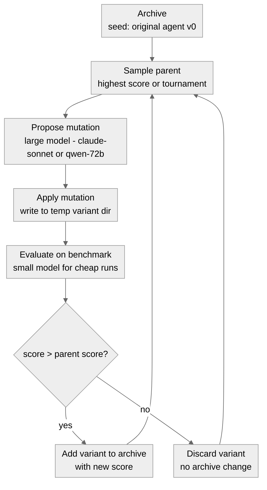
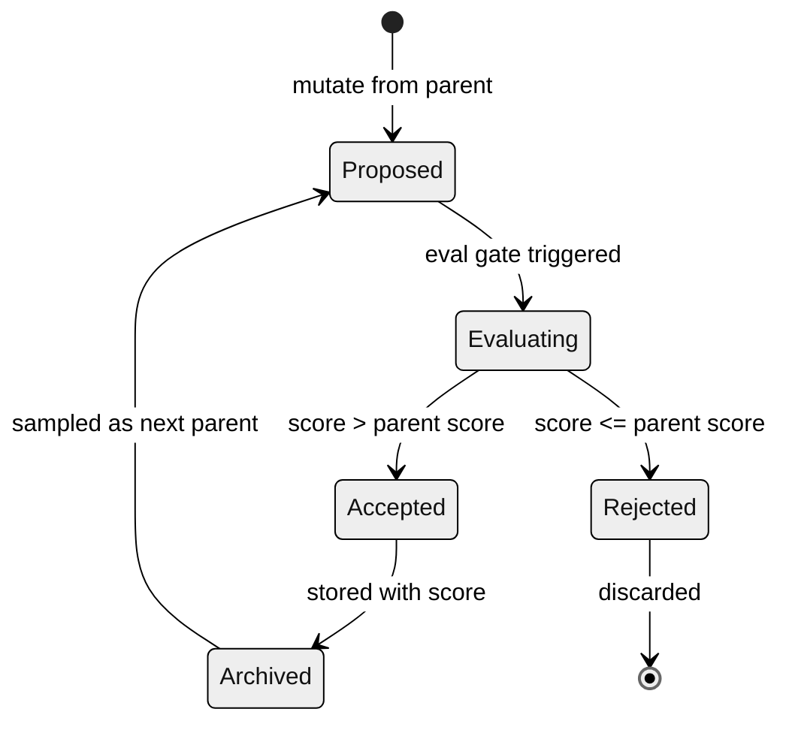

# 08 · Self-Modification - The DGM Pattern (Safely)

**What you'll learn** - The [Darwin Godel Machine (DGM)](https://arxiv.org/abs/2505.22954) is a self-rewriting agent that treats its own code and prompt as evolvable artifacts: it samples a parent variant from an archive, mutates it (adding a tool, rewriting a system prompt, patching a helper function), evaluates the mutation on a fixed benchmark, and keeps the variant only if it outperforms its parent. This note covers that loop in full - the archive, the keep/discard gate, and how [SIA](https://arxiv.org/abs/2605.27276) extends it to weight updates. You will also learn why, for subscription/local builders, the safe version of DGM modifies the harness and prompt rather than model weights, how to use a large model for mutation proposals and a small local model for cheap eval runs, and where in the curriculum's ACT -> RECORD -> REFLECT -> LEARN -> VERIFY pipeline self-modification fits.

> [!info] Prerequisites
> - [[07 - Verification Gates and Layered Control]] - the eval gate that makes keep/discard safe
> - [[03 - The Minimal Agent Loop]] - the baseline loop being mutated
> - [[06 - Skill Acquisition and Curation]] - the skill archive pattern reused here

## Learning Objectives

- [ ] Explain the DGM archive loop: sample parent, mutate, evaluate, keep/discard, add to archive
- [ ] Contrast DGM (prompt/code mutation) with SIA (harness + weight updates) and identify which is safe for local/subscription builders
- [ ] Implement a minimal keep/discard self-modification loop over an agent's own system prompt
- [ ] Apply model routing: large model proposes mutations, small local model runs cheap evaluations
- [ ] Define the eval gate requirement: a mutation is kept only if it beats the parent on a fixed, sandboxed benchmark
- [ ] Explain why self-modification is restricted to narrow, benchmarkable, sandboxed sub-problems

---

## 1. The DGM Pattern - Core Idea

The [Darwin Godel Machine](https://arxiv.org/abs/2505.22954) moved SWE-bench pass rates from 20% to 50% by letting an agent iteratively rewrite its own coding tools and system prompt. The mechanism is deceptively simple:

1. **Archive** - a persistent store of (variant, score) pairs, seeded with the original agent
2. **Sample** - pick a parent from the archive (typically the highest-scoring variant, or with tournament selection)
3. **Mutate** - ask a large model to propose a change: "here is the current system prompt and tools; suggest one targeted improvement"
4. **Evaluate** - run the mutated agent on a fixed benchmark; compute its score
5. **Keep/Discard** - if the new score beats the parent's score, add the mutant to the archive; otherwise discard
6. **Repeat** - the archive grows with only improvements; the process is open-ended

This is "Darwin" (population-based selection) crossed with "Godel" (the agent can reason about and rewrite itself). The key safety property is that **mutations are never applied unconditionally** - the eval gate is the invariant.

### What Gets Mutated

In the original DGM paper, the agent rewrites Python tool code. For subscription/local builders, weight-level rewriting is not available - but that is fine, because the harness surface is large:

| Mutable surface | Examples |
|---|---|
| System prompt | Add a reasoning step, sharpen a constraint, add a few-shot example |
| Skill definitions | Rewrite a skill's docstring + implementation |
| Tool descriptions | Improve the description so the model calls it more reliably |
| Harness logic | Change how results are formatted, how context is truncated |
| Router rules | Adjust which tasks go to which model |

> [!note] SIA vs DGM
> [SIA (Self Improving AI)](https://arxiv.org/abs/2605.27276) from [hexo-ai](https://github.com/hexo-ai/sia) adds weight updates on top of the DGM loop - fine-tuning the model on trajectories that passed the eval gate. This is the "more aggressive" variant. For subscription/local builders: **skip weight updates, apply DGM at the harness/prompt layer only**. The [Continual Harness](https://arxiv.org/abs/2605.09998) paper formalizes this as "online adaptation" without retraining. A live proposal to wire SIA into a self-evolving agent as a harness-evolution skill is tracked in [hermes-agent-self-evolution #99](https://github.com/NousResearch/hermes-agent-self-evolution/issues/99).

> [!note] HyperAgents - the meta-agent rewrites its own harness
> [HyperAgents](https://arxiv.org/pdf/2603.19461) (Meta FAIR) pushes the DGM idea up one level: the meta-agent rewrites *its own code*, so the mechanism that **generates** improvements is itself subject to improvement - the paper calls this *metacognitive self-modification*. It also extends self-improvement past coding into non-coding tasks ([VentureBeat coverage](https://venturebeat.com/orchestration/meta-researchers-introduce-hyperagents-to-unlock-self-improving-ai-for-non-coding-tasks)). Same caution applies, only harder: a meta-agent that edits its own improvement loop needs an even stronger external VERIFY gate, because a single bad meta-mutation can corrupt every downstream mutation.

> [!note] Self-Harness - self-modification at the harness layer
> [Self-Harness: Harnesses That Improve Themselves](https://arxiv.org/abs/2606.09498) (June 2026) applies the keep/discard idea to the *harness itself*, with no human engineer and no stronger external model in the loop. Its loop has three stages: **Weakness Mining** (find model-specific failure patterns in execution traces), **Harness Proposal** (generate diverse but minimal harness edits tied to those failures), and **Proposal Validation** (accept an edit only after regression testing). Read it as the harness-layer sibling of DGM: the same accept-after-test gate, but a far smaller blast radius than weight or code edits - which is exactly the "modify the harness and prompt, not the weights" stance this module recommends for subscription/local builders.

---

## 2. The Archive Loop - Diagram



*The DGM archive loop: only improvements enter the archive, so the population monotonically improves on the benchmark. Model routing splits the expensive mutation step from the cheap evaluation step.*

---

## 3. Variant Lifecycle - Diagram



*A variant's lifecycle: it is proposed from a parent, evaluated on the fixed benchmark, then either archived (and eligible to become a parent) or discarded. Rejected variants leave no trace in the archive.*

---

## 4. Model Routing in the DGM Loop

The [community consensus](https://www.reddit.com/r/AI_Agents/comments/1taei9m/stop_building_ai_agents/) on model routing applies directly here: don't use the large model for every call. DGM has a natural split:

- **Mutation proposal** - requires creativity, understanding of the agent's purpose, and knowledge of what changes might help. Use the large model (`claude-sonnet-4-5-20250929` via VibeProxy, or `Qwen2.5-Coder-14B-Instruct-4bit` via oMLX).
- **Evaluation runs** - requires only task execution, not reasoning about the agent itself. Use the small local model (`qwen2.5-coder-7b` via oMLX). These can be batched and run fast.

This matches the [Autodidact](https://github.com/BuffaloTechRider/Autodidact) local-first pattern: keep the slow, expensive model out of the inner eval loop.

> [!warning] Rate Limits vs Token Cost
> Both oMLX and VibeProxy are rate-limited, not per-token-metered. Many eval runs are cheap in dollar terms but can saturate local throughput. Design the eval loop to run evaluations sequentially or in small batches. The mutation-proposal step (one large-model call per iteration) is the bottleneck to manage against VibeProxy rate limits.

---

## 5. Why Narrow and Benchmarkable

Self-modification without a reliable eval gate is recursive drift - the agent "improves" on a proxy metric while degrading on real tasks. The DGM paper's result (20% -> 50% on SWE-bench) holds because SWE-bench is a fixed, external benchmark that cannot be gamed by prompt changes.

> [!warning] The compounding ceiling - self-improvement often stalls at iteration one
> A 2026 study of [1,000+ harness experiments](https://aiweekly.co/alerts/ai-agents-hit-self-improvement-wall-after-one-pass) found agents reliably propose **one** structural harness improvement but then fail to **compound** it across later iterations. The plateau is attributed not to model size but to a missing **self-model** - the agent has no internal account of *why* the first change worked, so it cannot build on it. This puts a concrete ceiling on the "self-improvement compounds with capability" assumption, at iteration one. Practical takeaway for this module: do not assume your keep/discard loop will keep climbing on its own. Expect a fast first gain, then diminishing returns - and treat each accepted mutation as a deliberate, separately-verified step, not a self-sustaining ratchet.

For your own agent, the rule is: **only attempt DGM-style self-modification on sub-problems where you can write a real eval set in under an hour**. Good candidates:

- "Does the agent correctly parse the output format?" (5-10 test cases)
- "Does the agent call the right tool for these 8 query types?"
- "Does the reflection step produce a non-empty lesson on failure trajectories?"

Bad candidates: "Is the agent more helpful?" (unmeasurable), "Does the agent write better code?" (expensive to evaluate).

The [[10 - Evaluation Harness]] module covers building eval sets. The [[09 - Sandboxing and Safe Execution]] module covers running mutated code without damaging your system - always required before self-modification loops.

> [!danger] Never Self-Modify Without a Sandbox
> Mutated tool code runs on your machine. Before starting any self-modification loop, ensure the eval environment is sandboxed. See [[09 - Sandboxing and Safe Execution]]. The [Airlock](https://github.com/airlockrun/airlock/) project (self-upgrading compiled agents) and [Containarium](https://github.com/footprintai/Containarium) (MCP-native sandbox) are purpose-built for this. Skipping sandboxing means a bad mutation can delete files, corrupt state, or exfiltrate data.

---

## 6. The Scaffold Layout

The runnable lab uses two scaffold paths:

```
evolve/loop.py       # delegates to agentkit.evolve (keep/discard loop)
evals/tasks.py       # the fixed eval set
evals/run.py         # runner that scores a variant
scaffold/lab_agent.py  # SelfImprovingAgent.improve() surface
```

The archive is managed internally by `agentkit.evolve`; accepted variants are written to disk as role config files (reviewed as a git diff before the agent reloads them).

> [!info] In the lab: agentkit.evolve
> The lab's `evolve/loop.py` delegates to `agentkit.evolve` — specifically `optimize_text` / `evolve_prompt` (labelled eval path) and `evolve_prompt_rho` (label-free, self-preference path). The keep/discard control is **deterministic and model-free**: the injected LLM is only the mutation proposer; every candidate is admitted solely through the LEARN `Gate` ([[07 - Verification Gates and Layered Control]]). The optimizer maintains a DGM-style open-ended archive of variants and does weakness-targeting internally.
>
> The high-level surface is `agent.improve(eval_set, role=..., epochs=...)` on `agentkit.SelfImprovingAgent`, which rewrites the role's config file on disk **only on ACCEPT** (review as a git diff). See `scaffold/lab_agent.py`.

---

## 7. Hands-On Lab - Minimal Keep/Discard Self-Modification Loop

This lab implements a keep/discard loop that mutates the agent's own system prompt and scores each variant on a tiny eval set. It maps directly to `evolve/loop.py` in the scaffold.

### Step 1 - Define a Tiny Eval Set

Create `evals/tasks.py` with five deterministic test cases:

```python
# evals/tasks.py
# Each task: input text -> expected keyword in the agent's response.
# Simple enough to run fast; real enough to catch regressions.

TASKS = [
    {
        "id": "t1",
        "user": "List three benefits of immutable data structures.",
        "must_contain": ["immutable", "side effect"],
    },
    {
        "id": "t2",
        "user": "What is the difference between a list and a tuple in Python?",
        "must_contain": ["mutable", "tuple"],
    },
    {
        "id": "t3",
        "user": "Explain what a context manager does in one sentence.",
        "must_contain": ["with", "__exit__"],
    },
    {
        "id": "t4",
        "user": "What does the walrus operator do?",
        "must_contain": [":=", "assign"],
    },
    {
        "id": "t5",
        "user": "Name two Python built-ins for functional programming.",
        "must_contain": ["map", "filter"],
    },
]
```

### Step 2 - Eval Runner and Gate

The eval runner scores a candidate system prompt; the gate wraps the keep/discard decision. Both are passed into `agentkit.evolve` — the archive itself is managed internally by the library (DGM-style open-ended archive with weakness-targeting).

```python
# evals/run.py
import sys, os
sys.path.insert(0, os.path.join(os.path.dirname(__file__), ".."))

from agentkit.evolve import Gate
from backends.adapter import make_client
from evals.tasks import TASKS


def score_variant(system_prompt: str, backend: str = "omlx") -> float:
    """Score a system prompt against the fixed eval set (0.0 - 1.0).
    Always uses the SMALL local model — cheap, fast, no VibeProxy rate pressure."""
    client, model = make_client(backend)
    passed = 0
    for task in TASKS:
        resp = client.chat.completions.create(
            model=model,
            messages=[
                {"role": "system", "content": system_prompt},
                {"role": "user", "content": task["user"]},
            ],
            max_tokens=256,
            temperature=0.0,
        )
        text = resp.choices[0].message.content.lower()
        if all(kw.lower() in text for kw in task["must_contain"]):
            passed += 1
    return passed / len(TASKS)


def make_gate() -> Gate:
    """Return the LEARN Gate: admit a candidate only if its score beats the parent."""
    # Gate.from_fn wraps a score-comparison predicate as an agentkit Gate object.
    # The gate is deterministic and model-free — the LLM is never in the keep/discard path.
    return Gate.from_fn(lambda candidate, parent: candidate.score > parent.score)
```

### Step 3 - The Keep/Discard Loop (via agentkit.evolve)

`evolve/loop.py` delegates to `agentkit.evolve`. The LLM is wired in only as the **mutation proposer**; keep/discard is fully deterministic via the LEARN `Gate`.

```python
# evolve/loop.py
"""
DGM-style keep/discard self-modification loop using agentkit.evolve.
- make_llm_proposer wires the LARGE model as the mutation proposer only
- The LEARN Gate (deterministic, model-free) controls keep/discard
- evolve_prompt runs the open-ended archive loop and returns OptimizeResult

Run:
    AGENT_BACKEND=vibeproxy python evolve/loop.py --epochs 5
    AGENT_BACKEND=omlx      python evolve/loop.py --epochs 5
"""

import argparse
import os
import sys

sys.path.insert(0, os.path.join(os.path.dirname(__file__), ".."))

from agentkit.evolve import evolve_prompt, make_llm_proposer, OptimizeResult
from backends.adapter import make_client
from evals.run import score_variant, make_gate

SEED_PROMPT = """You are a helpful Python tutor. Answer questions about Python
concisely and accurately. Include code examples when they clarify your answer."""


def run_loop(epochs: int, backend: str) -> None:
    # Mutation proposer: large model via VibeProxy or oMLX
    propose_client, propose_model = make_client(backend)
    proposer = make_llm_proposer(propose_client, model=propose_model)

    # Evaluator: small local model scores each candidate (0.0 - 1.0)
    def evaluate(prompt: str) -> float:
        return score_variant(prompt, backend="omlx")

    # Gate: LEARN Gate — candidate admitted only if score > parent score
    gate = make_gate()

    baseline_score = evaluate(SEED_PROMPT)
    print(f"Baseline score: {baseline_score:.2f}")

    result: OptimizeResult = evolve_prompt(
        SEED_PROMPT,
        propose=proposer,
        evaluate=evaluate,
        gate=gate,
        baseline_score=baseline_score,
        epochs=epochs,
        cwd=".",
    )

    print(f"\nDelta: {result.delta:+.2f}")
    if result.best is not None:
        print(f"Best variant score: {result.best.score:.2f}")
        print("Best system prompt:")
        print(result.best.artifact)
    else:
        print("No improvement found — baseline retained.")


if __name__ == "__main__":
    parser = argparse.ArgumentParser()
    parser.add_argument("--epochs", type=int, default=5)
    args = parser.parse_args()
    backend = os.getenv("AGENT_BACKEND", "omlx")
    run_loop(args.epochs, backend)
```

**Label-free (RHO) path** — when you have no eval labels, replace `evolve_prompt` with `evolve_prompt_rho`. The keep/discard decision becomes the agent's own pairwise self-preference (re-judged each epoch); the same gate still applies:

```python
from agentkit.evolve import evolve_prompt_rho

# judge_inputs: raw user queries the agent will compare its own outputs on
judge_inputs = [task["user"] for task in TASKS]

result: OptimizeResult = evolve_prompt_rho(
    SEED_PROMPT,
    propose=proposer,
    gate=gate,
    client=propose_client,
    judge_inputs=judge_inputs,
    epochs=epochs,
    cwd=".",
)
```

**High-level surface via SelfImprovingAgent** — `scaffold/lab_agent.py` wraps the above as a single method call. It rewrites the role's config file on disk only on ACCEPT (inspect the diff before the agent reloads):

```python
from agentkit import SelfImprovingAgent

agent = SelfImprovingAgent.from_config("roles/python_tutor.yaml")
result = agent.improve(eval_set=TASKS, role="python_tutor", epochs=5)
# result.best is None if no variant passed the gate
# On ACCEPT: roles/python_tutor.yaml is rewritten in-place (review as git diff)
print(f"Improvement: {result.delta:+.2f}")
```

### Running the Lab

```bash
# All-local: oMLX for both mutation proposals and eval
AGENT_BACKEND=omlx python evolve/loop.py --epochs 5

# Hybrid: VibeProxy for mutation proposals, oMLX for eval
# Note: VibeProxy routes your Claude MAX subscription via local proxy.
# Using a subscription via proxy may violate provider ToS - check before use.
AGENT_BACKEND=vibeproxy python evolve/loop.py --epochs 5
```

Expected output pattern:

```
Baseline score: 0.40
Delta: +0.20
Best variant score: 0.60
Best system prompt:
You are a helpful Python tutor...
```

> [!example] What Good Mutations Look Like
> After a successful run, inspect `result.best.artifact` (or the rewritten role config file). A typical improvement: the mutated prompt explicitly instructs the model to include `__exit__` in context manager explanations, or to always mention `:=` by name for walrus operator questions. These are targeted, verifiable changes — exactly the DGM pattern. The gate ensures only verified improvements reach disk.

---

## 8. Pitfalls

> [!warning] Pitfall 1 - The Eval Set Leaks Into the Mutation
> If the large model can see the eval task text when proposing mutations, it will overfit the system prompt to the test cases. Keep `evals/tasks.py` out of the proposer's context — `make_llm_proposer` receives only the current prompt and score, not the task inputs. The [DGM paper](https://arxiv.org/abs/2505.22954) addresses this as "evaluation leakage" - use a held-out test set separate from the optimization target.

> [!warning] Pitfall 2 - Score Plateaus and Noise
> With only 5 eval tasks, a single lucky run can score 1.0 trivially. Use at least 20-50 tasks for a meaningful signal. Also, LLM outputs are stochastic - run each variant 3 times and average the scores before making a keep/discard decision. See [[10 - Evaluation Harness]] for proper eval design.

> [!danger] Pitfall 3 - Unsandboxed Mutation of Tool Code
> The lab above mutates only the system prompt (a string), which is safe. If you extend this to mutate actual Python tool code, every mutation runs as executable code on your machine. Always sandbox first - see [[09 - Sandboxing and Safe Execution]]. The [Airlock](https://github.com/airlockrun/airlock/) pattern (compile + isolate) and [Containarium](https://github.com/footprintai/Containarium) (MCP-native sandbox) are the right infrastructure.

> [!warning] Pitfall 4 - Open-Ended Mutation Without a Stop Condition
> The DGM loop can run indefinitely. Always set an iteration budget and a "score ceiling" (e.g., stop at 0.90 or after 20 iterations without improvement). Without a stop condition, you accumulate archive bloat and burn through VibeProxy rate limits.

> [!note] Pitfall 5 - Layer 0 Violations
> The [NousResearch hermes-agent finding](https://github.com/NousResearch/hermes-agent/issues/29652) established the rule priority hierarchy: L0 (core identity) > L1 (prompt) > L2 (deterministic scripts) > L3 (global safety). DGM operates at L1 (prompt mutation). Never allow mutations to propose changes that override L0 or L3 constraints. The mutation meta-prompt should explicitly instruct the proposer: "do not change safety constraints or identity statements."

---

## 9. Connecting to the Canonical Loop

Self-modification is the LEARN step in the ACT -> RECORD -> REFLECT -> LEARN -> VERIFY pipeline, but with the highest stakes:

| Step | Module | DGM role |
|---|---|---|
| ACT | 03 | The baseline agent being evolved |
| RECORD | 04 | Archive stores variants + scores |
| REFLECT | 05 | Mutation proposal: "what change might help?" |
| LEARN | 08 (this note) | Apply mutation, update archive |
| VERIFY | 07, 10 | Eval gate: keep only if score improves |

The curriculum's thesis is that camps (1) and (2) differ in risk: DGM/SIA (camp 1, code/weight mutation) requires a strong VERIFY gate to be safe; skill accumulation (camp 2, Module 06) is safer because skills are additive, not mutating existing behavior. For subscription/local builders, camp 1 is reserved for narrow, benchmarkable sub-problems where the eval gate is reliable.

The [Autodidact](https://github.com/BuffaloTechRider/Autodidact) and [Komi-learn](https://github.com/kurikomi-labs/komi-learn) projects both implement the camp 2 path (memory + skill accumulation) without self-modification, which is the pragmatic default. Use DGM only when you have a specific, measurable sub-problem and the eval set to gate it.

---

> [!question] Checkpoint
> 1. What is the role of the archive in the DGM loop, and why does it guarantee monotonic improvement on the benchmark?
> 2. In the lab, the mutation proposal uses the large model but evaluation uses the small local model. What is the rationale, and how does this interact with VibeProxy rate limits?
> 3. Why is prompt mutation (as in the lab) safer than tool-code mutation, and what additional infrastructure is required before extending the loop to mutate executable code?
> 4. The eval set in the lab has only 5 tasks. What two problems does this cause, and how would you fix them before using the loop in production?
> 5. SIA adds weight updates on top of the DGM loop. Why is this unavailable to subscription/local builders, and what do they use instead?

---

## Navigation

← [[07 - Verification Gates and Layered Control]] · [[00 - Curriculum Map]] (home) · [[09 - Sandboxing and Safe Execution]] →
