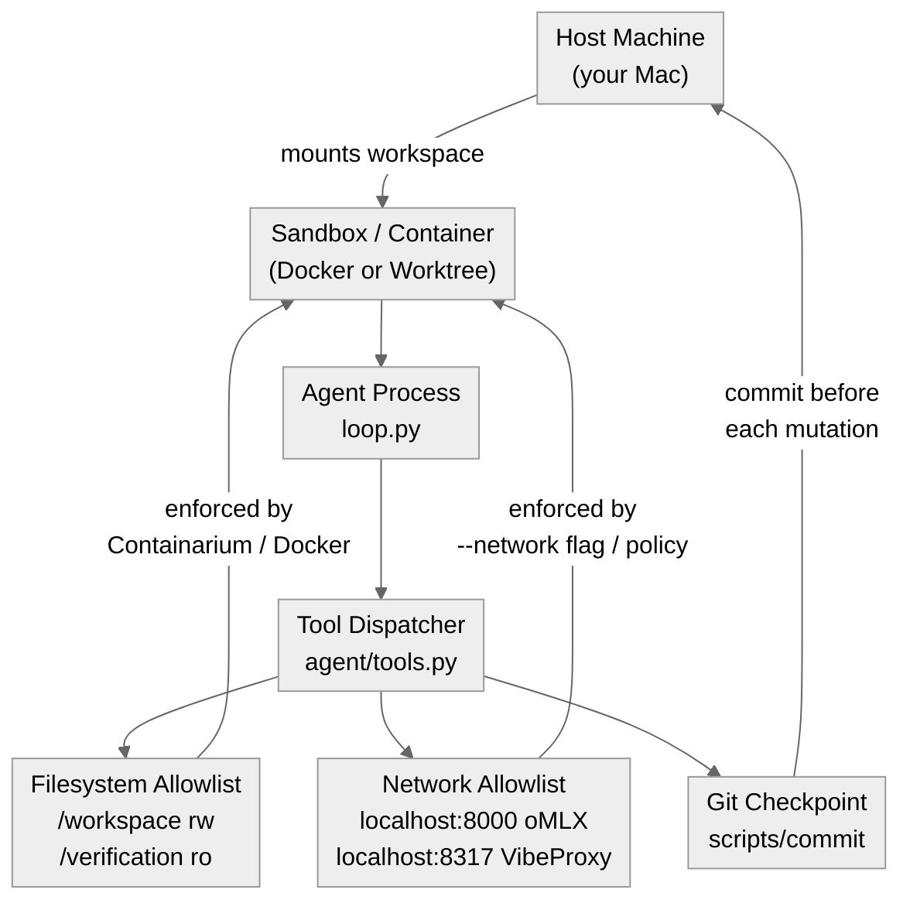
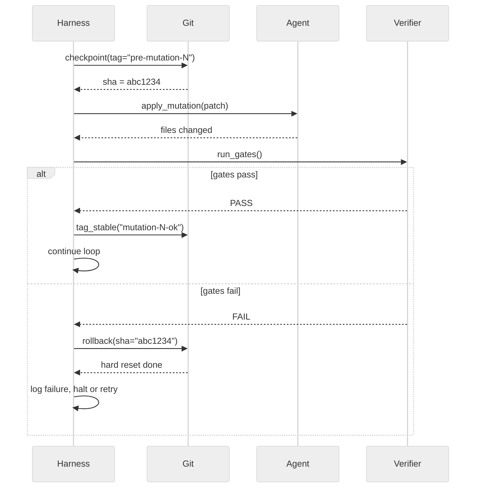

# 09 · Sandboxing and Safe Execution

**What you'll learn** - A self-modifying or tool-using agent is dangerous by definition: it edits files, executes generated code, installs packages, and can break the very infrastructure it runs on. This module covers the "blast radius" mindset - how to think about worst-case scope before running anything - and builds a practical isolation stack: container or worktree boundaries, capability allowlists (filesystem and network), revertible checkpoints via a safe git commit wrapper, and a rollback helper that undoes a bad self-modification in one command. Every technique is demonstrated with the unified adapter so it runs identically under oMLX and VibeProxy.

> [!info] Prerequisites
> - [[08 - Self-Modification - The DGM Pattern]] - you should understand how an agent rewrites its own code before learning how to contain that rewriting safely
> - [[07 - Verification Gates and Layered Control]] - verification gates run *inside* the sandbox; this module explains the fence around them

> [!note] In the lab
> The sandboxing stack taught here is backed by the `agentkit` library (`scaffold/lab_agent.py`). Concretely:
> - **Local containment** — `agentkit.sandbox.SubprocessSandbox`: argv-not-shell (so `"; rm -rf"` injected into code is inert), cwd-jailed, timed, output-capped. `.run(code, timeout=5, cwd=".")` returns an `ExecResult` with `.stdout`, `.stderr`, `.exit_code`, `.duration`.
> - **Egress control** — `agentkit.sandbox.net_guard`: default-deny allowlist. `net_guard.assert_allowed(url)` raises `EgressBlocked` for un-allowlisted hosts; `net_guard.is_allowed(url)` and `net_guard.allowed_hosts()` are the query helpers.
> - **Untrusted output** — `agentkit.agent.quarantine(text, source="tool")`: wraps subprocess/tool output before it re-enters the prompt; the raw result still appears in the trajectory audit trail.
> - **Hard-isolation seam** — `agentkit.sandbox.DockerSandbox`: shares the `Sandbox` Protocol with `SubprocessSandbox`; swap it in when you need container-level isolation without changing the evolve/gate layer.
> - **Gate integration** — the CONTAINMENT stage of `agentkit.gates` (see [[07 - Verification Gates and Layered Control]]) runs proposals through this same `SubprocessSandbox` and escalates anything that touches filesystem/subprocess/network/exec. See `scaffold/lab_agent.py`.

---

## Learning Objectives

- [ ] Explain the "blast radius" mindset and size it before running any agent loop
- [ ] Compare sandbox options: [Containarium](https://github.com/footprintai/Containarium), [Nerve](https://github.com/ClickHouse/nerve), [Claude Managed Agents](https://claude.com/blog/claude-managed-agents-updates), plain Docker, and git worktrees
- [ ] Implement a safe-commit wrapper that snapshots every self-modification
- [ ] Implement a checkpoint/rollback helper that can revert a bad mutation
- [ ] Define filesystem and network allowlists for a constrained agent subprocess
- [ ] Run the agent loop inside a restricted subprocess and verify containment

---

## 1. The Blast-Radius Mindset

Before starting any agent session ask one question: **if this run goes maximally wrong, what breaks?**

| Blast radius | What it means | Mitigation |
|---|---|---|
| File corruption | Agent overwrites source it cannot reconstruct | Git checkpoint before mutation |
| Dependency pollution | Agent `pip install`s incompatible packages | Isolated venv or container |
| Network exfiltration | Agent phones home, leaks keys | Egress allowlist or no-network sandbox |
| Infinite recursion | Self-modifying loop diverges | Iteration cap + rollback trigger |
| Self-disablement | Agent edits its own verification gate | Read-only mount for `verification/` |

The [agent-seed](https://github.com/B67687/agentic-workflows/pull/82) scaffold's `scripts/commit` wrapper embodies this mindset: every mutation is atomic and revertible before it is allowed to propagate.

> [!warning] Layer 1 prompting alone fails
> A production finding from the [NousResearch hermes-agent issue tracker](https://github.com/NousResearch/hermes-agent/issues/29652) is blunt: "Layer 1 (Prompt) alone failed - agents skipped explicit instructions." Safety constraints belong in L2 deterministic scripts (the sandbox and commit wrapper), not in the system prompt.

---

## 2. Sandbox Options

### 2.1 Containarium - MCP-Native Sandbox

[Containarium](https://github.com/footprintai/Containarium) is a self-hosted sandbox designed specifically for MCP tool calls. It intercepts tool invocations before they reach the host filesystem, runs them inside a disposable container, and returns results over the MCP tunnel. Key properties:

- Mounts a per-session ephemeral workspace; the host project tree is read-only by default
- Exposes an MCP endpoint your agent's tool client connects to instead of the raw OS
- Supports filesystem and network allowlists declared in a YAML policy file

```yaml
# containarium-policy.yaml (example)
filesystem:
  readonly:
    - /Users/yuxinliu/self-improving-agent-lab/verification
  readwrite:
    - /workspace          # ephemeral container workspace
network:
  egress:
    - localhost:8000      # oMLX
    - localhost:8317      # VibeProxy
  deny_all_other: true
```

### 2.2 Nerve - Self-Hosted Agent Runtime

[Nerve](https://github.com/ClickHouse/nerve) is a self-hosted runtime that wraps an LLM agent loop with a YAML-defined task manifest. The manifest declares which tools the agent is allowed to call, preventing ad-hoc tool invention. You describe allowed "namespaces" (shell, filesystem, http) and Nerve enforces them at dispatch time.

### 2.3 Claude Managed Agents - Self-Hosted Sandboxes + MCP Tunnels

[Claude Managed Agents](https://claude.com/blog/claude-managed-agents-updates) (Anthropic, 2025-2026) provides first-party infrastructure for running Claude sub-agents in isolated environments exposed via MCP tunnels. The parent orchestrator sends tasks over the tunnel; the sub-agent's execution environment is sandboxed by the managed runtime. Useful when you want Anthropic-managed containment rather than rolling your own Docker setup.

> [!note] VibeProxy ToS note
> Using a Claude MAX subscription via VibeProxy (and by extension Managed Agents features) may violate Anthropic's Terms of Service. Evaluate your use case before routing production workloads through the proxy.

### 2.4 Plain Docker / DockerSandbox

The lowest-dependency option. Run the agent loop as a subprocess inside a Docker container with explicit mounts and network modes. In the agentkit library, `DockerSandbox` is the named seam for this hard-isolation tier — it shares the `Sandbox` Protocol with `SubprocessSandbox`, so the evolve/gate layer can swap between them without code changes.

```bash
docker run --rm \
  --network none \                          # no egress
  -v "$(pwd)/workspace:/workspace:rw" \
  -v "$(pwd)/verification:/verification:ro" \
  -e AGENT_BACKEND=omlx \
  -e OMLX_MODEL=qwen2.5-coder-7b \
  python:3.12-slim python agent/loop.py
```

For local inference you need the container to reach oMLX on the host. Replace `--network none` with `--network host` on Linux, or use `host.docker.internal` on macOS:

```bash
-e OMLX_BASE_URL=http://host.docker.internal:8000/v1
```

### 2.5 Git Worktrees

When full containerization is impractical, a git worktree gives the agent a private branch to mutate. The main branch stays clean until verification passes and you explicitly merge.

```bash
# Create a fresh worktree for this agent session
git worktree add ../agent-sandbox-run-001 -b agent/run-001

# Agent runs inside that directory
cd ../agent-sandbox-run-001 && python agent/loop.py

# If it diverges badly, throw it away
git worktree remove --force ../agent-sandbox-run-001
git branch -D agent/run-001
```

---

## 3. Isolation Layer Diagram



*Isolation layers: the host exposes only scoped mounts to the sandbox; the agent's tool calls are filtered through allowlists before touching the real filesystem or network.*

---

## 4. Checkpoint and Rollback Pattern

The checkpoint pattern has three phases:

1. **Snapshot** - commit the current state so it is recoverable (pre-mutation)
2. **Mutate** - the agent applies its self-modification
3. **Verify** - run evaluation gates; if they pass, tag the commit as stable; if they fail, revert

### 4.1 File-level edits: anchored diffs, not overwrites

The same snapshot→mutate→verify discipline applies at the *single-file* scale, and this is the harness detail that separates Claude Code from a demo (the agent-harness thesis in [[00 - Curriculum Map]]). A naive "edit a file" tool asks the model to emit the *whole new file* and overwrites the original - which fails the moment a file is more than a few hundred lines (the model drops or mangles code it wasn't even changing). The production pattern is an **anchored diff**: the model emits only a unique `old_str → new_str` pair, and the harness applies it.

The lab's `agent/tools.py` `edit_file` implements exactly this, with four guarantees:

1. **Unique anchor.** `old_str` must appear *exactly once* (0 matches = anchor not found; >1 = ambiguous, refused). This forces the model to include enough surrounding context to be unambiguous, and makes the edit deterministic.
2. **Atomic write.** The new content is written to a temp file then `os.replace`d in - so a crash mid-write never leaves a half-written source file.
3. **Snapshot for rollback.** `edit_file` returns the prior content; the verify step (run the tests) decides keep-vs-restore. A failing edit is reverted to the snapshot, not left in place.
4. **Capability scope.** The write is denied *by path before the file is read* if it targets a self-modification-off-limits dir (`verification/`, `scripts/`, `.git/`) - the agent must not rewrite its own verifier (the L1-prose → L2-enforced move from [[07 - Verification Gates and Layered Control]]).

```python
# the contract (agent/tools.py::edit_file), in brief:
#   count = original.count(old_str)
#   if count == 0: return {"error": "anchor not found"}
#   if count > 1:  return {"error": "ambiguous anchor"}    # make it unique
#   updated = original.replace(old_str, new_str, 1)
#   _safe_write(path, updated)        # capability-scoped + atomic (temp + os.replace)
#   return {"ok": True, "snapshot": original}   # <- restore target on a downstream test failure
```

Paired with the `run_tests` tool, this is the **write → verify → recover loop**: the agent edits, runs the tests, and on failure the captured output is fed back into its next turn so it can fix and retry - the agent never has to guess what its edit broke, because the harness translates the consequence back to it.



*Checkpoint - mutate - verify - commit-or-rollback: no mutation persists without passing the verification gates.*

---

## 5. Hands-On Lab

The lab wires the checkpoint/rollback helper and safe-commit wrapper into the scaffold at `/Users/yuxinliu/self-improving-agent-lab`. All code works on both `AGENT_BACKEND=omlx` and `AGENT_BACKEND=vibeproxy`.

### 5.1 Safe Commit Wrapper - `scripts/commit`

Inspired by the [agent-seed](https://github.com/B67687/agentic-workflows/pull/82) `scripts/commit` pattern. This script is the only path by which the agent may persist a mutation - it enforces a checkpoint tag and appends a CHANGELOG entry.

```python
# scripts/commit_wrapper.py
"""
Safe-commit wrapper: snapshot -> stage -> commit -> tag.
Called by the agent harness, never directly by the LLM.
"""

import subprocess
import sys
from datetime import datetime, timezone
from pathlib import Path

CHANGELOG = Path("CHANGELOG.md")
VERIFICATION_DIR = Path("verification")

def run(cmd: list[str], check: bool = True) -> str:
    result = subprocess.run(cmd, capture_output=True, text=True, check=check)
    return result.stdout.strip()

def safe_commit(message: str, tag: str | None = None) -> str:
    """
    Stage all tracked changes, commit, and optionally tag.
    Returns the new commit SHA.
    Raises on any git failure so the harness can roll back.
    """
    # Guard: verification directory must not have unstaged changes
    diff = run(["git", "diff", "--name-only", str(VERIFICATION_DIR)], check=False)
    if diff:
        raise RuntimeError(
            f"Verification directory has unstaged changes: {diff}\n"
            "Self-modification must not alter verification gates."
        )

    # Append to CHANGELOG
    ts = datetime.now(timezone.utc).isoformat(timespec="seconds")
    entry = f"\n## {ts}\n{message}\n"
    with CHANGELOG.open("a") as f:
        f.write(entry)

    run(["git", "add", "-u"])
    run(["git", "add", str(CHANGELOG)])
    run(["git", "commit", "-m", message])
    sha = run(["git", "rev-parse", "HEAD"])

    if tag:
        run(["git", "tag", tag])
        print(f"Tagged {tag} at {sha[:8]}", file=sys.stderr)

    print(f"Committed {sha[:8]}: {message}", file=sys.stderr)
    return sha


if __name__ == "__main__":
    # CLI usage: python scripts/commit_wrapper.py "message" [tag]
    msg = sys.argv[1] if len(sys.argv) > 1 else "agent: automated mutation"
    tg = sys.argv[2] if len(sys.argv) > 2 else None
    print(safe_commit(msg, tg))
```

### 5.2 Checkpoint / Rollback Helper

```python
# scripts/checkpoint.py
"""
Checkpoint and rollback helper for self-modifying agent loops.
Usage:
    sha = checkpoint("pre-mutation-5")      # snapshot
    ...mutation happens...
    if not verify():
        rollback(sha)                       # undo everything
"""

import subprocess
from dataclasses import dataclass, field
from pathlib import Path


@dataclass
class CheckpointStore:
    history: list[tuple[str, str]] = field(default_factory=list)  # (tag, sha)

    def checkpoint(self, tag: str) -> str:
        """Commit the current working tree state and record the SHA."""
        # Stage all tracked files
        subprocess.run(["git", "add", "-u"], check=True, capture_output=True)

        # If nothing to commit, record existing HEAD
        status = subprocess.run(
            ["git", "status", "--porcelain"],
            capture_output=True, text=True
        ).stdout.strip()
        if not status:
            sha = subprocess.run(
                ["git", "rev-parse", "HEAD"],
                capture_output=True, text=True, check=True
            ).stdout.strip()
        else:
            subprocess.run(
                ["git", "commit", "-m", f"checkpoint: {tag}"],
                check=True, capture_output=True
            )
            sha = subprocess.run(
                ["git", "rev-parse", "HEAD"],
                capture_output=True, text=True, check=True
            ).stdout.strip()

        self.history.append((tag, sha))
        print(f"[checkpoint] {tag} -> {sha[:8]}")
        return sha

    def rollback(self, sha: str) -> None:
        """Hard-reset working tree to the given SHA."""
        subprocess.run(
            ["git", "reset", "--hard", sha],
            check=True, capture_output=True
        )
        print(f"[rollback] reset to {sha[:8]}")

    def latest(self) -> tuple[str, str] | None:
        return self.history[-1] if self.history else None
```

### 5.3 Running the Agent Loop in a Constrained Subprocess

This ties together the sandbox (subprocess with restricted environment), the checkpoint store, and the LLM backend. The key containment primitive is `agentkit.sandbox.SubprocessSandbox`: it runs proposed code via argv (not a shell), jails paths within `cwd`, enforces a timeout, and caps output size. The gate's CONTAINMENT stage (from [[07 - Verification Gates and Layered Control]]) routes all proposals through this same `SubprocessSandbox` and escalates anything that touches filesystem/subprocess/network/exec.

Tool and subprocess output is wrapped with `agentkit.agent.quarantine` before re-entering the prompt, so untrusted content is marked in the trajectory audit trail even though the raw result remains visible.

```python
# evolve/sandboxed_loop.py
"""
Self-modifying agent loop wrapped in:
  - agentkit SubprocessSandbox for each mutation execution
  - agentkit net_guard for egress control
  - agentkit quarantine for untrusted output re-entering the prompt
  - checkpoint/rollback around every LEARN step
  - the unified LLM adapter (omlx or vibeproxy)

Run:
  AGENT_BACKEND=omlx python evolve/sandboxed_loop.py
  AGENT_BACKEND=vibeproxy python evolve/sandboxed_loop.py
"""

import json
import os
import sys
from pathlib import Path

# Project root (one level up from evolve/)
ROOT = Path(__file__).parent.parent
sys.path.insert(0, str(ROOT))

from agentkit.sandbox import SubprocessSandbox, net_guard
from agentkit.agent import quarantine
from backends.adapter import make_client
from scripts.checkpoint import CheckpointStore
from verification.gates import run_gates  # returns True/False

MAX_ITERATIONS = int(os.getenv("MAX_ITERATIONS", "10"))
WORKSPACE = ROOT / "evolve" / "archive"
WORKSPACE.mkdir(parents=True, exist_ok=True)

SYSTEM_PROMPT = (ROOT / "AGENTS.md").read_text()
GOAL = (ROOT / "GOAL.md").read_text()

# One sandbox instance; reused across iterations
_sandbox = SubprocessSandbox(max_output_bytes=64 * 1024)


def propose_mutation(client, model: str, context: str) -> str:
    """Ask the LLM to propose a self-modification given recent context."""
    # Guard the outbound LLM call with net_guard (raises EgressBlocked if not allowlisted)
    backend_url = os.getenv("OMLX_BASE_URL", "http://localhost:8000/v1")
    net_guard.assert_allowed(backend_url)

    response = client.chat.completions.create(
        model=model,
        messages=[
            {"role": "system", "content": SYSTEM_PROMPT},
            {
                "role": "user",
                "content": (
                    f"GOAL:\n{GOAL}\n\n"
                    f"RECENT CONTEXT:\n{context}\n\n"
                    "Propose ONE small, verifiable improvement to the agent codebase. "
                    "Respond with a JSON object: "
                    "{\"file\": \"<relative path>\", \"description\": \"<one sentence>\", "
                    "\"patch\": \"<unified diff or new file content>\"}"
                ),
            },
        ],
        temperature=0.3,
    )
    return response.choices[0].message.content.strip()


def apply_patch(patch_json: str) -> bool:
    """
    Execute the proposed patch inside SubprocessSandbox.
    argv-not-shell: shell injection in the patch string is inert.
    cwd-jailed: paths are asserted within ROOT.
    """
    try:
        data = json.loads(patch_json)
        code = data.get("patch", "")
        if not code:
            return False

        result = _sandbox.run(code, timeout=10, cwd=str(ROOT))

        # Quarantine subprocess output before it re-enters the prompt
        safe_stdout = quarantine(result.stdout, source="sandbox")
        safe_stderr = quarantine(result.stderr, source="sandbox")

        if result.exit_code != 0:
            print(f"[apply_patch] sandbox exit_code={result.exit_code} stderr={safe_stderr[:200]}", file=sys.stderr)
            return False

        print(f"[apply_patch] ok duration={result.duration:.2f}s stdout={safe_stdout[:120]}")
        return True
    except (json.JSONDecodeError, KeyError, OSError) as e:
        print(f"[apply_patch] error: {e}", file=sys.stderr)
        return False


def main() -> None:
    client, model = make_client()
    store = CheckpointStore()
    context_window: list[str] = []

    print(f"[loop] backend={os.getenv('AGENT_BACKEND', 'omlx')} model={model}")
    print(f"[loop] max_iterations={MAX_ITERATIONS}")
    print(f"[loop] egress allowlist={net_guard.allowed_hosts()}")

    for i in range(MAX_ITERATIONS):
        print(f"\n--- Iteration {i+1}/{MAX_ITERATIONS} ---")

        # 1. SNAPSHOT before mutation
        sha = store.checkpoint(f"pre-mutation-{i+1}")

        # 2. PROPOSE mutation
        context = "\n".join(context_window[-5:]) if context_window else "No prior context."
        raw = propose_mutation(client, model, context)
        print(f"[propose] {raw[:120]}...")

        # 3. APPLY mutation via SubprocessSandbox (argv-not-shell, cwd-jailed, timed)
        applied = apply_patch(raw)
        if not applied:
            print("[apply] sandbox execution failed, rolling back")
            store.rollback(sha)
            context_window.append(f"iteration {i+1}: patch failed to apply")
            continue

        # 4. VERIFY
        passed = run_gates()
        if passed:
            # 5a. COMMIT via safe wrapper
            try:
                description = json.loads(raw).get("description", "agent mutation")
            except (json.JSONDecodeError, AttributeError):
                description = "agent mutation"

            from scripts.commit_wrapper import safe_commit
            new_sha = safe_commit(
                f"feat: {description}",
                tag=f"mutation-{i+1}-ok",
            )
            context_window.append(f"iteration {i+1}: mutation applied and verified ({new_sha[:8]})")
            print(f"[loop] iteration {i+1} SUCCESS")
        else:
            # 5b. ROLLBACK
            store.rollback(sha)
            context_window.append(f"iteration {i+1}: mutation failed verification, rolled back to {sha[:8]}")
            print(f"[loop] iteration {i+1} FAIL - reverted")

    print("\n[loop] complete")


if __name__ == "__main__":
    main()
```

Run it:

```bash
# Against local oMLX (no network cost):
AGENT_BACKEND=omlx python evolve/sandboxed_loop.py

# Against Claude via VibeProxy:
AGENT_BACKEND=vibeproxy VIBE_MODEL=claude-sonnet-4-5-20250929 python evolve/sandboxed_loop.py
```

> [!tip] Iteration cap is your first safety net
> `MAX_ITERATIONS=10` prevents runaway loops. The [Continual Harness](https://arxiv.org/abs/2605.09998) paper found that unbounded self-improvement loops almost always produce diminishing returns after a small number of high-quality iterations - the cap also aligns with this empirical finding.

### 5.4 Docker Variant - Fully Isolated Run

For maximum isolation, wrap the subprocess in Docker. Assumes the `Dockerfile` at the project root:

```dockerfile
# Dockerfile (minimal, for the sandboxed loop)
FROM python:3.12-slim
WORKDIR /app
COPY requirements.txt .
RUN pip install --no-cache-dir -r requirements.txt
COPY . .
# No entrypoint - caller specifies the script
```

```bash
# Build once
docker build -t sia-sandbox .

# Run with host.docker.internal so oMLX is reachable
docker run --rm \
  -v "$(pwd)/evolve/archive:/app/evolve/archive:rw" \
  -v "$(pwd)/verification:/app/verification:ro" \
  --add-host host.docker.internal:host-gateway \
  -e AGENT_BACKEND=omlx \
  -e OMLX_BASE_URL=http://host.docker.internal:8000/v1 \
  -e MAX_ITERATIONS=5 \
  sia-sandbox \
  python evolve/sandboxed_loop.py
```

The `verification/` directory is mounted read-only - the agent cannot disable its own safety gates.

---

## 6. Capability Scoping

Beyond the sandbox boundary, scope which capabilities the agent process can exercise.

### Filesystem Allowlist

```python
# agent/tools.py (capability-scoped file writer)
from pathlib import Path

ALLOWED_WRITE_DIRS: set[Path] = {
    Path("agent"),
    Path("memory"),
    Path("reflection"),
    Path("skills"),
    Path("evolve"),
}
FORBIDDEN_WRITE_DIRS: set[Path] = {
    Path("verification"),   # must not be modified by the agent
    Path("scripts"),        # commit wrapper must stay clean
    Path(".git"),
}

def safe_write(relative_path: str, content: str) -> None:
    """Write only to allowed directories; raise on forbidden paths."""
    p = Path(relative_path)
    parts = set(p.parents)
    parts.add(p.parent)

    if any(str(p).startswith(str(f)) for f in FORBIDDEN_WRITE_DIRS):
        raise PermissionError(f"Write to {relative_path} is forbidden by capability scope.")

    if not any(str(p).startswith(str(a)) for a in ALLOWED_WRITE_DIRS):
        raise PermissionError(
            f"Write to {relative_path} is outside the allowed directory set."
        )

    p.parent.mkdir(parents=True, exist_ok=True)
    p.write_text(content)
```

### Network Allowlist

For oMLX and VibeProxy the agent only needs to reach two local addresses. The lab uses `agentkit.sandbox.net_guard` — a default-deny egress allowlist that complements `SubprocessSandbox`'s local containment: the sandbox controls *what* code can do locally; `net_guard` controls *where* it can reach on the network.

```python
from agentkit.sandbox import net_guard

# Inspect the current allowlist
print(net_guard.allowed_hosts())   # -> set[str] of permitted hostnames

# Guard a URL before making a request
url = "http://localhost:8000/v1/chat/completions"
if net_guard.is_allowed(url):
    # safe to proceed
    ...

# Or raise immediately on a blocked host (raises EgressBlocked)
net_guard.assert_allowed(url)

# A call to an un-allowlisted host raises EgressBlocked
net_guard.assert_allowed("https://exfil.example.com/data")
# -> EgressBlocked: host 'exfil.example.com' is not in the egress allowlist
```

`net_guard.assert_allowed(url)` is the canonical guard call: place it at every outbound request site so blocked hosts fail loudly rather than silently succeeding or producing a confusing socket error.

---

## 7. Pitfalls

> [!danger] Never mount the .git directory writable into a container
> If the agent can write to `.git/` it can rewrite history, forge commit SHAs, and invalidate every checkpoint. Always mount the project root with `.git` excluded or the entire mount as read-only, with only the `workspace/` subdirectory writable.

> [!warning] Verification gates mounted read-only is not optional
> The whole point of the checkpoint/rollback pattern breaks if the agent can modify `verification/gates.py` to always return `True`. In every sandbox variant, `verification/` is `ro`.

> [!warning] git worktrees share the object store
> A git worktree creates a separate working tree but shares `.git/objects` with the parent. A `git gc` in the parent or a corrupt object can affect the worktree. For multi-session durability, clone the repo instead of using a worktree.

> [!tip] Rate limits matter more than cost here
> On oMLX and VibeProxy you are rate-limited, not per-token-metered. Tight `MAX_ITERATIONS` keeps you within rate windows. As the [community experience with self-improving harnesses](https://www.henrypan.com/blog/2026-05-25-self-improvement-harness/) shows, most iteration budget is wasted on bad patches - the checkpoint overhead is negligible compared to a divergent loop eating your rate limit.

> [!danger] A rollback does not undo installed packages
> `git reset --hard` reverts source files but not `pip install` side effects. If the agent runs `pip install` as a mutation step and you roll back, the environment is now inconsistent. Mitigation: run mutations in a throwaway venv or container; never let the agent call `pip install` directly.

---

> [!question] Checkpoint
> 1. What does "blast radius" mean in the context of a self-modifying agent, and name three dimensions you would scope before starting a loop?
> 2. Why is the `verification/` directory mounted read-only in every sandbox variant, and what goes wrong if it is not?
> 3. The [NousResearch production finding](https://github.com/NousResearch/hermes-agent/issues/29652) concluded that Layer 1 (prompt) safety alone fails. Where should safety constraints live instead, and how does `scripts/commit_wrapper.py` implement this?
> 4. You run `git reset --hard <sha>` to roll back a mutation, but the agent previously ran `pip install httpx==0.30.0`. Is the environment now consistent? What is the correct fix?
> 5. Describe one scenario where a git worktree is the right sandbox choice and one scenario where plain Docker is clearly better.

---

## Navigation

← [[08 - Self-Modification - The DGM Pattern]] · [[00 - Curriculum Map]] (home) · [[10 - Evaluation Harness]] →

**Cross-reference:** [[07 - Verification Gates and Layered Control]] - verification gates are what the sandbox protects; understand them before tuning this isolation stack.
