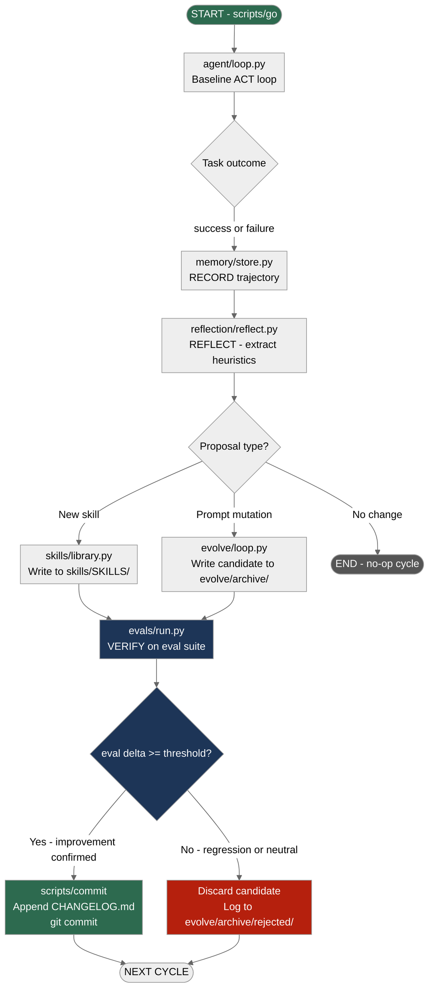

# 11 · Capstone - A Production Self-Improving Agent

**What you'll learn** - This module wires every subsystem from the curriculum into a single, coherent, runnable agent. You will trace one complete self-improvement cycle end-to-end - from task execution through memory recording, reflection, skill proposal, evaluation gating, and conditional commit - and leave with a production checklist that keeps the system honest: budget-aware, rollback-ready, and with a human in the loop at the right moment.

> [!info] Prerequisites
> This module assumes you have completed all prior modules. The most critical is [[10 - Evaluation Harness]], which provides the external ground truth that gates every learning step. Full cross-references: [[03 - The Minimal Agent Loop]], [[04 - Memory Systems]], [[05 - Reflection and Self-Correction]], [[06 - Skill Acquisition and Curation]], [[07 - Verification Gates and Layered Control]], [[08 - Self-Modification - The DGM Pattern]], [[09 - Sandboxing and Safe Execution]], [[10 - Evaluation Harness]].

---

## Learning Objectives

- [ ] Describe the full architecture: how all seven subsystems connect in a single data flow
- [ ] Run one complete improvement cycle on both `AGENT_BACKEND=omlx` and `AGENT_BACKEND=vibeproxy`
- [ ] Apply the production checklist - skeptic's 4 questions, human-in-the-loop placement, rate-limit budget, rollback strategy
- [ ] Interpret `CHANGELOG.md` and eval trend output to tell whether the agent has actually improved
- [ ] Explain where deterministic L2 scripts are mandatory and why prompt-only control fails in production

---

## 1 - The Full Architecture

Before running anything, draw the wiring in your head. Seven subsystems, one loop.



*Full architecture: every subsystem from the curriculum connected in one deterministic flow. The VERIFY gate at `evals/run.py` is the single decision point - nothing reaches `scripts/commit` without passing it.*

The key design principle is that **only `evals/run.py` decides whether a change is kept**. Reflection and proposal are generative and fallible; the eval gate is deterministic and external. This mirrors the curriculum's thesis: for local/subscription builders, memory + skill accumulation gated by strong VERIFY is the pragmatic sweet spot over unconstrained self-modification - see [henrypan's 1k harness experiments](https://www.henrypan.com/blog/2026-05-25-self-improvement-harness/).

---

## 2 - One Complete Self-Improvement Cycle

The sequence diagram below shows the message flow across subsystems for a single cycle that ends in a committed improvement.


*One complete improvement cycle. The LLM contributes to ACT, REFLECT, and skill authoring; deterministic scripts handle RECORD, VERIFY, and COMMIT. Nothing is entrusted to the LLM that requires guaranteed correctness.*

### What each file actually does in this cycle

| Path | Role | Subsystem |
|---|---|---|
| `scripts/go` | Launches the cycle with correct env; enforces iteration protocol | L2 deterministic |
| `agent/loop.py` | Orchestrates ACT phase; calls tools; collects outcome | Module 03 |
| `memory/store.py` | Persists trajectory to SQLite/vector store; embeddings via oMLX | Module 04 |
| `reflection/reflect.py` | LLM critique pass; returns structured proposal JSON | Module 05 |
| `skills/library.py` | Reads/writes the skill library; manages candidate lifecycle | Module 06 |
| `evolve/loop.py` | Handles prompt/code mutation proposals; writes to `evolve/archive/` | Module 08 |
| `evals/run.py` | Runs eval suite; returns delta score vs. baseline | Module 10 |
| `verification/gates.py` | Contains threshold constants + gate logic (imported by evals/run.py) | Module 07 |
| `scripts/commit` | Safe commit wrapper; appends CHANGELOG.md atomically | L2 deterministic |

> [!note] L2 Scripts are Non-Negotiable
> The production finding from [NousResearch hermes-agent issue #29652](https://github.com/NousResearch/hermes-agent/issues/29652) is explicit: "Layer 1 (Prompt) alone failed - agents skipped explicit instructions." In this scaffold, `scripts/go` and `scripts/commit` are L2 deterministic scripts. They cannot be overridden by a model's reasoning. RECORD, VERIFY threshold checking, and git commit are always L2. Only ACT and REFLECT are LLM-driven.

---

## 3 - Hands-On Lab: Running the Full Cycle

### 3.1 - Environment setup

```bash
cd /Users/yuxinliu/self-improving-agent-lab
cp .env.example .env
# Edit .env and set at minimum:
#   AGENT_BACKEND=omlx        # or vibeproxy
#   OMLX_MODEL=qwen2.5-coder-7b
#   VIBE_MODEL=claude-sonnet-4-5
#   VERIFY_THRESHOLD=0.02     # min eval delta to accept a change
#   HUMAN_IN_LOOP=true        # pause before committing
pip install -r requirements.txt
```

Both backends use the same adapter from `backends/adapter.py`:

```python
# backends/adapter.py - canonical adapter (do not modify)
import os
from openai import OpenAI

BACKENDS = {
    "omlx":      {"base_url": "http://localhost:8000/v1",  "model": os.getenv("OMLX_MODEL", "qwen2.5-coder-7b")},
    "vibeproxy": {"base_url": "http://localhost:8317/v1",  "model": os.getenv("VIBE_MODEL",  "claude-sonnet-4-5")},
}

def make_client(backend=None):
    b = BACKENDS[backend or os.getenv("AGENT_BACKEND", "omlx")]
    return OpenAI(base_url=b["base_url"], api_key=os.getenv("LLM_API_KEY", "not-needed")), b["model"]
```

> [!warning] VibeProxy embeddings caveat
> VibeProxy exposes chat only - there is NO embeddings endpoint on the Claude subscription. The memory layer always uses oMLX's local embeddings endpoint (`http://localhost:8000/v1`) regardless of which backend handles generation. If oMLX is not running when you use `AGENT_BACKEND=vibeproxy`, `memory/store.py` will raise a connection error. Start oMLX first, even in vibeproxy mode.

### 3.2 - Running one cycle (omlx)

```bash
# Ensure oMLX is running (menu-bar icon, model loaded)
AGENT_BACKEND=omlx scripts/go
```

The `scripts/go` iteration protocol (from [agent-seed](https://github.com/B67687/agentic-workflows/pull/82)):

```bash
#!/usr/bin/env bash
# scripts/go
set -euo pipefail

BACKEND="${AGENT_BACKEND:-omlx}"
echo "=== Cycle start: backend=$BACKEND $(date -u +%Y-%m-%dT%H:%M:%SZ) ===" | tee -a CHANGELOG.md

python -m agent.loop \
  --goal GOAL.md \
  --agents AGENTS.md \
  --backend "$BACKEND" \
  --record-to memory/store.py \
  --reflect-with reflection/reflect.py \
  --verify-with evals/run.py \
  --threshold "${VERIFY_THRESHOLD:-0.02}" \
  --human-in-loop "${HUMAN_IN_LOOP:-true}"

echo "=== Cycle end: $(date -u +%Y-%m-%dT%H:%M:%SZ) ===" | tee -a CHANGELOG.md
```

### 3.3 - Running one cycle (vibeproxy)

```bash
# VibeProxy must be running (menu-bar icon, Claude MAX session active)
# oMLX must ALSO be running for embeddings
AGENT_BACKEND=vibeproxy scripts/go
```

The adapter swaps `base_url` automatically. No other change is needed. The generation calls go to `http://localhost:8317/v1`; embedding calls inside `memory/store.py` always go to `http://localhost:8000/v1`.

> [!tip] ToS reminder
> Using a Claude MAX subscription via VibeProxy routes your OAuth session through a local proxy. This may violate Anthropic's Terms of Service. Evaluate your own risk tolerance before use.

### 3.4 - The core orchestration: evolve/loop.py

This is the integration point that wires the subsystems together in code:

```python
# evolve/loop.py - full integration orchestrator
import json, os, hashlib, datetime
from backends.adapter import make_client
from memory.store import MemoryStore
from reflection.reflect import Reflector
from skills.library import SkillLibrary
from evals.run import EvalRunner
from verification.gates import VERIFY_THRESHOLD

def run_improvement_cycle(task: str, backend: str | None = None) -> dict:
    client, model = make_client(backend)
    memory  = MemoryStore()           # SQLite + oMLX embeddings
    reflect = Reflector(client, model)
    skills  = SkillLibrary()
    evals   = EvalRunner()

    # --- ACT ---
    from agent.loop import run_task
    trajectory = run_task(task, client, model)

    # --- RECORD ---
    traj_id = memory.store(trajectory)
    print(f"[RECORD] trajectory {traj_id} stored")

    # --- REFLECT ---
    proposal = reflect.propose(trajectory, skills.list_current())
    print(f"[REFLECT] proposal type={proposal['type']} rationale={proposal['rationale'][:80]}")

    if proposal["type"] == "no_change":
        return {"committed": False, "reason": "no improvement proposed"}

    # --- LEARN (write candidate) ---
    candidate_hash = hashlib.sha256(proposal["content"].encode()).hexdigest()[:8]
    candidate_path = f"skills/SKILLS/candidate_{candidate_hash}.py"
    with open(candidate_path, "w") as f:
        f.write(proposal["content"])
    print(f"[LEARN] candidate written to {candidate_path}")

    # --- VERIFY ---
    baseline_score = evals.run(use_candidate=None)
    candidate_score = evals.run(use_candidate=candidate_path)
    delta = candidate_score - baseline_score
    print(f"[VERIFY] baseline={baseline_score:.4f} candidate={candidate_score:.4f} delta={delta:+.4f}")

    if delta < VERIFY_THRESHOLD:
        rejected_path = f"evolve/archive/rejected/candidate_{candidate_hash}.py"
        os.rename(candidate_path, rejected_path)
        print(f"[DISCARD] delta {delta:+.4f} < threshold {VERIFY_THRESHOLD} - discarded")
        return {"committed": False, "delta": delta, "reason": "below threshold"}

    # --- COMMIT ---
    skill_name = proposal.get("name", f"skill_{candidate_hash}")
    final_path = f"skills/SKILLS/{skill_name}.py"
    os.rename(candidate_path, final_path)

    changelog_entry = (
        f"\n## {datetime.date.today()} - {skill_name}\n"
        f"- delta: {delta:+.4f} on eval suite\n"
        f"- rationale: {proposal['rationale']}\n"
    )
    with open("CHANGELOG.md", "a") as f:
        f.write(changelog_entry)

    os.system(f'bash scripts/commit "skill: add {skill_name} ({delta:+.4f} on evals)"')
    print(f"[COMMIT] {skill_name} committed")
    return {"committed": True, "delta": delta, "skill": skill_name}
```

### 3.5 - Human-in-the-loop gate

The `HUMAN_IN_LOOP=true` flag inserts a confirmation step before `scripts/commit` runs. This is the single intervention that [community consensus](https://www.reddit.com/r/AI_Agents/comments/1taei9m/stop_building_ai_agents/) identifies as saving "90% of the headache."

```python
# In evolve/loop.py, before the COMMIT block:
if os.getenv("HUMAN_IN_LOOP", "true").lower() == "true":
    print(f"\n[HUMAN-IN-LOOP] Proposed commit: skill={skill_name}, delta={delta:+.4f}")
    print(f"Skill content preview:\n{proposal['content'][:400]}\n")
    answer = input("Accept and commit? [y/N] ").strip().lower()
    if answer != "y":
        os.rename(candidate_path, f"evolve/archive/rejected/human_{candidate_hash}.py")
        return {"committed": False, "reason": "human rejected"}
```

---

## 4 - Production Checklist

This checklist is the skeptic's 4-question framework applied to self-improving agents, extended with operational concerns.

### 4.1 - The skeptic's 4 questions (apply before each feature)

Drawn from [community hard-won experience](https://www.reddit.com/r/AI_Agents/comments/1taei9m/stop_building_ai_agents/):

| Question | If yes | If no |
|---|---|---|
| Can you draw the flow as clear, enumerable steps? | Make it a deterministic script (L2). Skip the LLM. | Agent may be appropriate |
| Does this path have >5 branches with unpredictable inputs? | Consider an agent for that path only | Automation is fine |
| Is the worst-case wrong answer high-cost? | Automation only, or HITL on every execution | Agent with VERIFY gate |
| Will compliance review this? | Automation, full stop - no agent | Proceed with caution |

> [!danger] Never self-approve
> The [NousResearch production finding](https://github.com/NousResearch/hermes-agent/issues/29652) is a hard rule: the agent must not evaluate its own proposals. `evals/run.py` is an external, deterministic judge. The agent's LLM does not see the eval results before they are computed - it only sees the final keep/discard decision.

### 4.2 - Rate-limit budget

These backends are rate-limited, not per-token-metered. A naive reflection loop can exhaust limits without spending money. Design for throughput, not cost.

```python
# config.py - rate limit budget for one cycle
RATE_LIMIT_CONFIG = {
    "max_act_calls":      10,   # tool calls during ACT phase
    "max_reflect_calls":   3,   # LLM calls during REFLECT
    "max_eval_tasks":     20,   # eval tasks per VERIFY run
    "min_seconds_between_cycles": 30,  # hard floor to avoid hammering the proxy
}
```

> [!tip] Model routing within a cycle
> For cheap steps (RECORD formatting, candidate file naming, changelog entry), use a small oMLX model. Reserve the larger model (Claude via vibeproxy, or a 32B oMLX model) for REFLECT and skill authoring. The [community consensus](https://www.reddit.com/r/AI_Agents/comments/1taei9m/stop_building_ai_agents/) is explicit: "don't default to flagship for every call." `backends/router.py` handles this - assign model tiers per phase.

### 4.3 - Rollback strategy

Every committed change is a git commit. Rolling back is a git operation, not a special agent function.

```bash
# See what changed in the last 5 improvement cycles
git log --oneline -10

# Roll back to a known-good state (e.g., before last 3 skill commits)
git revert HEAD~3..HEAD --no-commit
git commit -m "chore: revert last 3 skill additions (eval regression)"

# Or, to inspect the eval trend before deciding:
python evals/run.py --trend --last-n 10
```

The `CHANGELOG.md` is append-only and committed with every skill. It is the human-readable audit trail. The eval trend from `evals/run.py --trend` is the numeric audit trail.

### 4.4 - Sandbox discipline

Any skill that touches the filesystem, runs code, or calls external APIs must run inside the sandbox defined in Module 09. The `verification/gates.py` config enforces this:

```python
# verification/gates.py
VERIFY_THRESHOLD = float(os.getenv("VERIFY_THRESHOLD", "0.02"))

SANDBOX_REQUIRED_FOR = ["filesystem", "subprocess", "http", "eval", "exec"]

def requires_sandbox(skill_code: str) -> bool:
    return any(token in skill_code for token in SANDBOX_REQUIRED_FOR)
```

> [!warning] Skills that exec() are DGM territory
> If a proposed skill contains `exec()`, `eval()`, or `subprocess`, treat it as a self-modification proposal (Module 08 rules apply): require a stricter eval threshold, run in the Containarium/Docker sandbox from [[09 - Sandboxing and Safe Execution]], and flag for human review regardless of `HUMAN_IN_LOOP` setting.

---

## 5 - Monitoring: Did It Actually Improve?

Two artifacts tell you whether the agent is improving over time: `CHANGELOG.md` and the eval trend.

### 5.1 - Reading CHANGELOG.md

```markdown
## 2026-05-31 - parse_json_safely
- delta: +0.04 on eval suite
- rationale: agent was failing on malformed JSON from tool calls; new skill wraps json.loads with recovery

## 2026-05-30 - retry_on_rate_limit
- delta: +0.02 on eval suite
- rationale: intermittent rate-limit errors caused task failures; skill adds exponential backoff

## 2026-05-29 - (no commit)
- candidate extract_table_data: delta -0.01 - discarded (below threshold)
```

A healthy CHANGELOG shows: small, positive, explained deltas; occasional discards (the VERIFY gate is working); a clear rationale that a human can audit.

An unhealthy CHANGELOG shows: large unexplained deltas; no discards ever (VERIFY gate too loose); skills with generic names and vague rationales.

### 5.2 - Eval trend output

```bash
python evals/run.py --trend --last-n 20
```

Expected output format:

```
Eval trend (last 20 cycles):
  Cycle  Score   Delta   Committed  Skill
  001    0.610   -       -          (baseline)
  002    0.634   +0.024  YES        retry_on_rate_limit
  003    0.634   +0.000  NO         (no proposal)
  004    0.638   +0.004  YES        parse_json_safely
  005    0.635   -0.003  NO         (candidate rejected)
  ...
  020    0.671   +0.061  -          (cumulative gain)

Cumulative improvement: +6.1pp over 20 cycles
Acceptance rate: 7/20 (35%)
```

> [!tip] What good numbers look like
> The [Darwin Gödel Machine](https://arxiv.org/abs/2505.22954) reports 20% to 50% gains on SWE-bench over many cycles - but that is an unconstrained self-rewriting system on a narrow benchmark. For a memory + skill system on general tasks, expect 5-15pp cumulative gain over 20-50 cycles before plateauing. An acceptance rate of 20-40% means the VERIFY gate is doing real work. 100% acceptance means `VERIFY_THRESHOLD` is too low. 0% means the reflection quality is poor or the tasks are too hard for the model.

### 5.3 - Diagnosing a plateau

If improvement stalls:

1. Check reflection quality - is `reflect.py` extracting specific, actionable heuristics, or generic ones? See [[05 - Reflection and Self-Correction]].
2. Check skill diversity - is the library accumulating redundant skills? Use `skills/library.py --dedupe`. See [[06 - Skill Acquisition and Curation]].
3. Check eval coverage - are the eval tasks too easy (ceiling effect) or too hard (floor effect)? See [[10 - Evaluation Harness]].
4. Check memory retrieval - is the agent retrieving relevant past trajectories, or is retrieval degrading? See [[04 - Memory Systems]].
5. Consider a harder task distribution - the agent may have exhausted the improvement surface on current tasks. Update `GOAL.md`.

---

## 6 - Pitfalls

> [!danger] Recursive drift without external evals
> If you let the agent evaluate its own proposals - even indirectly, through a "self-critic" prompt - you lose the external ground truth. The [Continual Harness paper](https://arxiv.org/abs/2605.09998) documents this as "recursive drift": the agent learns to game its own critic rather than to improve on actual tasks. The eval suite in `evals/tasks.py` must contain tasks the agent did NOT author.

> [!warning] Prompt-only control fails at scale
> Do not put safety constraints, commit guards, or threshold checks inside a system prompt and expect them to hold. The [hermes-agent production finding](https://github.com/NousResearch/hermes-agent/issues/29652) is the canonical reference: L1 (prompt) constraints were bypassed; L2 (scripts) held. Every hard constraint in this scaffold is in `scripts/go`, `scripts/commit`, and `verification/gates.py` - not in a prompt.

> [!warning] Embeddings break silently on vibeproxy-only setups
> If oMLX is not running and `AGENT_BACKEND=vibeproxy`, the memory store will silently fall back to no-op or crash depending on error handling. Always verify oMLX is serving on `:8000` before running any cycle. The architecture requires local embeddings regardless of generation backend.

> [!tip] The "3am Slack message" rule
> From [community experience](https://www.reddit.com/r/AI_Agents/comments/1taei9m/stop_building_ai_agents/): "3am Slack message when the agent approves the wrong invoices." For a self-improving agent, the equivalent is an unreviewed skill commit that degrades production behavior. `HUMAN_IN_LOOP=true` is the default for this reason. Disable it only for tasks where the worst-case wrong answer is reversible and cheap.

> [!danger] Skills accumulate technical debt
> The [SkillOS paper](https://arxiv.org/abs/2605.06614) and [Muse-Autoskill](https://arxiv.org/abs/2605.27366) both document skill proliferation as a failure mode: the library grows, retrieval degrades, and new skills conflict with old ones. Run `skills/library.py --audit` periodically to prune skills that have not been invoked in N cycles. A skill that is never retrieved is a liability, not an asset.

> [!note] Self-modification is a separate regime
> This capstone defaults to skill accumulation (camp 2 in the curriculum's taxonomy). If you want to explore prompt mutation or code rewriting (camp 1, Module 08), keep those candidates in `evolve/archive/` with a stricter threshold (e.g., `EVOLVE_THRESHOLD=0.05` vs. `VERIFY_THRESHOLD=0.02`) and always sandbox execution. The [DGM paper](https://arxiv.org/abs/2505.22954) documents what full self-rewriting can achieve, but it requires a narrow, benchmarkable problem and a hermetic sandbox.

---

> [!question] Checkpoint
> 1. In the full architecture diagram, what is the only decision point that can route a proposal to `scripts/commit`? Why must this step be deterministic rather than LLM-driven?
> 2. Why does `memory/store.py` always connect to `http://localhost:8000/v1` for embeddings, even when `AGENT_BACKEND=vibeproxy`?
> 3. You observe that the acceptance rate in your eval trend is 95% over 30 cycles. What does this suggest about your `VERIFY_THRESHOLD`, and what risk does it create?
> 4. A proposed skill contains `subprocess.run(...)`. According to `verification/gates.py`, what additional requirements must be satisfied before this skill can be committed?
> 5. Your CHANGELOG shows three consecutive cycles with `delta: +0.08` for skills with names like `general_improvement_v1`, `general_improvement_v2`. What two failure modes does this pattern signal?

---

## Navigation

← [[10 - Evaluation Harness]] · [[00 - Curriculum Map]] (home) · [[12 - Resources and Field Map]] →
