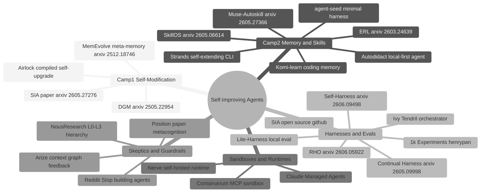
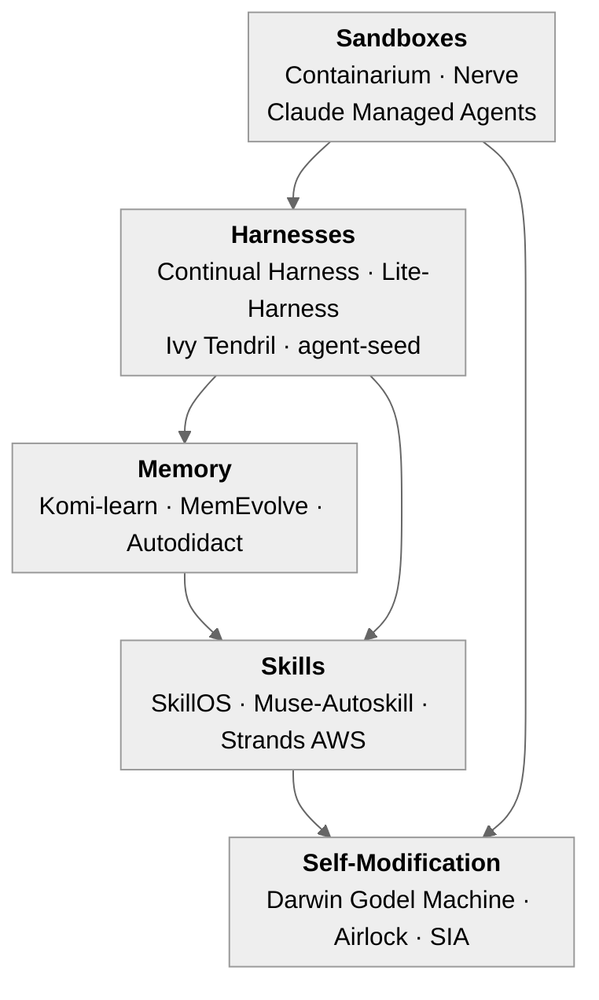

# 12 · Resources, Papers, and the Field Map

**What you'll learn** - This closing module is your annotated field guide. You will survey every paper, project, and community signal that shaped this curriculum, understand why each source matters and where its ideas appear, learn the precise vocabulary used throughout all twelve modules, and see how the camps, tools, and research threads connect to one another in a single map you can return to whenever you explore a new direction.

> [!info] Prerequisites
> Complete [[11 - Capstone - Production Agent]] before reading this module. Familiarity with all prior modules is assumed - this note cross-links backward, not forward.

## Learning Objectives

- [ ] Locate and describe every primary source in the curriculum's research grounding
- [ ] Explain why each source belongs to its camp (self-modification, memory/skills, or skeptics)
- [ ] Define all key terms in the glossary without looking them up
- [ ] Read the field map and identify which module teaches each cluster of ideas
- [ ] Use the annotated bibliography as a launchpad for independent research

---

## Annotated Bibliography

### Papers and Research

| Source | Why It Matters | Module(s) |
|--------|---------------|-----------|
| [Darwin Gödel Machine (DGM)](https://arxiv.org/abs/2505.22954) | Shows that coding agents can rewrite their own code and validate improvements on benchmarks - SWE-bench scores jumped from 20% to 50%. The canonical proof-of-concept for camp 1 (code self-modification). | [[08 - Self-Modification - The DGM Pattern]], [[07 - Verification Gates and Layered Control]] |
| [SkillOS](https://arxiv.org/abs/2605.06614) | Formalizes the skill-curation loop: generate candidate skills, score them, archive low-value ones, retrieve high-value ones at inference time. The academic backing for the skill library pattern. | [[06 - Skill Acquisition and Curation]] |
| [Muse-Autoskill](https://arxiv.org/abs/2605.27366) | Extends skill creation with self-evolving memory: agents write skills and simultaneously update an episodic memory of when to use them. Shows memory + skills as coupled, not separate. | [[04 - Memory Systems]], [[06 - Skill Acquisition and Curation]] |
| [Continual Harness](https://arxiv.org/abs/2605.09998) | Presents an online adaptation harness - agents improve between task batches, with replay buffers and curriculum scheduling. The closest academic analog to the `evals/run.py` scaffold. | [[10 - Evaluation Harness]], [[03 - The Minimal Agent Loop]] |
| [SIA: Self Improving AI with Harness and Weight Updates](https://arxiv.org/abs/2605.27276) | Combines a harness with weight fine-tuning. For local builders the harness half is directly applicable; the weight update half is a pointer to future hardware. | [[10 - Evaluation Harness]], [[11 - Capstone - Production Agent]] |
| [Experiential Reflective Learning (ERL)](https://arxiv.org/pdf/2603.24639) | Grounds the REFLECT step: agents store experience traces, extract lessons, and inject them as few-shot context. Directly motivates the ACT → RECORD → REFLECT → LEARN loop. | [[05 - Reflection and Self-Correction]] |
| [Position: Truly Self-Improving Agents Require Intrinsic Metacognitive Learning](https://openreview.net/forum?id=4KhDd0Ozqe) | A position paper arguing that external reward signals are insufficient - agents need to model their own uncertainty and learning progress. Useful as a counter-argument and a long-term north star. | [[01 - What Self-Improving Means]], [[05 - Reflection and Self-Correction]] |
| [MemEvolve / EvolveLab](https://arxiv.org/pdf/2512.18746) | Meta-evolution of agent memory: the memory format itself is searched and improved, not just its contents. Motivates treating your memory schema as a first-class artifact. | [[04 - Memory Systems]], [[08 - Self-Modification - The DGM Pattern]] |
| [HyperAgents](https://arxiv.org/pdf/2603.19461) | Meta FAIR. The meta-agent rewrites its own code, so the mechanism that generates improvements is itself improved ("metacognitive self-modification"); extends self-improvement beyond coding. The next rung above DGM. | [[08 - Self-Modification - The DGM Pattern]] |
| [Meta-Harness](https://arxiv.org/html/2603.28052v1) | Stanford IRIS Lab / MIT / KRAFTON. An agent optimizes the harness around a frozen model; 76.4% on Terminal-Bench 2.0 (Opus 4.6), beating hand-engineered harnesses with no weight updates. Proves harness choices alone can swing results up to 6x. | [[10 - Evaluation Harness]], [[03 - The Minimal Agent Loop]] |
| [Agent Harness Engineering: A Survey](https://openreview.net/pdf?id=eONq7FdiHa) | Names and maps the "harness engineering" discipline: tools, patterns, evals, memory, permissions, observability, orchestration. The taxonomy for the whole curriculum's harness layer. | [[03 - The Minimal Agent Loop]], [[10 - Evaluation Harness]] |
| [Self-Harness: Harnesses That Improve Themselves](https://arxiv.org/abs/2606.09498) | An agent improves its own harness with no human in the loop: mine weaknesses from execution traces, propose minimal harness edits, accept only after regression tests. The harness-layer sibling of DGM. | [[08 - Self-Modification - The DGM Pattern]], [[07 - Verification Gates and Layered Control]] |
| [Retrospective Harness Optimization (RHO)](https://arxiv.org/abs/2606.05922) | Optimizes the harness from unlabeled past trajectories via self-preference - no ground truth, no validation set. One retrospective pass lifts SWE-Bench Pro 59% to 78%. Reflection straight from the RECORD log. | [[05 - Reflection and Self-Correction]], [[04 - Memory Systems]] |

### Projects and Tools

| Source | Why It Matters | Module(s) |
|--------|---------------|-----------|
| [agent-seed](https://github.com/B67687/agentic-workflows/pull/82) | The minimal harness pattern: `GOAL.md` + `scripts/go` iteration protocol + `AGENTS.md` operating contract + `scripts/commit` safe wrapper + `CHANGELOG.md`. This PR is the direct inspiration for the curriculum's scaffold layout. | [[03 - The Minimal Agent Loop]], [[11 - Capstone - Production Agent]] |
| [Autodidact](https://github.com/BuffaloTechRider/Autodidact) | A self-evolving LOCAL-FIRST agent - no cloud dependency. Shows that the full camp 2 loop is achievable on a single machine. Validates the oMLX / local-first design choice. | [[02 - Backends - oMLX and VibeProxy]], [[06 - Skill Acquisition and Curation]] |
| [Airlock](https://github.com/airlockrun/airlock/) | Self-upgrading compiled agents - when the agent rewrites itself, the new binary is compiled and swapped atomically. An extreme version of camp 1. | [[08 - Self-Modification - The DGM Pattern]], [[09 - Sandboxing and Safe Execution]] |
| [Komi-learn](https://github.com/kurikomi-labs/komi-learn) | Continuous memory and self-improvement for coding agents. Tight feedback between coding outcomes and memory updates. | [[04 - Memory Systems]], [[06 - Skill Acquisition and Curation]] |
| [Containarium](https://github.com/footprintai/Containarium) | Self-hosted MCP-native sandbox for AI agents. The reference implementation for containerized tool execution used in the sandboxing module. | [[09 - Sandboxing and Safe Execution]] |
| [Nerve](https://github.com/ClickHouse/nerve) | Self-hosted runtime for AI agents - lightweight, production-grade agent runner. Shows how to wrap any LLM into a structured agentic loop. | [[03 - The Minimal Agent Loop]], [[11 - Capstone - Production Agent]] |
| [Lite-Harness](https://github.com/LiteLLM-Labs/lite-harness) | Self-hosted Cursor-style agents using Claude Code / OpenCode. Demonstrates harness construction without paid APIs. | [[10 - Evaluation Harness]] |
| [Ivy Tendril](https://github.com/yeaight7/awesome-ai-devtools/pull/3) | Orchestrator with plan-based lifecycle, verification gates, and self-improving memory. Local-first, manages Claude Code / Codex / Copilot. The closest production-grade reference for the full curriculum arc. | [[07 - Verification Gates and Layered Control]], [[10 - Evaluation Harness]], [[11 - Capstone - Production Agent]] |
| [SIA (open source)](https://github.com/hexo-ai/sia) | The open-source implementation companion to the SIA paper. Directly inspectable harness + adapter code. | [[10 - Evaluation Harness]] |
| [Strands - AWS](https://aws.amazon.com/blogs/devops/building-self-extending-cli-tools-with-aws-strands/) | Shows self-extending CLIs via tool registration at runtime. Camp 2 applied to CLI tooling, with a production deployment story. | [[06 - Skill Acquisition and Curation]], [[11 - Capstone - Production Agent]] |
| [Arize - Context Graph](https://arize.com/blog/self-improving-agent-with-context-graph/) | Self-improving agent driven by a graph of human disagreement signals. Treats human feedback as structured data, not free text. | [[05 - Reflection and Self-Correction]], [[07 - Verification Gates and Layered Control]] |
| [Claude Managed Agents](https://claude.com/blog/claude-managed-agents-updates) | Anthropic's production stance: self-hosted sandboxes + MCP tunnels. Authoritative signal on where the platform is heading. | [[09 - Sandboxing and Safe Execution]] |
| [awesome-harness-engineering](https://github.com/ai-boost/awesome-harness-engineering) | Curated list of harness-engineering tools, patterns, evals, memory, permissions, observability, and orchestration. The fastest way to scan the field's tooling. | [[03 - The Minimal Agent Loop]], [[10 - Evaluation Harness]] |
| [OpenAI - Harness engineering with Codex](https://openai.com/index/harness-engineering/) | A production account of running an agent-first codebase (~1M LOC, ~1,500 PRs, small team). "Humans steer. Agents execute." Defines the mindset shift the curriculum trains for. See also the [Codex App Server deep-dive](https://openai.com/index/unlocking-the-codex-harness/). | [[03 - The Minimal Agent Loop]], [[11 - Capstone - Production Agent]] |

### Community Findings

| Source | Why It Matters | Module(s) |
|--------|---------------|-----------|
| [NousResearch hermes-agent issue #29652 - rule priority hierarchy](https://github.com/NousResearch/hermes-agent/issues/29652) | Production verdict: Layer 1 (Prompt) alone failed - agents skipped instructions. Teams moved deterministic steps to L2 scripts. This finding directly shapes the L0/L1/L2/L3 hierarchy taught in the verification module. | [[07 - Verification Gates and Layered Control]], [[11 - Capstone - Production Agent]] |
| [Reddit r/AI_Agents - Stop building AI agents](https://www.reddit.com/r/AI_Agents/comments/1taei9m/stop_building_ai_agents/) | 1,447 upvotes. Decision framework: can you draw it as clear steps? Use automation. More than 5 branches with unpredictable inputs? Maybe agent. High cost of worst-case wrong answer? Automation. Compliance review? Automation, full stop. | [[01 - What Self-Improving Means]], [[07 - Verification Gates and Layered Control]] |
| ["What 1k Harness Experiments Taught Me" (henrypan)](https://www.henrypan.com/blog/2026-05-25-self-improvement-harness/) | The most data-dense practitioner post in the curriculum. Covers what actually breaks in harness loops at scale: prompt drift, skill rot, verification overfitting, and rate-limit cliffs. | [[10 - Evaluation Harness]], [[05 - Reflection and Self-Correction]] |
| [AI agents hit a self-improvement wall after one pass](https://aiweekly.co/alerts/ai-agents-hit-self-improvement-wall-after-one-pass) | Across 1,000+ experiments, agents made one structural harness improvement but failed to compound it - a missing self-model, not model size, was the ceiling. The empirical caveat behind this curriculum's "narrow + verify, don't expect a self-sustaining ratchet" stance. | [[08 - Self-Modification - The DGM Pattern]], [[10 - Evaluation Harness]] |

---

## Glossary

**ACT / RECORD / REFLECT / LEARN** - The canonical four-step self-improvement loop used throughout this curriculum. ACT performs the task. RECORD captures the full trajectory. REFLECT critiques the trajectory and extracts heuristics. LEARN writes those heuristics to memory, a skill, or the agent's own prompt or code. Every step is gated by VERIFY. Introduced in [[03 - The Minimal Agent Loop]], completed in [[05 - Reflection and Self-Correction]].

**archive / keep-discard** - The decision made during the LEARN step about whether a candidate skill or lesson should be promoted to the active skill library, held in the archive for possible revival, or discarded entirely. Described in [[06 - Skill Acquisition and Curation]].

**embeddings-local** - The design constraint that the vector embedding layer always runs on a local model (via oMLX `/v1/embeddings` or sentence-transformers), even when the generation backend is VibeProxy. This is because VibeProxy exposes chat only - there is no embeddings endpoint on the Claude subscription. Detailed in [[02 - Backends - oMLX and VibeProxy]] and [[04 - Memory Systems]].

**eval harness** - The outer loop that runs the agent against a fixed set of tasks, scores outcomes, and feeds results back into the LEARN step. In this curriculum the harness lives at `evals/run.py` and `evals/tasks.py`. Taught in [[10 - Evaluation Harness]].

**model routing** - Assigning different LLM backends or model sizes to different steps in a pipeline based on task complexity. Cheap / fast local models handle simple steps; larger or Claude-backed models handle hard steps. Detailed in [[02 - Backends - oMLX and VibeProxy]].

**recursive drift** - The failure mode where self-modification compounds errors: each LEARN step that is not externally verified can slightly degrade behavior, and over many iterations those small degradations accumulate. The VERIFY gate exists specifically to catch and halt recursive drift. Discussed in [[07 - Verification Gates and Layered Control]].

**rule-priority hierarchy L0-L3** - The four-layer control structure derived from the NousResearch [hermes-agent production finding](https://github.com/NousResearch/hermes-agent/issues/29652). L0 - core, non-overridable identity; L1 - prompt-level instructions; L2 - deterministic no-agent scripts; L3 - global safety rails. Production teams moved steps that agents skipped in L1 down to L2 scripts. Taught in [[07 - Verification Gates and Layered Control]].

**sandbox** - An isolated execution environment (container, subprocess, or MCP-native runtime like [Containarium](https://github.com/footprintai/Containarium)) where agent-generated code runs without access to the host filesystem or secrets. Required before any code self-modification step. Taught in [[09 - Sandboxing and Safe Execution]].

**self-improving** - An agent that uses the outcomes of its own task executions to change its future behavior, without requiring manual re-prompting or retraining by the developer. In this curriculum "self-improving" always means camp 2 (memory + skill accumulation) as the pragmatic default, with camp 1 (code / weight self-modification) reserved for narrow sandboxed problems. Introduced in [[01 - What Self-Improving Means]].

**skill library** - A directory of reusable, versioned callable skills written by the agent during the LEARN step and retrieved during the ACT step via embedding similarity. Lives at `skills/SKILLS/` in the scaffold and is managed by `skills/library.py`. Taught in [[06 - Skill Acquisition and Curation]].

**verification gate** - A checkpoint that must pass before the output of a LEARN step is committed. Gates can be automated (test suite, benchmark score threshold) or human-in-the-loop. They are the primary defense against recursive drift. Taught in [[07 - Verification Gates and Layered Control]].

---

## Field Map

The diagram below places every source in the curriculum relative to one another. The three camps are the organizing axis; cross-cutting concerns (sandboxes, harnesses, community skepticism) appear as their own branches.



*Mindmap of the full field: three camps plus cross-cutting concerns of harnesses, sandboxes, and community guardrails.*

The second diagram clusters the GitHub projects by theme so you can find the right reference implementation for any problem.



*GitHub projects clustered by theme: arrows indicate that the target cluster depends on or is enabled by the source cluster.*

---

## Where Each Concept Is Taught

| Concept | Primary Module | Secondary Module |
|---------|---------------|-----------------|
| ACT / RECORD / REFLECT / LEARN loop | [[03 - The Minimal Agent Loop]] | [[05 - Reflection and Self-Correction]] |
| oMLX and VibeProxy backends | [[02 - Backends - oMLX and VibeProxy]] | all code notes |
| Memory vector store | [[04 - Memory Systems]] | [[06 - Skill Acquisition and Curation]] |
| Reflection and ERL | [[05 - Reflection and Self-Correction]] | [[07 - Verification Gates and Layered Control]] |
| Skill library and keep/discard | [[06 - Skill Acquisition and Curation]] | [[10 - Evaluation Harness]] |
| L0-L3 rule hierarchy | [[07 - Verification Gates and Layered Control]] | [[11 - Capstone - Production Agent]] |
| DGM self-modification pattern | [[08 - Self-Modification - The DGM Pattern]] | [[09 - Sandboxing and Safe Execution]] |
| Sandbox and safe execution | [[09 - Sandboxing and Safe Execution]] | [[07 - Verification Gates and Layered Control]] |
| Eval harness and benchmark loop | [[10 - Evaluation Harness]] | [[03 - The Minimal Agent Loop]] |
| Production integration | [[11 - Capstone - Production Agent]] | [[07 - Verification Gates and Layered Control]] |

---

## Hands-On Lab - Build Your Own Field Map Browser

This lab puts the bibliography to work. You will write a small script that, given a concept name, returns the relevant sources, the glossary definition, and the module links. It runs on both backends through the unified adapter.

**Reference file:** `/Users/yuxinliu/self-improving-agent-lab/backends/adapter.py`

### Step 1 - Install and set up

```bash
cd /Users/yuxinliu/self-improving-agent-lab
pip install openai
cp .env.example .env
# Set AGENT_BACKEND=omlx or AGENT_BACKEND=vibeproxy in .env
```

### Step 2 - The field-map browser script

```python
# field_map_browser.py
# Usage:
#   AGENT_BACKEND=omlx python field_map_browser.py "skill library"
#   AGENT_BACKEND=vibeproxy python field_map_browser.py "recursive drift"

import sys
import os

# Reuse the unified adapter - works on omlx and vibeproxy
sys.path.insert(0, os.path.join(os.path.dirname(__file__), "backends"))
from adapter import make_client

FIELD_MAP = """
PAPERS:
- Darwin Godel Machine (DGM) https://arxiv.org/abs/2505.22954 - Camp 1, self-modification, SWE-bench
- SkillOS https://arxiv.org/abs/2605.06614 - Camp 2, skill curation loop
- Muse-Autoskill https://arxiv.org/abs/2605.27366 - Camp 2, skill + memory coupling
- Continual Harness https://arxiv.org/abs/2605.09998 - harness, online adaptation
- SIA paper https://arxiv.org/abs/2605.27276 - harness + weight updates
- ERL https://arxiv.org/pdf/2603.24639 - reflection, experience traces
- Metacognitive position https://openreview.net/forum?id=4KhDd0Ozqe - intrinsic learning north star
- MemEvolve https://arxiv.org/pdf/2512.18746 - meta-evolution of memory format

PROJECTS:
- agent-seed https://github.com/B67687/agentic-workflows/pull/82 - minimal harness scaffold
- Autodidact https://github.com/BuffaloTechRider/Autodidact - local-first self-improving agent
- Airlock https://github.com/airlockrun/airlock/ - compiled self-upgrade
- Komi-learn https://github.com/kurikomi-labs/komi-learn - memory for coding agents
- Containarium https://github.com/footprintai/Containarium - MCP-native sandbox
- Nerve https://github.com/ClickHouse/nerve - self-hosted runtime
- Lite-Harness https://github.com/LiteLLM-Labs/lite-harness - local eval harness
- Ivy Tendril https://github.com/yeaight7/awesome-ai-devtools/pull/3 - orchestrator with VERIFY gates
- SIA open source https://github.com/hexo-ai/sia - harness reference implementation
- Strands https://aws.amazon.com/blogs/devops/building-self-extending-cli-tools-with-aws-strands/ - self-extending CLI
- Arize https://arize.com/blog/self-improving-agent-with-context-graph/ - human-disagreement graph
- Claude Managed Agents https://claude.com/blog/claude-managed-agents-updates - sandboxes + MCP tunnels

COMMUNITY:
- NousResearch L0-L3 https://github.com/NousResearch/hermes-agent/issues/29652 - rule priority production finding
- Reddit stop-building-agents https://www.reddit.com/r/AI_Agents/comments/1taei9m/stop_building_ai_agents/ - decision framework
- 1k experiments https://www.henrypan.com/blog/2026-05-25-self-improvement-harness/ - practitioner data

GLOSSARY TERMS: ACT/RECORD/REFLECT/LEARN, archive/keep-discard, embeddings-local,
eval-harness, model-routing, recursive-drift, rule-priority-hierarchy L0-L3,
sandbox, self-improving, skill-library, verification-gate
"""

SYSTEM_PROMPT = """You are a field-map browser for a self-improving agents curriculum.
Given a concept or term, return:
1. The glossary definition (2-3 sentences, technical).
2. The relevant sources from the field map (name + URL + one sentence why).
3. The curriculum modules where this concept is taught (e.g. "Module 04 - Memory Systems").
Be precise. Do not fabricate URLs. Use only sources in the FIELD MAP context."""

def browse(concept: str) -> str:
    client, model = make_client()
    response = client.chat.completions.create(
        model=model,
        messages=[
            {"role": "system", "content": SYSTEM_PROMPT + "\n\nFIELD MAP:\n" + FIELD_MAP},
            {"role": "user", "content": f"Look up: {concept}"}
        ],
        temperature=0.1,
        max_tokens=600,
    )
    return response.choices[0].message.content

if __name__ == "__main__":
    concept = " ".join(sys.argv[1:]) if len(sys.argv) > 1 else "verification gate"
    backend = os.getenv("AGENT_BACKEND", "omlx")
    print(f"[backend: {backend}]\n")
    print(browse(concept))
```

### Step 3 - Try both backends

```bash
# Local inference (oMLX required - start from menu bar)
AGENT_BACKEND=omlx python field_map_browser.py "skill library"

# Via VibeProxy (Claude MAX subscription required)
AGENT_BACKEND=vibeproxy python field_map_browser.py "recursive drift"

# More queries to try
AGENT_BACKEND=omlx python field_map_browser.py "L0 L1 L2 L3 rule hierarchy"
AGENT_BACKEND=omlx python field_map_browser.py "Darwin Godel Machine"
AGENT_BACKEND=omlx python field_map_browser.py "embeddings local"
```

> [!note] Rate limits vs. token cost
> On both backends, these lookups are rate-limited, not per-token-metered. You can run the browser in a loop across all glossary terms without incurring any dollar cost - just watch for rate-limit errors if you batch more than a few dozen calls per minute. This is the local-first economics advantage described in [[02 - Backends - oMLX and VibeProxy]].

### Step 4 - Extend with embeddings-based retrieval

Replace the full FIELD_MAP string injection with an embeddings search (oMLX only - VibeProxy has no embeddings endpoint):

```python
from openai import OpenAI

def embed(text: str) -> list[float]:
    # Always local - VibeProxy does not expose embeddings
    emb_client = OpenAI(base_url="http://localhost:8000/v1", api_key="not-needed")
    return emb_client.embeddings.create(
        model="nomic-embed-text",
        input=text
    ).data[0].embedding

# Build a small in-memory index of field-map entries,
# then retrieve the top-k closest entries by cosine similarity
# before passing them to the generation model.
# See memory/store.py in the scaffold for the full vector store implementation.
```

This mirrors the pattern in [[04 - Memory Systems]] - the generation backend is swappable, but the embedding layer is always local via oMLX.

---

## Pitfalls

> [!warning] Fabricated URLs are the most common bibliography error
> When asking an LLM to summarize sources, it will confidently hallucinate plausible-looking arXiv IDs and GitHub URLs. Every URL in this module was hand-verified. When extending this bibliography, always open the link before citing it.

> [!danger] Treating camp 1 as the default
> The [DGM paper](https://arxiv.org/abs/2505.22954) is the most exciting result in the field, but it runs on a large benchmark with a sandboxed coding environment and a clear correctness oracle. Most practical agents have none of those conditions. Camp 2 (memory + skills) is the pragmatic default; camp 1 is for narrow, well-defined, sandboxed sub-problems. The [Reddit community finding](https://www.reddit.com/r/AI_Agents/comments/1taei9m/stop_building_ai_agents/) is a useful corrective.

> [!warning] Confusing the harness with the agent
> The eval harness (Module 10) is the outer loop that scores the agent. The agent is the inner loop that solves tasks. They are separate processes. [Continual Harness](https://arxiv.org/abs/2605.09998) and [Lite-Harness](https://github.com/LiteLLM-Labs/lite-harness) are harness frameworks; [Nerve](https://github.com/ClickHouse/nerve) and [Autodidact](https://github.com/BuffaloTechRider/Autodidact) are agent runtimes. Blurring these leads to architectures that are hard to debug.

> [!tip] The henrypan post is underrated
> ["What 1k Harness Experiments Taught Me"](https://www.henrypan.com/blog/2026-05-25-self-improvement-harness/) reads like a practitioner postmortem. It names failure modes (prompt drift, skill rot, verification overfitting, rate-limit cliffs) that no paper covers. Read it before deploying anything from [[11 - Capstone - Production Agent]].

> [!warning] L1 alone is not enough - the production verdict
> The [NousResearch finding](https://github.com/NousResearch/hermes-agent/issues/29652) is blunt: "Layer 1 (Prompt) alone failed." Agents skipped explicit prompt instructions. Moving deterministic steps to L2 scripts fixed the issue. If your production agent relies only on prompt instructions for safety-critical behavior, it will eventually skip them.

---

> [!question] Checkpoint
> 1. Which paper produced the 20% to 50% SWE-bench jump, and what camp does it represent?
> 2. Why does the curriculum always run embeddings locally even when generation uses VibeProxy?
> 3. What is the difference between the L1 and L2 layers in the rule-priority hierarchy, and what production finding motivated moving steps from L1 to L2?
> 4. You encounter a new task that can be drawn as a clear sequence of steps with no branching and a compliance team will review the output. According to the decision framework from the Reddit community finding, should you build an agent or an automation?
> 5. Name two projects that belong to the "Memory" cluster and two that belong to the "Harnesses" cluster in the field map.

---

## Navigation

← [[11 - Capstone - Production Agent]] · [[00 - Curriculum Map]] (home) · [[13 - Graduating to a Framework]] →
