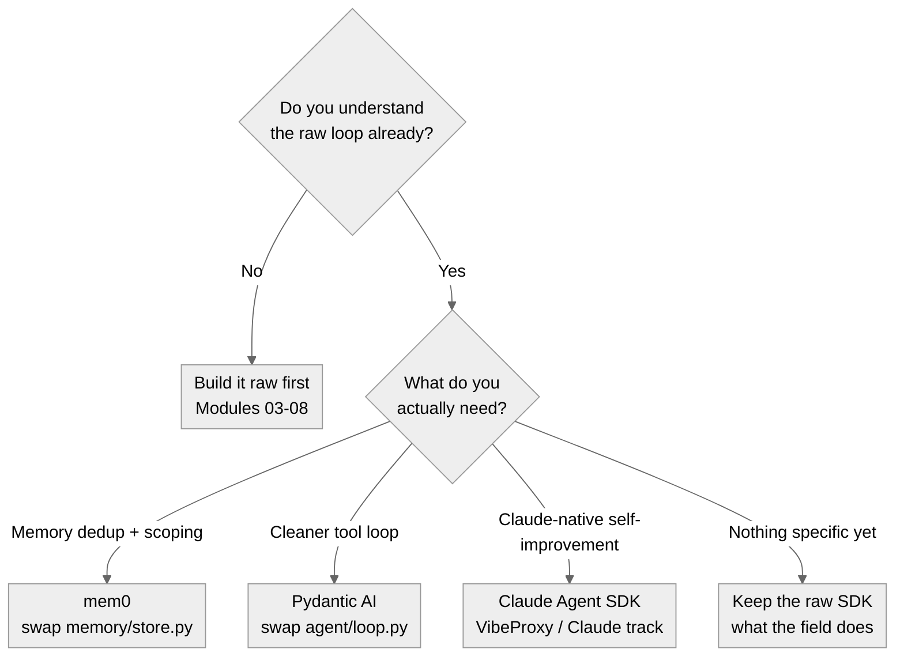
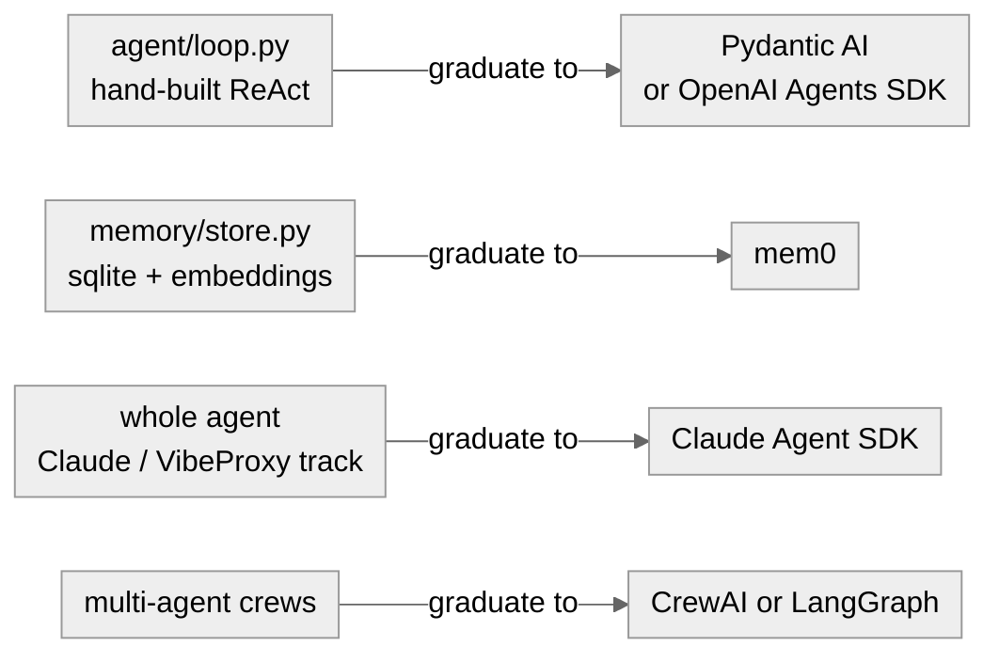

# 13 · Graduating to a Framework

**What you'll learn.** You built the whole loop on the raw OpenAI SDK on purpose - so you can *see* every step. This appendix module asks the next question: now that you understand the mechanics, should you adopt a popular agent framework, and if so, which one and where? You'll see what the real 2026 self-improving-agent projects actually use, the make-or-break test for any framework in this curriculum (does it accept a custom `base_url`?), and two concrete, backend-compatible drop-ins shipped in `frameworks/`.

> [!info] Prerequisites
> - [[11 - Capstone - Production Agent]] - you should have the full raw-SDK loop working end to end first
> - [[03 - The Minimal Agent Loop]] and [[04 - Memory Systems]] - the pieces a framework would replace

---

## Learning Objectives

- [ ] Recall what the real self-improving-agent projects are built on (and what they avoid)
- [ ] Apply the one make-or-break test: can the framework target oMLX/VibeProxy via a custom `base_url`?
- [ ] Decide *when* a framework helps vs. when it only adds opacity
- [ ] Swap `memory/store.py` for [mem0](https://github.com/mem0ai/mem0) using `frameworks/mem0_memory.py`
- [ ] Swap `agent/loop.py` for [Pydantic AI](https://github.com/pydantic/pydantic-ai) using `frameworks/pydantic_ai_loop.py`
- [ ] Explain why the Claude Agent SDK fits the VibeProxy track but not oMLX-local

---

## 1. What the real projects actually use

Before adopting anything, look at what the field does. Surveying the 2026 self-improving-agent projects this curriculum cites - all real, all inspectable - one pattern dominates:

| Project | Stars | Built on |
|---|--:|---|
| [SIA](https://github.com/hexo-ai/sia) | 567 | **Claude Agent SDK** (default) / OpenHands |
| [Containarium](https://github.com/footprintai/Containarium) | 208 | Custom Go (MCP sandbox infra) |
| [Nerve](https://github.com/ClickHouse/nerve) | 54 | **Claude Agent SDK** + FastAPI |
| [komi-learn](https://github.com/kurikomi-labs/komi-learn) | 28 | Raw Anthropic SDK + stdlib |
| [Autodidact](https://github.com/BuffaloTechRider/Autodidact) | 18 | Raw OpenAI SDK + FAISS |
| [agent-seed](https://github.com/B67687/agentic-workflows) | - | Custom shell harness |

> [!important] The most important finding is a negative one
> **Not one of these projects uses LangChain, CrewAI, or AutoGen.** Self-improving agents rewrite their own loop, memory, and skills - so they need a loop they fully control, not one hidden behind a framework. The minimalism of this lab is not a beginner shortcut; it is what the field actually does. The one framework that recurs is the **Claude Agent SDK**, used by the two highest-signal projects ([SIA](https://github.com/hexo-ai/sia) and [Nerve](https://github.com/ClickHouse/nerve)).

---

## 2. The make-or-break test: custom `base_url`

Everything in this curriculum runs on oMLX (`:8000`) or VibeProxy (`:8317`) - both OpenAI-compatible, no paid keys. So any framework you adopt **must** accept a custom OpenAI-compatible `base_url`. That single test matters more than star count.

The good news: every major framework passes it. The decision is therefore not "can I?" but "should I, and where?"



*Decision flow - a framework is a tool for a specific need, not a default. If you cannot name what it buys you, you do not need it yet.*

---

## 3. The framework landscape (all pass the `base_url` test)

| Framework | Stars | How to point it at our backends | Best leverage point | Verdict |
|---|--:|---|---|---|
| [mem0](https://github.com/mem0ai/mem0) | 57k | `openai_base_url` in `MemoryConfig` | Memory (Module 04/06) | **Adopt (optional)** |
| [CrewAI](https://github.com/crewAIInc/crewAI) | 52k | `LLM(base_url=...)` | Multi-agent demos | Compare only |
| [LangGraph](https://github.com/langchain-ai/langgraph) | 33k | `ChatOpenAI(base_url=...)` | Loop + checkpointers | Compare only |
| [OpenAI Agents SDK](https://github.com/openai/openai-agents-python) | 27k | `set_default_openai_client(...)` | Loop (Module 03) | Optional |
| [Pydantic AI](https://github.com/pydantic/pydantic-ai) | 17k | `OpenAIProvider(base_url=...)` | Loop (Module 03) | **Adopt (optional)** |
| [Strands](https://github.com/strands-agents/sdk-python) | 6k | `OpenAIModel(client_args={...})` | Loop | Low (AWS-centric) |

Every one of these carries the *same* caveat: it hides the ReAct loop or the extract-embed-upsert pipeline that Modules 03-08 exist to teach. That is why this curriculum builds raw first and treats frameworks as a **graduation**, not a foundation.



*Each hand-built lab component maps to the framework that can replace it - once you understand what it does.*

---

## 4. Hands-on lab - the two drop-ins

The scaffold ships two backend-aware adapters under [`frameworks/`](https://github.com/shaneliuyx/self-improving-agents-curriculum/tree/main/scaffold/frameworks). They target oMLX/VibeProxy with no code change - only a `base_url`.

```bash
# install the optional graduation deps
pip install -e ".[frameworks]"        # adds mem0ai + pydantic-ai

# with a backend running (oMLX :8000 or VibeProxy :8317):
python -m frameworks.pydantic_ai_loop   # the loop, framework-managed
python -m frameworks.mem0_memory        # memory, framework-managed (needs oMLX for embeddings)
```

### 4a. Pydantic AI as the loop

The only backend-aware line is the provider - everything else (the ReAct loop, tool dispatch, message history you wrote by hand in Module 03) is framework-managed:

```python
from pydantic_ai import Agent
from pydantic_ai.models.openai import OpenAIChatModel
from pydantic_ai.providers.openai import OpenAIProvider
from backends.adapter import BACKENDS

b = BACKENDS["omlx"]  # or "vibeproxy"
model = OpenAIChatModel(b["model"], provider=OpenAIProvider(base_url=b["base_url"], api_key="not-needed"))
agent = Agent(model, system_prompt="Use the calculator tool for arithmetic.")
```

Open `frameworks/pydantic_ai_loop.py` next to `agent/loop.py` and compare: the framework version is shorter, but the raw version is the one that shows you what `run_sync()` is doing.

### 4b. mem0 as the memory layer

mem0 does LLM-driven extraction, dedup, and scoping - the pipeline `memory/store.py` leaves as exercises. The curriculum's one rule still holds: **embeddings stay local**. `frameworks/mem0_memory.py` pins mem0's embedder to `EMBED_BASE_URL` (oMLX) while letting generation follow `AGENT_BACKEND`:

```python
"embedder": {"provider": "openai", "config": {
    "model": EMBED_MODEL, "openai_base_url": "http://localhost:8000/v1", "api_key": "not-needed"}}
```

> [!tip] Run them side by side
> Keep `memory/store.py` and `frameworks/mem0_memory.py` both wired into the capstone agent behind a flag. Diff the retrieved memories on the same trajectory - you will *see* what mem0's dedup and extraction change, instead of taking it on faith.

---

## 5. The Claude Agent SDK track

The most Claude-native choice is the [Claude Agent SDK](https://github.com/anthropics/claude-agent-sdk-python) - it is what [SIA](https://github.com/hexo-ai/sia) and [Nerve](https://github.com/ClickHouse/nerve) build on. It **bundles the Claude Code CLI and authenticates through your Claude subscription directly** - no API key, and (unlike the other adapters) no VibeProxy. The SDK *is* Claude Code, so it uses the same subscription auth. The scaffold ships it as `frameworks/claude_agent_sdk_loop.py`:

```python
from claude_agent_sdk import query, ClaudeAgentOptions, tool, create_sdk_mcp_server

@tool("calculate", "Evaluate arithmetic", {"expression": str})
async def calculate(args):
    return {"content": [{"type": "text", "text": str(eval(args["expression"]))}]}

server = create_sdk_mcp_server(name="lab-tools", version="1.0.0", tools=[calculate])
options = ClaudeAgentOptions(mcp_servers={"lab": server}, allowed_tools=["mcp__lab__calculate"], max_turns=3)
async for message in query(prompt="What is 17 * 23?", options=options):
    ...   # collect AssistantMessage -> TextBlock.text
```

> [!warning] It does not fit the oMLX-local track
> The Claude Agent SDK speaks the Claude Code / Anthropic shape, not an OpenAI-compatible local endpoint, so it ignores `base_url`. oMLX-local users stay on `agent/loop.py` or `frameworks/pydantic_ai_loop.py`. Run it with `python -m frameworks.claude_agent_sdk_loop` (needs an active Claude subscription).

> [!success] Verified working (live, 2026-05-31)
> Tested against `claude-agent-sdk` 0.2.87: the adapter authenticates via the bundled Claude Code, registers the `mcp__lab__calculate` tool, and the model uses it to return the correct answer (`17 * 23 + 5 = 396`).
>
> **Root cause of an early failure:** an `ANTHROPIC_API_KEY` in the environment makes the SDK bill **metered API credits** (which were at $0) instead of your subscription, giving `billing_error: "Credit balance is too low"`. The adapter now defaults to the subscription by removing `ANTHROPIC_API_KEY` for the call (`prefer_subscription=True`, restored afterward); pass `prefer_subscription=False` to keep API-credit billing. (The SDK reports billing failures as a confusing "error result: success"; the adapter surfaces the real reason.)

---

## 6. Pitfalls

> [!danger] Teaching opacity
> `Runner.run()`, `create_react_agent()`, and `memory.add()` hide exactly the operations Modules 03-08 teach. Adopt a framework *after* you can implement the piece by hand - not instead of learning it. A self-improving agent whose loop you cannot read is one you cannot safely let modify itself.

> [!warning] The embeddings rule does not relax
> A framework's defaults will happily call a cloud embeddings API. Always pin the embedder to oMLX (`EMBED_BASE_URL`). VibeProxy has no embeddings endpoint - see [[02 - Backends - oMLX and VibeProxy]].

> [!note] Lock-in is a self-improvement risk
> Module 08 has the agent rewrite its own loop. The more framework abstraction sits between the agent and its behavior, the smaller the surface it can safely self-modify. Frameworks and aggressive self-modification pull in opposite directions - choose per sub-problem.

---

> [!question] Checkpoint
> 1. What is the single make-or-break test for adopting a framework in this curriculum, and why does it beat star count?
> 2. Name two real self-improving-agent projects and what each is built on. What do *none* of them use?
> 3. Where does `frameworks/mem0_memory.py` send embeddings, and why is that not configurable per backend?
> 4. Why does the Claude Agent SDK fit the VibeProxy track but not oMLX-local?
> 5. Give one concrete reason heavy framework abstraction conflicts with Module 08 (self-modification).

---

## Navigation

← [[12 - Resources and Field Map]] · [[00 - Curriculum Map]] (home) · [[11 - Capstone - Production Agent]] (back to capstone)
