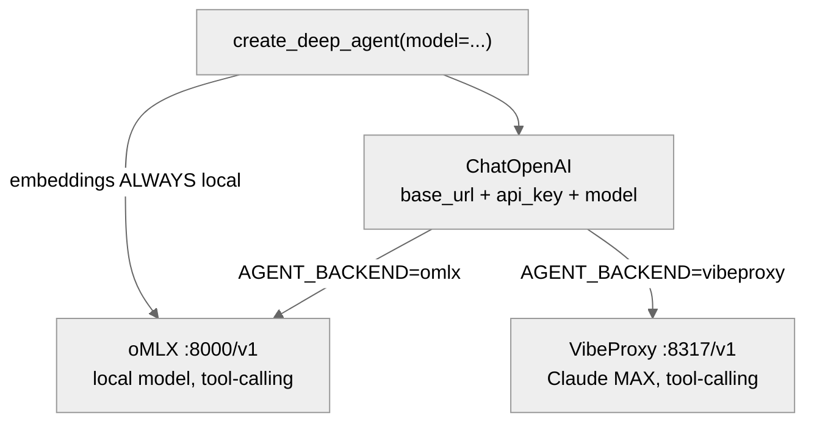

# 14 · Framework Capstone - Shipping on deepagents

**What you'll learn.** Modules 03-11 had you build every harness primitive by hand on the raw OpenAI SDK - the loop, memory, reflection, skills, verification gates, sandbox, eval harness - so you can *see* each one. Module 13 asked *whether* to adopt a framework and gave you the make-or-break test (custom `base_url`). This module is the payoff: you take a **real problem** - an agent that fixes a failing test in a repo and learns from each fix - and ship it on [deepagents](https://github.com/langchain-ai/deepagents), the 24K-star "batteries-included agent harness." The lesson is *transfer*: because you built the primitives by hand, you can now wield the platform with judgment - you know exactly what each framework feature is doing for you, so you can trust it, debug it, or override it. That judgment is the whole point of the brain/harness/agent framing in [[00 - Curriculum Map]].

> [!info] Prerequisites
> - [[11 - Capstone - Production Agent]] - you should have the hand-built raw-SDK agent working end-to-end first. This module only makes sense as a *contrast* to that one.
> - [[13 - Graduating to a Framework]] - the decision and the `base_url` test. This module is the hands-on build that note 13 points to.
> - A backend running: oMLX (`:8000`) or VibeProxy (`:8317`). As always, **embeddings stay local** (oMLX), even on the VibeProxy track.

---

## Learning Objectives

- [ ] State the transfer thesis: you hand-build primitives to earn the judgment to wield a platform - not to avoid platforms forever
- [ ] Point deepagents at oMLX/VibeProxy with a custom `base_url` (the same swap your `backends/adapter.py` does, now via a LangChain model object)
- [ ] Map every hand-built lab subsystem to its deepagents equivalent (the primitive -> framework table - this module's spine)
- [ ] Build a real self-improving code-fix agent on deepagents: read failing test -> edit code -> run test -> learn the fix
- [ ] Decide what deepagents gives you for free vs. what you still own (the eval gate stays yours - never let the framework self-approve)
- [ ] Articulate when this capstone's "buy" answer is right and when [[11 - Capstone - Production Agent]]'s "build" answer is right

---

## 1. The Transfer Thesis

The article that motivates the harness layer ([Anthropic's masterclass](https://www.youtube.com/watch?v=efRIrLXoOVA): *"the harness matters as much as the model"*; [O'Reilly, "Agent Harness Engineering"](https://www.oreilly.com/radar/agent-harness-engineering/)) makes a claim that sounds like it contradicts this curriculum: *most teams die hand-rolling the harness instead of solving the business problem; rent the harness, own the business logic.* If that is true, why did you spend Modules 03-11 hand-rolling a harness?

Because the two are sequential, not opposed. You hand-roll **once, to learn** - so that when you adopt a platform you are not cargo-culting it. A developer who has written `agent/loop.py` knows what `create_deep_agent` is doing on the inside: the continue-vs-stop decision, the tool-dispatch, the failure-as-observation. They can read deepagents' streamed steps and know which knob to turn when it misbehaves. A developer who *only* ever called `create_deep_agent` is back to the demo-that-doesn't-ship problem - they cannot debug the layer they never understood.

So the arc is: **Module 11 = build (understand the layer). Module 14 = buy (wield the layer). Module 13 = the decision between them.** A teaching lab is the one place hand-rolling is always correct; a business shipping an agent usually should not.

---

## 2. The make-or-break test, applied: deepagents on a local backend

Note 13's rule: a framework is usable in this curriculum only if it accepts a custom `base_url` so it can target oMLX/VibeProxy instead of a paid API. deepagents passes - it accepts any LangChain chat-model object, and [`ChatOpenAI`](https://docs.langchain.com/oss/python/integrations/chat/openai) takes `base_url` + `api_key`. This is the **same swap** your `backends/adapter.py` already does with the raw `openai` SDK, just wrapped in a LangChain object.


*The same backend-swap rule as the rest of the curriculum: generation backend is swappable via `base_url`; embeddings stay on oMLX (deepagents/VibeProxy do not serve embeddings).*

```python
# frameworks/deepagents_backend.py - one model object, both backends.
# Mirrors backends/adapter.py::make_client, but returns a LangChain model
# object (what deepagents wants) instead of a raw openai client.
import os
from langchain_openai import ChatOpenAI

def make_model() -> ChatOpenAI:
    backend = os.getenv("AGENT_BACKEND", "omlx")
    if backend == "vibeproxy":
        # VibeProxy uses OAuth; the api_key is ignored but must be non-empty.
        return ChatOpenAI(
            base_url="http://localhost:8317/v1",
            api_key=os.getenv("LLM_API_KEY", "not-needed"),
            model=os.getenv("VIBE_MODEL", "claude-sonnet-4-6"),
            temperature=0.0,
        )
    # oMLX (default). Any model that supports tool-calling works.
    return ChatOpenAI(
        base_url="http://localhost:8000/v1",
        api_key=os.getenv("OMLX_API_KEY", "not-needed"),
        model=os.getenv("OMLX_MODEL", "Qwen2.5-Coder-7B-Instruct-MLX-4bit"),
        temperature=0.0,
    )
```

> [!warning] Tool-calling is required
> deepagents drives everything (file edits, shell, sub-agents) through tool calls. The local model you point it at MUST support tool-calling. A `Qwen2.5-Coder-Instruct` class model does; a base completion model does not. If the agent "does nothing," check that first.

---

## 3. The Primitive -> Framework Map (this module's spine)

This is the transfer table. Every subsystem you hand-built, and what deepagents provides instead. Read it as: *"I understand X because I built it; here is the framework feature that now does X for me, and what I still own."*

| Hand-built (Modules 03-11) | deepagents equivalent | Who owns it now |
|---|---|---|
| `agent/loop.py` continue/stop/tool-dispatch | `create_deep_agent(...)` + LangGraph loop | Framework |
| `agent/tools.py` define + dispatch | `tools=[...]` (your fns) + built-in file/shell tools | Shared - your domain tools, their primitives |
| **Structured edit + rollback** (Module 03/09 gap) | Built-in **filesystem** tools (read/write/edit/search) over pluggable backends | Framework |
| `memory/store.py` episodic/semantic + retrieval | **Persistent memory** - pluggable state + store backends for cross-session recall | Framework (but you choose the store) |
| Context-budget / compression | **Context management** - summarize long threads, offload tool output to disk | Framework |
| `scripts/commit` checkpoint/rollback | LangGraph **checkpointing** (durable, per-step) | Framework |
| Sub-task isolation (you didn't build this) | **Subagents** - spawn isolated context for a subtask | Framework |
| `verification/gates.py` HITL gate | **Human-in-the-loop** - approve/edit/reject tool calls before they run | Framework |
| `skills/library.py` | **Skills** - reusable behaviors loaded on demand | Framework |
| **`evals/run.py` external eval gate** | *nothing - you keep this* | **YOU** |
| Observability / step log | LangGraph streaming + LangSmith traces | Framework |

The single most important row is the last: **the eval gate stays yours.** deepagents will happily let an agent edit code and declare success. The curriculum's hard rule from [[11 - Capstone - Production Agent]] §4.1 - *never let the agent self-approve* - does not change because you adopted a framework. The framework runs the loop; an **external, deterministic** `evals/run.py` still decides keep-vs-discard. Renting the harness does not mean renting your judgment.

---

## 4. Hands-On Lab: a self-improving code-fix agent

**Goal.** Build an agent that, given a repo with a failing test, reads the failure, edits the source to fix it, re-runs the test, and - on success - records the fix as a reusable lesson. This is the *same job* as the hand-built capstone, now on deepagents, so you can feel the difference directly.

### 4.1 - Install (optional graduation deps)

```bash
# deepagents lives behind the [frameworks] extra so the core lab stays openai+numpy only
cd ~/self-improving-agent-lab
uv pip install deepagents langchain-openai     # or: pip install -e ".[frameworks]"
```

### 4.2 - The agent

```python
# frameworks/deepagents_codefix.py
# A self-improving code-fix agent on deepagents, backend-swappable to oMLX/VibeProxy.
# Contrast with the hand-built agent/loop.py: the loop, file edits, and checkpointing
# are the framework's; the run_tests tool and the external eval gate are still ours.
import subprocess
from deepagents import create_deep_agent
from frameworks.deepagents_backend import make_model

def run_tests(test_path: str) -> str:
    """Run pytest on a path; return pass/fail + captured output.
    This is OUR domain tool - the framework supplies file edit + shell, but
    'what counts as success' is ours to define (see the eval-gate note below)."""
    proc = subprocess.run(
        ["python", "-m", "pytest", test_path, "-x", "-q"],
        capture_output=True, text=True, timeout=120,
    )
    status = "PASS" if proc.returncode == 0 else "FAIL"
    return f"[{status}]\n{proc.stdout[-2000:]}\n{proc.stderr[-1000:]}"

SYSTEM = """You are a code-fix agent. Given a failing test:
1. Read the test and the source file it exercises (use the filesystem tools).
2. Make the SMALLEST edit to the source that could fix the failure.
3. Call run_tests to check. If it still fails, read the new output and try again.
4. Stop when the test passes, or after 5 edit-test cycles. Do not edit the test itself."""

agent = create_deep_agent(
    model=make_model(),          # <-- oMLX/VibeProxy via base_url (section 2)
    tools=[run_tests],           # <-- our domain tool; file edit/shell are built in
    system_prompt=SYSTEM,
)

if __name__ == "__main__":
    result = agent.invoke({"messages": "Fix the failing test in tests/test_buggy.py"})
    print(result["messages"][-1].content)
```

### 4.3 - Keeping the eval gate (the part you do NOT delegate)

deepagents returns when the *agent* thinks it is done. That is not the same as *verified* done. Wrap the framework agent in the curriculum's external gate exactly as Module 11 does - the agent never sees the verdict before it is computed:

```python
# frameworks/deepagents_cycle.py - framework runs the loop; WE gate the result.
from evals.run import run_eval          # the same deterministic judge from Module 10
from frameworks.deepagents_codefix import agent

def one_cycle(task_msg: str) -> bool:
    agent.invoke({"messages": task_msg})         # framework: edit + test loop
    report = run_eval("post-deepagents-fix")     # OURS: external ground truth
    accepted = report.regression_count == 0 and report.success_rate >= report.baseline_rate
    # keep the edit on accept; git revert on reject (Module 08 discipline, unchanged)
    return accepted
```

> [!danger] The framework does not own your gate
> This is the [[11 - Capstone - Production Agent]] §4.1 rule restated for the buy path: a self-improving agent must not evaluate its own proposals. deepagents can self-report success all day; `run_eval` is the external, deterministic judge that decides keep-vs-discard. If you let the framework's own "looks done" be your accept signal, you have rebuilt the demo-that-doesn't-ship.

### 4.4 - Run it

```bash
# oMLX (local)
AGENT_BACKEND=omlx python -m frameworks.deepagents_codefix
# VibeProxy (Claude MAX) - oMLX still needed for embeddings if you wire memory
AGENT_BACKEND=vibeproxy python -m frameworks.deepagents_codefix
```

**Result** *(to be measured on first run; mark `~estimated` until then)*: the deepagents agent should fix a simple off-by-one or wrong-operator bug in 1-3 edit-test cycles, with file edits and the loop handled by the framework. Compare wall-time and lines-of-your-code against the hand-built `agent/loop.py` doing the same task - the framework version is far less *your* code, which is exactly the trade: less code you own, more behavior you did not have to build (and cannot see without the understanding Modules 03-11 gave you).

`★ Insight`
- **You wrote ~40 lines; deepagents supplied the harness.** The hand-built equivalent (loop + file-edit tool + checkpoint) is hundreds of lines across `agent/`, `verification/`, `scripts/`. That delta is the article's whole point - but it is only safe to take *after* you have built it once.
- **The one line you must not delete is `run_eval`.** Everything else is rentable. The external eval gate is the curriculum's non-negotiable, framework or no framework.
- **`base_url` is the entire compatibility story.** The same fact that made `adapter.py` backend-agnostic makes deepagents backend-agnostic. If a future framework fails the `base_url` test, it fails this curriculum (note 13).

---

## 5. When to buy, when to build

| Situation | Answer | Why |
|---|---|---|
| Learning the harness layer | **Build** (Modules 03-11) | You cannot wield what you do not understand |
| Shipping an agent for a real business | **Buy** (this module) | Hand-rolling production infra is where teams die ([the article](https://www.youtube.com/watch?v=efRIrLXoOVA)) |
| Your loop shape is genuinely unusual | **Build on LangGraph** (note 13) | deepagents' bundled middleware assumes a standard shape |
| You need it working this week, standard shape | **Buy - deepagents** | Batteries included; standard agent shape |
| Regulated / high-cost-of-error path | **Build or heavy HITL** | [[11 - Capstone - Production Agent]] §4.1 - automation, not agency |

The harness commoditizes (the article's "AWS of agents" thesis - see [[13 - Graduating to a Framework]]). Your durable edge is never the harness; it is the domain logic, the eval criteria, and the judgment to know which layer you are standing on. This curriculum built that judgment from the primitive up.

---

## 6. Pitfalls

**Entry 1 - The local model can't tool-call.** *Symptom:* deepagents agent returns immediately with no file edits. *Root cause:* the oMLX model you pointed at is a base/completion model, not an instruct model with tool-calling. *Fix:* use a tool-calling-capable model (`Qwen2.5-Coder-7B-Instruct`, etc.); confirm with a one-tool smoke test before the full agent.

**Entry 2 - Letting the framework self-approve.** *Symptom:* "improvements" that pass the agent's own judgment but regress the eval suite. *Root cause:* using deepagents' return value as the accept signal instead of an external gate. *Fix:* wrap every cycle in `run_eval` (§4.3); the agent never sees the verdict before it is computed.

**Entry 3 - Embeddings sent to VibeProxy.** *Symptom:* `404` on embeddings when `AGENT_BACKEND=vibeproxy`. *Root cause:* VibeProxy serves chat only, no embeddings endpoint. *Fix:* memory/embeddings always use oMLX `:8000` regardless of generation backend - the curriculum's standing rule (see [[02 - Backends - oMLX and VibeProxy]]).

---

## 7. References

- **[deepagents](https://github.com/langchain-ai/deepagents)** (langchain-ai, 24K stars) - "the batteries-included agent harness"; `create_deep_agent`, filesystem/shell/memory/HITL/subagents middleware on the LangGraph runtime. The framework this capstone builds on.
- **[deepagents customization docs](https://docs.langchain.com/oss/python/deepagents/customization)** - how to pass a custom model object and override middleware/tools/backends.
- **[ChatOpenAI integration](https://docs.langchain.com/oss/python/integrations/chat/openai)** - the `base_url` + `api_key` swap that targets oMLX/VibeProxy.
- **[Anthropic agent-harness masterclass](https://www.youtube.com/watch?v=efRIrLXoOVA)** (49K views) - *"the harness matters as much as the model."*
- **[O'Reilly, "Agent Harness Engineering"](https://www.oreilly.com/radar/agent-harness-engineering/)** - the harness-as-a-layer framing.

---

## Navigation

← [[13 - Graduating to a Framework]] · [[00 - Curriculum Map]] (home) · [[11 - Capstone - Production Agent]] (the build counterpart)
